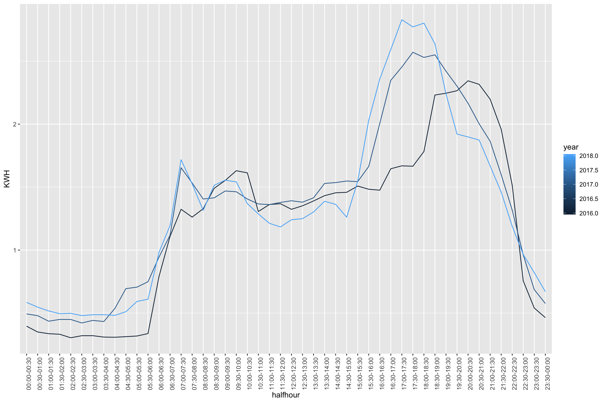
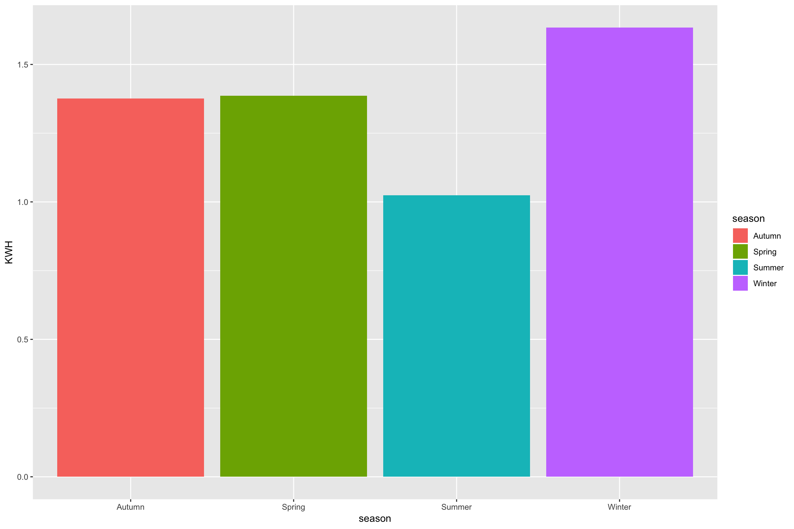
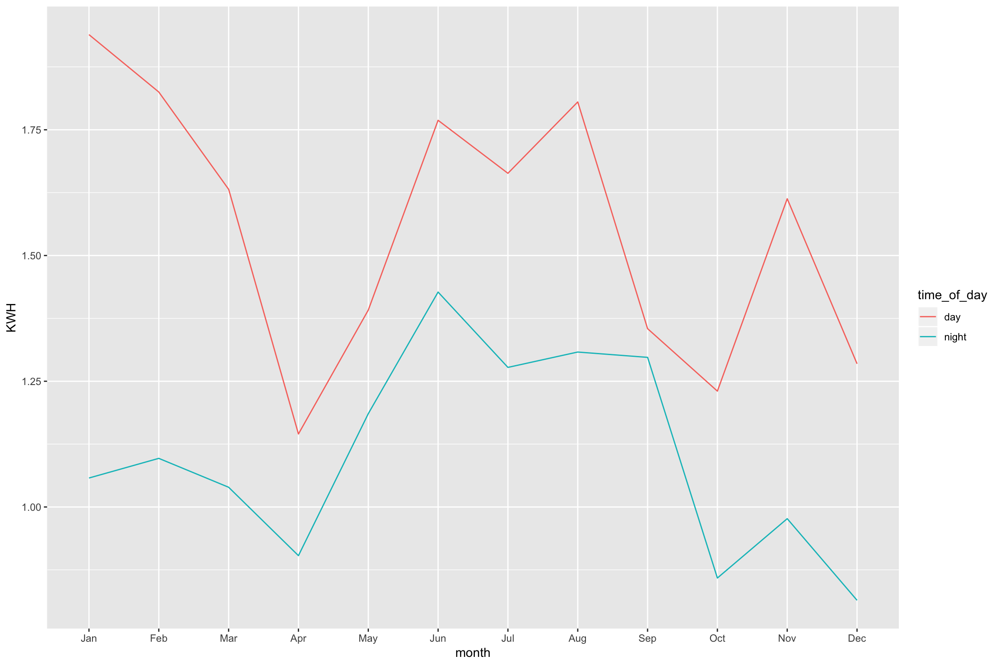
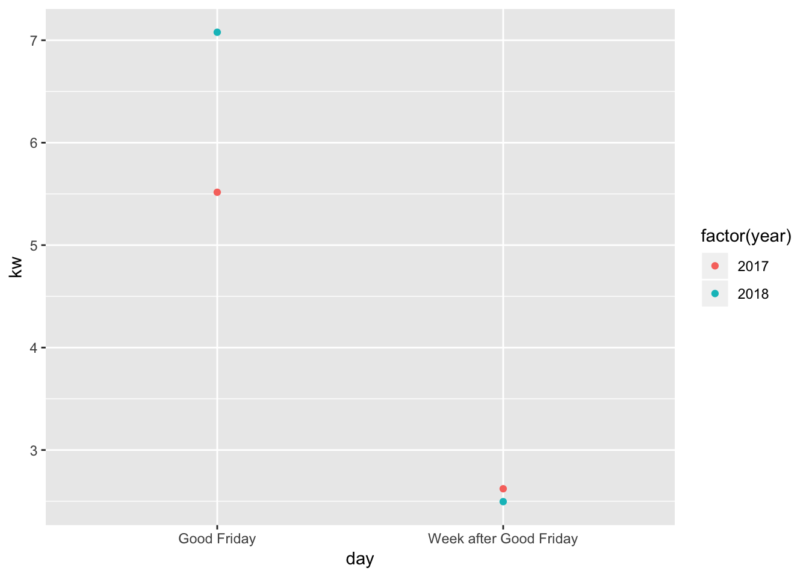
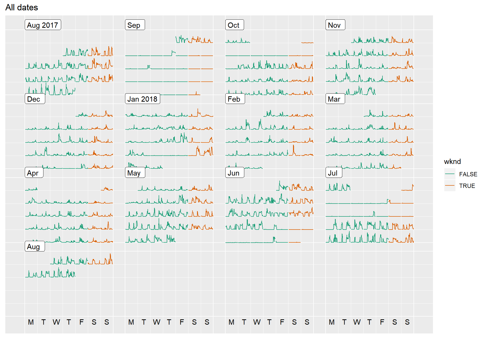

```{r, echo = FALSE, message = FALSE, warning = FALSE, warning = FALSE}
knitr::opts_chunk$set(
  message = FALSE,
  warning = FALSE,
  error = FALSE, 
  collapse = TRUE,
  comment = "",
  fig.height = 8,
  fig.width = 12,
  fig.align = "center",
  cache = FALSE
)
```

# Exercise

Smart meters are now installed at every property in Melbourne. The Victorian government has a current initiative to encourage households to examine their energy use and particularly to get a better deal on energy pricing. Their tool to compare suppliers is at https://compare.energy.vic.gov.au. If you use this tool between now and the end of the year, you will get an energy rebate of $50.

Your task is to get the electricity usage data for your household. It is relatively straightforward. You need to go to your provider's page, which can be determined by visiting https://www.energy.vic.gov.au/electricity/electricity-distributors. If you have a recent bill, your meter number will be on it. You need this to create a login, so that you can download your data. 

The format of the data should `csv` and look something like mine, which is provided, `meter1.csv`. In addition, there should be a web page, [like this one from citipower](https://customermeterdata.portal.powercor.com.au/customermeterdata/articles/Question/A12-How-do-I-read-the-detailed-report?retURL=%2Fcustomermeterdata%2Fapex%2FCADArticleList&popup=true) describing the format of the data, that will be useful when you are trying to tidy it. You should be able to see half hourly electricity usage. 

You only need one data set per group. Everyone in the group should work on this one. If you have problems getting your own data, we will provide you with some. 

1. (1pt) Describe the steps that you will need to take to read in your electricity usage, and tidy it. 

*a. Filter only rows with code id "300"*

*b. Gather the data into long form, to create two variables: half hourly intervals and the kwh.*

*c. It may be necessary to transform the half hourly variable into a numeric variable.*

2. (1pt) Tidy your data, using the `tidyverse` functions. The end product should look something like this:

```
  date       halfhour   kwh
  <date>        <dbl> <dbl>
1 2017-11-24      0.5     0
2 2017-11-24      0.5     0
3 2017-11-24      1       0
4 2017-11-24      1       0
5 2017-11-24      1.5     0
6 2017-11-24      1.5     0
```

although your `halfhour` variable might be more explicit like 12:00-12:30, 12:30-01:00, 01:00-01:30, ... And you might want to add week day, month, year variables. 

*Here is the code for this data set, and the results*

```{r echo=TRUE}
library(tidyverse)
library(lubridate)
library(glue)
elec <- read_csv("data/smart_meter/di1.csv", skip=1, 
    col_names = c("id", "date", paste0("d", 1:48), paste0("stuff", 1:5)), 
    col_types = "ccddddddddddddddddddddddddddddddddddddddddddddddddccccc")
elec <- elec %>% filter(id == 300) 
elec <- elec %>%
  mutate(date = ymd(date)) %>%
  select(id:d48) %>%
  gather(halfhour, kwh, d1:d48) %>%
  mutate(halfhour = as.numeric(sub("d", "", halfhour))/2) %>%
  arrange(date, halfhour) %>%
  mutate(wday = wday(date, label = TRUE, abbr = TRUE, 
                     week_start = 1),
         month = month(date, label = TRUE, abbr = TRUE),
         year = year(date)) %>%
         mutate(dt = ymd_hm(glue("{date} 12:00"), 
                           tz = "Australia/Melbourne") +
           minutes(60*halfhour))
glimpse(elec)
```

3. (2pts) Make a line plot of half-hourly usage for these two days, Sunday August 5, 2018 and Wednesday Aug 8, 2018. Describe what you learn about electricity use on these two days. 

```{r echo=TRUE}
elec %>% 
  filter(date %in% c(ymd("2018-07-29"), ymd("2018-08-01"))) %>%
  ggplot(aes(x=halfhour, y=kwh, group=date, colour=date)) + geom_line()
```

*The patterns in each time series, and the difference between series need to be explained. For example: The days both have peaks aound 9am, and again in the evening. The weekend day also has multiple peaks during the day. For my household, this is likely the clothes dryer being put on several times on the weekend.*

4. (1pt) Aggregate your daily kwh usage. Make a side-by-side boxplot of usage by week day. Are there some days of the week that you use more electricity than others?

* Here is the code and result. You need to have summed the kwh to total per day.*

```{r echo=TRUE}
elec %>% 
  group_by(date) %>%
  summarise(dkwh = sum(kwh, na.rm=TRUE)) %>%
  mutate(wday = wday(date, label = TRUE, abbr = TRUE, 
                     week_start = 1)) %>%
  ggplot(aes(x=wday, y=dkwh)) + geom_boxplot()
```

*The general distribution from one day to the next needs to be explained. For example: The weekend days have higher medians than the week days, which means these are the high energy use days. There are some week days that have outliers in usage, that mean unusually high energy use days. Thursday has the biggest variation in usage.*

5. (4pts) Decide on several (about 3) more types of plots to make to learn about your energy usage. Make these plots and write some paragraphs describing what you have learned. 

*Some reasonable plots to look at are monthly usage as side-by-side boxplots, time of day usage as side-by-side boxplots, a calendar plot of usage, a long time series of the entire period. There's probably lots of creative submissions here. Each needs to have a paragraph explaining what is learned about their energy usage from the plot.*

Here are some good examples from the reports. These are three from group Thor. What is terrific about these plots is the way they break down time in a logical way. 



*The graph above shows the average amount of electricity used each halfhour each year. From 00:00 until 05:00, the least amount of eletricity was used in 2016. Additionally, The highest peak amount of electricity used occurred in 2018 at 15:00. Although 2018 had the highest peak, the drop after that was much more steep than in 2016 and 2017, indicating that less electricity was used later in the evening compared to the previous years.*



*From this graph we can see that the highest electricity usage is in Winter. This could be because of the increased usage of heating systems within the house and the fact that families generally go out less in Winter. Contrastingly, summer has the lowest energy usage. This could be because every summer, families tend to go away and thus will not use electricity within the house.Spring and autumn are quite close, which is expected as nothing different happens within those two months.*



*Throughout the entire year, there has been significantly more electricity used during the day than night, which makes sense as this is the time when people are usually awake and active. The least amount of electricity used during the day is in April, while during the night it was in December. On the otherhand, the most amount of electricity used during the day is in January, whil during the night it is in June.*

This plot by Team Rocket, shows a creative exploration, to look at good Friday vs the week after, people at home vs at work, possibly.




*Energy use has significantly be reduced between Good Friday and the Week after Good Friday. There may be a few flaws with this comparison, such as Fridays generally being more likely to use less power as seen in previous data, and also as previously discussed, Good Friday should be considered a rest day, and most likely all members of the household would be home.*

And this is a calendar plot provide by team GeoZoo!



*This graph shows the daily usages of energy on a halfhour basis for all the months. Here, it allows us to clearly see which months have the highest amounts of usage of energy. We hypothesised that the colder/Winter months would have more energy usage as more households utilise appliances to keep themselves warm. From this graph we can see that Aug 2017 has a high usage of energy almost daily, as well as the end of May, start of Jun, and end of Jul 2018. These months all appear to have a higher daily usage of energy when compared to the warmer months of Nov-Dec 2017 and Jan-Mar 2018. We can also see in this graph that there are certain periods where there was no energy usage. This may be because the house owner may have left for a holiday or travelled for business purposes. i.e. most of Sept 2017 and end Jun-start Jul 2018.*

(1 point for overall readability of the report.)

# Grading

Points for the assignment will be based on:

- How well you have explained your tidying procedures.
- Whether the Rmd file, can take your data file as provided,  produce the tidy data, and plots reported in your final submission.
- Accuracy of your answers to the given questions. 
- Creativeness in exploring your energy use, and plots used to tell a story. 
