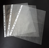

```{r setup, include=FALSE}
library(learnr)
knitr::opts_chunk$set(echo = FALSE,   
                      message = FALSE,
                      warning = FALSE,
                      collapse = TRUE,
                      fig.height = 4,
                      fig.width = 8,
                      fig.align = "center",
                      cache = FALSE)
tutorial_html_dependency()
```

# Week of introduction

## About your instructors

Welcome to ETC1010: Data Modelling and Computing, semester 2, 2018.

- Di: a professor at Monash University in Melbourne Australia, doing research in statistics, data science, visualisation, and statistical computing. I like to play all sorts of sports, tennis, soccer, hockey, cricket, and go boogie boarding.
- Steph: graduated with a Bachelor of Economics and Bachelor of Commerce from Monash, and studying a Masters of Statistics at QUT, based at Monash.  Steph loves to read `r emo::ji("book")`, any and all recommendations are welcome. Has an R package called taipan, and another called sugarbag soon to appear. 
- Stuart: third year PhD student, interested in visualisation, programming languages and high dimensional data. Likes old movies, cooking and Nintendo. Has many R packages for analysing genomics data: plyranges, superintronic, starmie... 
- Mitch: a data science exploreR, graduated from Monash University studying Econometrics, Math Statistics & Computational Science. Compulsively collects and uses data to automate gardening, lighting and chickens `r emo::ji("chick")`. Lots of R packages: taipan, tidyverts suite, fasster, ...

## Language of data analysis

*This course is brought to you today by the letter "R"!*


Grover image sourced from https://en.wikipedia.org/wiki/Grover.

### What is R? 

*R is a language for data analysis. If R seems a bit confusing, disorganized, and perhaps incoherent at times, in some ways that's because so is data analysis.* Roger Peng, 12/07/2018


### Why R?

* [Most commonly used data science software](http://www.kdnuggets.com/2017/05/poll-analytics-data-science-machine-learning-software-leaders.html) - helps YOU the job market
* [Sharon Machlis from ComputerWorld says "R is hot"](https://www.computerworld.com/article/2497143/business-intelligence/business-intelligence-beginner-s-guide-to-r-introduction.html)


* __Free__
* __Powerful__: Almost 15000 contributed packages on the main repository (CRAN), as of Feb 2019, provided by top international researchers and programmers. 
* __Flexible__: It is a language, and thus allows you to create your own solutions
* __Community__: Large global community friendly and helpful, lots of resources

### It's a new language!

```{r}
library(emo)
set.seed(2019)
```

`r emo::ji("cartwheel")` Flexibility <--------> Complexity `r emo::ji("nervous")`

`r emo::ji("swim")` Ability to program <---------> Programming requirement `r emo::ji("scream")`

*It's taught to New Zealand high school students!* 

### Community tidbits

R Consortium conducted a survey of users 2017.

These are the locations of respondents to an R Consortium survey conducted in 2017.


**8% of R users are between 18-24 BUT 45% of R users are between 25-34!**

Sample of Australian organisations/companies that sent employees to [useR! 2018](https://user2018.r-project.org): ABS, CSIRO, ATO, Microsoft, Energy Qld, Auto and General, Bank of Qld, BHP, AEMO, Google, Flight Centre, Youi, Amadeus Investment Partners,  Yahoo, Sydney Trains, Tennis Australia, Rio Tinto, Reserve Bank of Australia, PwC, Oracle, Netflix, NOAA Fisheries, NAB, Menulog, Macquarie Bank, Honeywell, Geoscience Australia, DFAT, DPI, CBA, Bank of Italy, Australian Red Cross Blood Service, Amazon, Bunnings.

## Getting set up

```{r}
set.seed(2018)
```

- `r emo::ji("airplane")` R (2018-07-02, Feather Spray): [Install this first](https://cran.ms.unimelb.edu.au) because it is what does the work
- `r emo::ji("airport")` RStudio 1.1.453: [Install the free version](https://www.rstudio.com/products/rstudio/download/) because it helps you work with R.

If you need help on these the [DataCamp installation page can help](https://www.datacamp.com/community/tutorials/installing-R-windows-mac-ubuntu).

*If R were an airplane, RStudio would be the airport</b>, providing many, many supporting services that make it easier for you, the pilot, to take off and go to awesome places. Sure, you can fly an airplane without an airport, but having those runways and supporting infrastructure is a game-changer* [Julie Lowndes](http://jules32.github.io/resources/RStudio_intro/) 


### Cheatsheets

RStudio started a trend by writing really concise summaries, and others have added to the collection. You can find the RStudio collection in the "Help" menu on the IDE, and at https://www.rstudio.com/resources/cheatsheets/. 

Start with the [RStudio IDE cheatsheet](https://github.com/rstudio/cheatsheets/raw/master/rstudio-ide.pdf). 

### Using the IDE

- __Project__: This is like a multi-tab folder, or a filing cabinet, for your work! Create a project for your work in this class. Just one should be sufficient. You can call it anything you like, or "ETC1010" if you don't have any better ideas. *Remember: every time you start to work on something for this class, open this project!!*



- __Source code editor__: This is where you edit your script! Experiment with writing your data analysis pipeline, ... You can have multiple files open, there are useful shortcuts (eg "Run", "Knit"), code is highlighted usefully and there is tab-completion when you start typing. *Also, if you want to look at any of the data you have read or created, it can be viewed in a tab on this pane.*
- __Console window__: This is where the code is executed. There is a prompt ">" which says *R is waiting for your command*. You don't actually need to type anything in this pane, you can run code directly from the Editor pane. The functions will show up in this window, and the results will be here. (Although, if you use an R notebook the result will show up in that notebook.)
- __Help__: *?function* will show the help pages for the function here.
- __Plot__: Plots you ask R to make will show up here, and you can zoom to make them bigger in a separate window if you want.
- __Environment__: Data that you have read into R, or data or functions that you create will be listed here. **When you quit R, you will be asked if you want to save the environment. I suggest that you always answer NO.** Because we are scripting everything it is always easy to re-create the objects in the environment. The only time it can be useful is if you have created something that took a while, but a better option is to save this object to a file, and read it in at the start of the next R session.

## Let's start writing...

(This section is based on http://r4ds.had.co.nz/workflow-basics.html)

In your RStudio console pane, let's tell R to do some things.

### Calculator

You can use R as a calculator:

```
1 / 200 * 30
(59 + 73 + 2) / 3
sin(pi / 2)
```

### Create objects

You can create new objects with `<-`:

```
x <- 3 * 4
```

Check your environment pane, and you should see an object called `x`.
You can inspect an object by typing its name (in the console pane):

```
x
```

Make another assignment:

```
this_is_a_really_long_name <- 2.5
```

To inspect this object, try out RStudio’s completion facility: type "this", press TAB, add characters until you have a unique prefix, then press return.

Let's make another object:

```
r_rocks <- 2 ^ 3
```

Now inspect it:

```
r_rock
```

Oops, try again:

```
R_rocks
```

Oops!

There’s an implied contract between you and R: it will do the tedious computation for you, but in return, you must be completely precise in your instructions. Typos matter. Case matters.

### Calling functions

R has a large collection of built-in functions that are called like this:

```
function_name(arg1 = val1, arg2 = val2, ...)
```

Let's create a vector of data, and use some functions to compute statistics:

```
x <- c(-1, 4, 2, -2, -1, 0, -4, 10)
mean(x)
median(x)
sd(x)
range(x)
```

### More exercises?

If you are done setting up your computer, and trying these small exercises, you can either:

- Complete the exercises in section 4.4 or textbook
- Read through and complete the exercises in Chapters 26 and 27 on creating RMarkdown documents
- Login to your DataCamp account and start on the Introduction to R course

### There are many ways...

There can be many ways to achieve the same result. I don't know everything. You might find a better solution than I have give you. Your tutors might give you different ways to do it than I told you. 


## Packages

There are more than 14000 packages available on the main archive contributed by experts (and relatively new to R people too). There are another several hundred on the bioconductor archive, focused primarily on bioinformatics applications. There are many more on people's github pages, that may be in development.

### Install packages

- From CRAN 


```{r eval=FALSE, echo=TRUE}
install.packages("learnr")
```

- From bioconductor

```{r eval=FALSE, echo=TRUE}
source("https://bioconductor.org/biocLite.R")
biocLite("ggbio")
```

- From github repos

```{r eval=FALSE, echo=TRUE}
devtools::install_github("skoval/deuce")
```

### Use packages

**Install once, use many times**

```{r echo=TRUE}
library(learnr)
```

## Resources

- [DataCamp](https://www.datacamp.com) has many introductory R and data analysis courses, and you have a free subscription for the semester.
- [RStudio Cheatsheets](https://www.rstudio.com/resources/cheatsheets/)
- [useR! 2018 beginners tutorial: RCurious](https://www.youtube.com/watch?v=AmqxVDlfKQY)

## Course structure

The [unit guide](https://unitguidemanager.monash.edu/view?unitCode=ETC1010&tpCode=S2-01&tpYear=2018) is the authority on the course structure.

### Website

http://dmac.dicook.org

"dmac" stands for Data Modeling and Computing, and it runs off Prof Cook's website.

Links to 

- Textbook and other online resources related to topics
- Lecture notes for each class
- Assignment and project instructions
- ED system for doing online quizzes, conduct discussions, ask questions about the course material and exercises, and turn in assignments and project. *Only your name and email address are recorded in the ED systems.*
- DataCamp
- Unit guide
- Moodle

### Learning objectives

The learning goals associated with this unit are to:

1. learn to read different data formats, learn about tidy data and wrangling techniques
2. apply effective visualisation and modelling to understand relationships between variables, and make decisions with data
3. develop communication skills using reproducible reporting.

__Data preparation accounts for about 80% of the work of data scientists__

[Gil Press, Forbes, 2016](https://www.forbes.com/sites/gilpress/2016/03/23/data-preparation-most-time-consuming-least-enjoyable-data-science-task-survey-says/##47cbbbf46f63)

*This is one of the least taught parts of data science, and business analytics, and yet it is what data scientists spend most of their time on. By the end of this semester, we hope that you will have the tools to be more efficient and effective in this area, so that you have more time to spend on your mining and modeling.*

### Philosophy

"If you feed a person a fish, they eat for a day. If you teach a person to fish, they eat for a lifetime."

Whatever I do in the data analysis that is shown to you during the class, you can do it, too.

### Grading

- Reading quizzes: 5% - Prior to each class, for the first 8 weeks, check the web site. Quiz needs to be completed by class time. No mulligans. One can be missed without penalty. 
- Lab exercise: 5% - Each class period will have a quiz to be completed individually. Two can be missed without penalty. 
- Assignment: 10% - Teamwork, data analysis challenge, due weeks 3, 5, 9.
- Mid-semester theory and concept exam, 7.5% week 6
- Data analysis practice exam, 7.5% week 11
- Project: 15% - Data analysis, report and presentation
- Final Exam: 50%

### How do you do well in this class

- Participate actively in this class. 
- Do the reading prior to each class period.
- Practice the materials taught in each lectorial by doing more exercises from the textbook.
- Make use of your Datacamp account, while its amazngly free. Do more tutorials on data analysis and statistical modeling. 
- Be curious, be positive, be engaged. 

### MoVE unit

If you are enrolled in a MoVE unit and forget your laptop, or do not own one as yet, please visit the locations below to borrow a laptop for an activity or part of a day: Clayton: Room 2.24 - Level 2, Learning and Teaching Building

You’re required to provide proof of ID (student card or personal ID) in order to borrow a laptop. This service is open from 7.45am - 7.00pm on Monday to Friday.

*Access to R is through a server. Last year we found that this was a slow way to work. The most successful approach was to have a USB stick, attach to the borrowed laptop, and install R, RStudio and all your packages on this. Use this as your working environment, with the borrowed laptop simply as the computing engine.*

### Group assignments

Group assignments will be conducted according to the [Monash policies](https://www.monash.edu/__data/assets/pdf_file/0011/1098659/Team-Assessment-Guidelines.pdf). 

What we expect to see is that each member of the group completes the entire assignment, as best they can. Group members compare their answers and combine it into one document for the final asubmission. 

Individual submissions will be done during Wednesday class, and the group submission will be done in the Friday class. 25% of the grade will come from the individual submission. If any individual assignment is a perfect match for another group member, both will receive zero. 50% of the grade will come from the final group submission. These points are awarded by the instructor's grading.

The other 25% of the assignment grade will come from peer evaluation. Peer evaluation is an important learning tool. Each student will be randomly assigned another team's submission to provide feedback on three things: (1) Could you reproduce the analysis? (2) Did you learn something new from the other team's approach? (3) What would you suggest to improve their work?

Conflicts can arise in group work. Conflict can be both productive and destructive. Teams need to work on managing conflicts and building on the strengths of all team members. If the group becomes unmanageble then the members need to consult with the instructor.

#### Making the groups

Here we are going to set up the groups for doing assignment work.

1. Choose a hex sticker design from the bag. 
2. Find the other people in the class with the same design as you
3. Grab your gear and claim a table to work together at. 

Here are some icebreakers to help you get to know each other:

1. If you were a comic strip character, who would you be and why?
2. What thought or message would you want to put in a fortune cookie?
3. What is one food you'd never want to taste again?
4. What award would you love to win and for what achievement?

LASTLY, come up with a name for your team and tell this to a tutor, along with the names of members of the team.

## Lab quiz

Go to the ED page, and complete the lab quiz.

*NOTE: Reading assignment on web site due for Thursday's class*

## Share and share alike

<a rel="license" href="http://creativecommons.org/licenses/by-nc-sa/4.0/"></a><br />This work is licensed under a <a rel="license" href="http://creativecommons.org/licenses/by-nc-sa/4.0/">Creative Commons Attribution-NonCommercial-ShareAlike 4.0 International License</a>.

