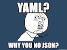
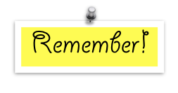

```{r setup, include=FALSE}
library(learnr)
knitr::opts_chunk$set(echo = FALSE,   
                      message = FALSE,
                      warning = FALSE,
                      collapse = TRUE,
                      fig.height = 4,
                      fig.width = 8,
                      fig.align = "center",
                      cache = FALSE)
tutorial_html_dependency()
```

```{r}
library(tidyverse)
library(lubridate)
library(gridExtra)
```

---

class: center, middle

# R Markdown

---


## R Markdown

- Fully reproducible reports -- each time you knit the analysis is ran from the beginning

- Simple markdown syntax for text

- Code goes in chunks, defined by three backticks, narrative goes outside of chunks

---

## Let's take a tour -- R Markdown

<center>
[DEMO]
</center>

Before we move on...

.question[
What is the Bechdel test?
]

--

The Bechdel test asks whether a work of fiction features at least two women who talk to each other about something other than a man, and there must be two women named characters.

--

Concepts introduced:

- Forking a project of mine: "Bechdel"

- Knitting documents

- R Markdown and (some) R syntax

---

## R Markdown tips

- Keep the [R Markdown cheat sheet](https://github.com/rstudio/cheatsheets/raw/master/rmarkdown-2.0.pdf) and Markdown Quick Reference (Help -> Markdown Quick Reference) handy, we'll refer to it often as the course progresses

- The workspace of your R Markdown document is separate from the Console

<br><br>
<center>
[DEMO]
</center>

---

## How will we use R Markdown?

- Every assignment / report / project / etc. is an R Markdown document

- You'll always have a template R Markdown document to start with

- The amount of scaffolding in the template will decrease over the semester

---


# Creating reproducible documents

## What is R Markdown?

[R Markdown home page](http://rmarkdown.rstudio.com/)

- R Markdown is an authoring format that enables easy creation of dynamic documents, presentations, and reports from R. It uses the R packages `rmarkdown` and `knitr` to make it all work.
- It combines the core syntax of __markdown__ (an easy-to-write plain text format) __with embedded R code chunks__ that are run so their output can be included in the final document. 
- R Markdown documents are fully reproducible (they can be automatically regenerated whenever underlying R code or data changes).
- An R Markdown file is a plain text file that has the extension `.Rmd`
- These lecture notes are created using R Markdown, learnr output.

### YAML Headers

The top of the R Markdown file sets up the title, author, date and output format to create. It is called YAML, an acronym for "Yet Another Markup Language"! 

YAML has `---` at the top and bottom. For example, 

```
---
title: "ETC1010: Data Modelling and Computing"
author: "Professor Di Cook""
output: html_document
---
```

And just a few options to create the title, author, date and output. 




Source: https://memegenerator.net/instance/64206149/y-u-no-yaml-why-you-no-json

### Code chunks

Chunks of R code surrounded by "```" and the "{r" specifies that this is R code. You can use other computer languages in the same document. For example this document has embedded a chunk of code, which loads the "tidyverse" library, makes a sample of the diamonds data from that package, and prints it to a table in the notes: 

```{r test, echo=TRUE}
library(tidyverse)
smaller <- diamonds %>% 
  filter(carat <= 2.5)
smaller
```


### Markdown syntax

#### Headings

"#" is a top level heading, or section

"##" is a second level heading, or subsection

"###" is  a third level heading, or subsubsection

#### Lists

"-" or "*" or "+" on the beginning of several lines makes a bullet list

If you use "1.", "2.", ... is creates a numbered lists

Sub-lists can be done by indenting with FOUR spaces, followed by the same syntax. 

For example:

```
- Item A
     - Item a
     - Item aa
- Item B
```

produces:

- Item A
     - Item a
     - Item aa
- Item B

### Links

Simply enter the URL, or if you want different text use "[]" around the text followed by () around the link, eg

```[RStudio cheatsheets](https://www.rstudio.com/resources/cheatsheets/)```

will produce the following link:

[RStudio cheatsheets](https://www.rstudio.com/resources/cheatsheets/)

### Images

A simple way to include images is

``

which embeds the image from the web into your document:


*Note on ethics:* When you use someone else's work, you need to (1) check if it's allowed, that it has a [creative commons license](http://creativecommons.org/licenses/by/4.0/), (2) reference them as the source.

### Making the output

- Click on the "Knit" button to compile your document.

- If you have a big document, build it up in pieces. You can run just one code chunk at a time, or the past several, or even one line of code. The "Run" button has a menu of options of doing the coding in pieces.

### Your turn



**Open your class project when you start RStudio**


1. Create a new notebook using `File > New File > R` Notebook. Read the instructions. Practice running the chunks. Verify that you can modify the code, re-run it, and see modified output.

2. Create a new R Markdown document with `File > New File > R Markdown... Knit` it by clicking the appropriate button. Knit it by using the appropriate keyboard short cut. Verify that you can modify the input and see the output update.

3. Compare and contrast the R notebook and R markdown files you created above. How are the outputs similar? How are they different? How are the inputs similar? How are they different? What happens if you copy the YAML header from one to the other?

4. Give your `.Rmd` file to another member of your team. Have them test if they can compile it on their computer.

## Code chunks

In the code chunks `.Rmd` document, there are many options that are useful to know about.

### Name

Straight after the "```{r" you can use a text string to name the chunk. This has three advantages:

1. You can more easily navigate to specific chunks using the drop-down code navigator in the bottom-left of the script editor.
2. Graphics produced by the chunks will have useful names that make them easier to use elsewhere.
3. You can set up networks of cached chunks to avoid re-performing expensive computations on every run. More on that below.

### `eval = FALSE`

Keeps the code chunk in the document but does not execute it! This can be very useful if you find that your document suddenly won't build. You can turn off the most recent chunks to learn if thay are the culprits causing the error. 

Or if you have a chunk of code that takes a long time to run, you may want to onely run it once and save the output to read in, when you compile the document again. This way the reader can still determine what you have done with the data but you don't have to wait a long time everytime you build the document. 

### `echo = FALSE`

Most of the time you want the report to focus on your results not the code you used to get it. This option will show the results, but not the code. People can still look at your code, if you provide your `.Rmd` file along with the output file.

### Don't print warnings

`message = FALSE` or `warning = FALSE` (and also `error = FALSE` which could be dangerous) prevents messages or warnings from appearing in the finished file.

### Hide results and plots

Sometimes, but not very often, you may want to `results = 'hide'` hides printed output, and `fig.show = 'hide'` hides plots.

### Global options

You can set the default chunk behaviour once at the top of the `.Rmd` file using a chunk like:

```
knitr::opts_chunk$set(
  comment = "#>",
  collapse = TRUE,
  echo = FALSE,
  message = FALSE,
  warning = FALSE,
  fig.width = 4,
  fig.height = 4
)
```

then you will only need to add chunk options when you have the occasional one that you'd like to behave differently.

## Different types of documents

### Your turn

1. Change the output of your current R Markdown file to produce a Word document. See if you can change it to produce pdf - this is harder because it involves installing more software (latex) on your computer, and especially on Windows its tricky.
2. Create a new document that will produce a slide show `File > New R Markdown > Presentation`
3. Create a flexdashboard document - you may need to install the package `flexdashboard` to see this option in the `File > New R Markdown > From template` list.
4. Create a new web app using `File > Shiny Web app`

Take a look at the [R Markdown Gallery](https://rmarkdown.rstudio.com/gallery.html). 

## Making a report


We are going to pull data from the Atlas of Living Australia, and write a short report on Platypus sightings. Install the package `ALA4R` and load it.


```{r echo=TRUE}
# install.packages("ALA4R")
library(ALA4R)
```

Take a look at what the package does using the code `help(package="ALA4R")`

Look up the scientific name for platypus using:

```{r echo=TRUE}
l <- specieslist("platypus")
```

This returns a lot of different organisms with "platypus" in the name, but you should be able to find one line with the relevant information, that its scientific name is "Ornithorhynchus anatinus". Pull all the records for the cute little creature, using:

```{r echo=TRUE, eval=FALSE}
platypus <- occurrences("Ornithorhynchus anatinus", download_reason_id=10)
```

This will generate almost 7Mb of data. We will save this data to a file, so that you have it for future analysis. Create a directory called **data** in your project for the course. This is where we will keep the data sets for the course.

```{r echo=TRUE, eval=FALSE}
save(platypus, file="data/platypus.rda")
```

When you want to use this data again, load it to your R session with:

```{r echo=TRUE}
load("data/platypus.rda")
```

Alternatively, you can save to all sorts of different file formats, eg `csv`, `xls`, using different saving or data output functions. Look up how to write a `csv` file using the function `write_csv` from the `tidyverse` suite of packages.  

Add a section header called "About the data" to your document. Write a paragraph about the "Atlas of Living Australia" and how you pulled the copy of the data. (You could even try adding a picture of a platypus into your report. Be sure that it is an image that you are free to use.)

### Adding plots

Let's make some plots. Two of the variables in the data set are the latitude and longitude indicating where the animal was spotted. This is going to be the first plot, made using the `ggplot2` package from `tidyverse` suite.

Before we can make the plot, though, we need to understand what's in the data. It is a `list` with two components, `data` and `meta`. It is only the first part that we need to start, and it will be easier if we extract this part only.

```{r echo=TRUE}
platydata <- platypus$data
```

Now we can make a plot:

```{r echo=TRUE}
library(tidyverse)
ggplot(data=platydata) + geom_point(aes(x=longitude, y=latitude))
```

There are a lot of points, so using alpha might make it easier to see the density of occurrences.

```{r echo=TRUE}
ggplot(data=platydata) + geom_point(aes(x=longitude, y=latitude), alpha=0.1)
```

If you are good at recognising the shape of Australia, you might realise that the sightings are all along the east coast and Tasmania. There is a strange location, that looks like someone saw one in Antarctica! We might need to filter this observation out later, because its extremely unlikely to have been found that far south.

But, we can make it look a bit more like Australia by making a map projection.


```{r  echo=TRUE, fig.height=6, eval=FALSE}
ggplot(data=platydata) + 
  geom_point(aes(x=longitude, y=latitude), alpha=0.1) +
  coord_map()
```

The locations would be even more recognisable if we added a real map underneath. One way this can be done is to use a google map. The `ggmap` package has an interface to extracting google maps. Install it and then grab a map of Australia with this code.

```{r echo=TRUE, eval=FALSE}
library(ggmap)
#register_google(XXX) You need to register with google to get maps now
oz <- get_map(location=c(lon=133.8807, lat=-23.6980), zoom=4)
save(oz, file="data/oz.rda")
```

```{r echo=TRUE}
library(ggmap)
load("data/oz.rda")
ggmap(oz) + 
  geom_point(data=platydata, aes(x=longitude, y=latitude), 
              alpha=0.1, colour="orange")
```

Write a couple of paragraphs about the locations of platypus in Australia, based on the map that you have created.

### Temporal trend

The date of the sighting is another variable in the data set. Let's make a plot of the sightings over time. The variable is called `eventDate`. It is considered to be a `character` variable by R, so the first step is to get R to recognise that it is a date time object.

```{r echo=TRUE}
library(lubridate)
platydata <- platydata %>% 
  mutate(eventDate = ymd(eventDate))
```

then we can simply plot occurrence over time.

```{r echo=TRUE}
ggplot(data=platydata) +
  geom_point(aes(x=eventDate, y=1))
```

There are some records dating back before 1800. There were only records from 1770! And these first records are in the database!

```{r eval=FALSE}
# Check odd cases
platydata %>% filter(latitude < (-50)) 
# These just have the lat/long wrong
platydata %>% filter(eventDate < ymd("1850-01-01")) 
```

Let's focus on records since 1900, and count the number for each year.

```{r echo=TRUE}
platydata1900 <- platydata %>% filter(year>1900) %>%
  count(year) 
ggplot(data=platydata1900) +
  geom_point(aes(x=year, y=n))
```

Add a trend line.

```{r echo=TRUE}
ggplot(data=platydata1900, aes(x=year, y=n)) +
  geom_point() +
  geom_smooth(se=F)
```

Make it interactive so that we can investigate some observations.

```{r echo=TRUE}
library(plotly)
ggplotly()
```


*Discussion question:* Was there a population explosion in 1980 and 2004? Is the population of platypus been increasing since 1900, and descreasing in the last decade?

Add a new section to your report, titled "Temporal patterns". Write a couple of paragraphs on what you have learned about the data over time.

### Check 

Give your `.Rmd` file and data set to one of your team mates to compile. 

## Lab quiz

Take the quiz for today from ED.

## Share and share alike

<a rel="license" href="http://creativecommons.org/licenses/by-nc-sa/4.0/"></a><br />This work is licensed under a <a rel="license" href="http://creativecommons.org/licenses/by-nc-sa/4.0/">Creative Commons Attribution-NonCommercial-ShareAlike 4.0 International License</a>.

