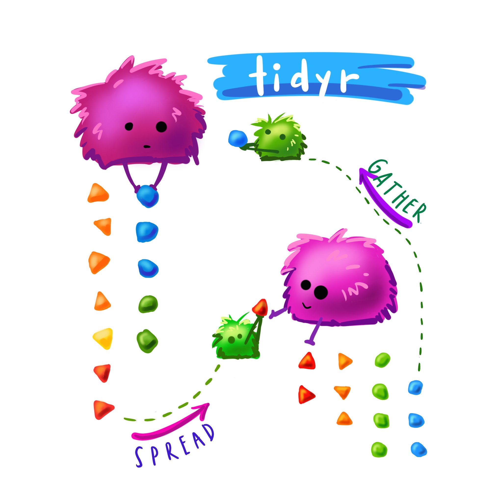

```{r setup, include=FALSE}
library(emo) 
library(knitr) 
opts_chunk$set(echo = TRUE,   
                      message = FALSE,
                      warning = FALSE,
                      collapse = TRUE,
                      fig.height = 4,
                      fig.width = 8,
                      fig.align = "center",
                      cache = FALSE,
                      comment = NA )
```

class: bg-blue

.vvvhuge.white.center.middle[
What is this song?
]


---

A note on difficulty

* This is not a programming course
* This is a course about data, modelling, and computing. 
* At the moment, you might be sitting there, feeling a bit confused about where we are, what are are doing, what R is, and how it even works.
* The theory of this class will only get you so far
* the real learning happens from doing the data analysis - the **pressure of a deadline also forces you to write more**


---
class: bg-black

.gigantic.white.middle.center[
Recap
]

---
class: bg-main1

Survey: 
- Traffic Light System: .green[Green = "good!"] ; .red[Red = "Help!"]
- R + Rstudio
- Tower of babel analogy for writing R code
- We are using ___, not ___ for ETC1010?
- Functions are  ___
- columns in data frames are accessed with ___ ?
- packages are installed with ___ ?
- packages are loaded with ___ ?
- Why do we care about Reproducibility?
- Output + input of rmarkdown
- I have an assignment group
- If I have an assignment group, have recorded my assignment group in the ED survey

```{r countdown}
countdown(minutes = 3)
```

---

# Today: Outline

- Motivation
- Terminology of data
- Different examples of data 
- Steps in making data tidy
- Lots of examples

---

.pull-left[
```{r clean-data-img}

```
]

.pull-right[

You're ready to sit down with a newly-obtained dataset, excited about how it will open a world of insight and understanding, and then find you can't use it. You'll first have to spend a significant amount of time to restructure the data to even begin to produce a set of basic descriptive statistics or link it to other data you've been using.
]

---

.blockquote[
"Tidy data" is a term meant to provide a framework for producing data that conform to standards that make data easier to use. Tidy data may still require some cleaning for analysis, but the job will be much easier.
--John Spencer
]

Source: [Measure Evaluation](https://www.measureevaluation.org/resources/newsroom/blogs/tidy-data-and-how-to-get-it)


---

* I want to take the first 15 minutes of class to discuss two ideas:

1. How to google things effectively
2. How to learn new things

---

# How to google a thing

Let's say we are presented with some new idea, we need to know how to explore it efficiently.

---

# Learning new things

The thing that differentiates novices, nexperts, and experts is ...


---

* I expect you to do the readings before class
* This weeks idea of tidy data is one of the more challenging aspects of data analysis. 
* This also means that it can be challenging to teach!
* I want to take the first 10 minutes of class to explain 5 

---

Before we start, we need to have a short discussion on some key functions to use in data cleaning. These are these five functions:

* select
* filter
* arrange
* mutate
* summarise


---

Describe how these are related to each other, what they do, and how they work.

---

# Go to the rstudio.cloud

- Open Lecture 2A.
- Notice the `data/` directory:
    - `graduate-programs.csv`
    - `genes.csv`
    - `ASN00086282.dly`
    - `TB_notifications_2018-03-18.csv`
    - `french_fries.rda`
    - `rates.csv`
    - `WebAirport_FY_1986-2017.xls`
- Open the `graduate-programs.Rmd` file

```{r cd-graduate-programs}
countdown(minutes = 2)
```

---

## Example: US graduate programs

This is data from a study on US grad programs. It originally came in an excel file containing rankings of many different programs. This data set contains information on four programs astronomy, economics, entomology and psychology. 

```{r readgrad}
library(tidyverse)
grad <- read_csv("data/graduate-programs.csv")
grad %>% top_n(10)
```

What's good about the format?

- Rows contain information about the institution
- Columns contain types of information, like average number of publications, average number of citations, % completion, 

It makes it easy to make summaries:

```{r gradsummary}
grad %>% count(subject)
grad %>% filter(subject == "economics") %>%
  summarise(m=mean(NumStud), s=sd(NumStud))
grad %>% filter(subject == "economics") %>%
  ggplot(aes(x=NumStud, y=MedianTimetoDegree)) +
  geom_point() + theme(aspect.ratio=1)
```

---

What do we learn from these summaries?

"The average number of graduate students per economics program is:"

- "about 61"
- about 39

"What is the best description of the relationship between number of students and median time to degree?"

- "as the number of students increases the median time to degree increases, weakly"
- as the number of students increases the variability in median time to degree decreases

---

## Terminology of data: Variable

- A __variable__ is a quantity, quality, or property that you can measure. For the grad programs, these would be all the column headers.

---

## Terminology of data: Observation

- An __observation__ is a set of measurements made under similar conditions (you usually make all of the measurements in an observation at the same time and on the same object). An observation will contain several values, each associated with a different variable. I'll sometimes refer to an observation as a data point. For the grad programs, this is institution, and program, uniquley define the observation.

---

## Terminology of data: Value

- A __value__ is the state of a variable when you measure it. The value of a variable typically changes from observation to observation.

---

## Tidy tabular form

__Tabular data__ is a set of values, each associated with a variable and an observation. Tabular data is __tidy__ iff (if and only if):

* Each observation in its own row,
* Each variable in its own column, 
* Each value is placed in its own `cell`.

---

# The grad program

Is in tabular form. 

It also is in **wide** tidy form, because there are multiple columns containing different variables.

It can also be useful - for the process of data analysis - to arrange data into **long** tidy form, where each value is uniquely identified.

```{r grad-gather}
grad %>% gather(variable, value, -subject, -Inst)
```

---

## Different examples of data

For each of these data examples, **let's try together to identify the variables and the observations** - some are HARD!

---

### Genes experiment

`r ji("thinking")`

```{r}
genes <- read_csv("data/genes.csv")
genes 
```

---

### Melbourne weather

What are the variables? Observations?

`r ji("scared")`

```{r}
melbtemp <- read_fwf("data/ASN00086282.dly", 
   col_positions=fwf_widths(c(11, 4, 2, 4, 
        rep(c(5, 1, 1, 1), 31))))
melbtemp %>% select(X1, X2, X3, X4, X5, X9, 
          X13, X17, X21, X25, X29, X33)
```

---

### TB incidence

This is current tuberculosis data taken from [WHO](http://www.who.int/tb/country/data/download/en/), the case notifications table.

`r set.seed(2018); ji("sick")`

```{r}
tb <- read_csv("data/TB_notifications_2018-03-18.csv") %>%
  select(country, year, starts_with("new_sp_")) %>%
  filter(year>1996, year<2012)
tb %>% top_n(20)
```

---

### French fries

10 week sensory experiment, 12 individuals assessed taste of french fries on several scales (how potato-y, buttery, grassy, rancid, paint-y do they taste?), fried in one of 3 different oils, replicated twice. First few rows:

```{r}
load("data/french_fries.rda")
french_fries %>% top_n(10)
```

```{r graph-french-fries}
include_graphics("images/french_fries.png")
```

What are the variables? Observations?

---

# Rude Recliners contingency table

This data is collated from this story: [41% Of Fliers Think You're Rude If You Recline Your Seat](http://fivethirtyeight.com/datalab/airplane-etiquette-recline-seat/)

```{r}
fly <- read_csv("data/fly_tbl.csv")
fly
```

What are the variables?

---

## Messy vs tidy

Messy data is messy in its own way. You can make unique solutions, but then another data set comes along, and you have to again make a unique solution. 

Tidy data can be though of as legos. Once you have this form, you can put it together in so many different ways, to make different analyses.


---

## Data Tidying verbs



Source: A drawing made by Alison Horst [@allison_horst](https://twitter.com/allison_horst?lang=en) 

- `gather`: Specify the **keys** (identifiers) and the **values** (measures) to make long form data. You can also think of this as longer form data.
- `spread`: Variables in columns
- `separate`: Split one column into many

---

# one more time: `gather`

.pull-left[
```r
gather(<DATA>,
       <KEY>,
       <VALUE>,
       <COLUMNS TO SELECT>)
```
]

.pull-right[
* Key is ...
* value is ..
* columns to select look like this: ...
]

---

# gather: example

---

## Tidying genes data

```{r}
genes
genes_long <- genes %>% 
  gather(variable, expr, -id) 
genes_long
```

---

### Separate columns

```{r}
genes_long %>%
  separate(variable, c("trt", "leftover"), "-") 
```

--- 

## Separate columns

```{r}
genes_long %>%
  separate(variable, c("trt", "leftover"), "-") %>%
  separate(leftover, c("time", "rep"), "\\.") 
```

---

### Now spread to examine different aspects

#### Examine treatments against each other

```{r}
genes_long <- genes_long %>%
  separate(variable, c("trt", "leftover"), "-") %>%
  separate(leftover, c("time", "rep"), "\\.") 
genes_long %>%
  spread(trt, expr) %>%
  ggplot(aes(x=WI, y=WM, colour=id)) + geom_point()
```

Generally, some negative association within each gene, WM is low if WI is high. 

---

#### Examine replicates against each other

```{r}
genes_long %>%
  spread(rep, expr) %>%
  ggplot(aes(x=R1, y=R4, colour=id)) + 
  geom_point() + coord_equal()
```

Very roughly, replicate 4 is like replicate 1, eg if one is low, the other is low. That's a good thing, that the replicates are fairly similar.

---

## Try this yourself

Here is a little data set to practice gather, spread and separate on.

```{r}
kb <- read_csv("data/koala_bilby.csv")
kb
```

Try to do these by yourself, but the code is in the Rmd file if you need help.

---

### Exercise 1

Gather the data into long form, naming the two new variables, `label` and `count`

```{r echo=FALSE}
kb_long <- kb %>% gather(label, count, -ID)
kb_long
```

### Exercise 2

Separate the labels into two new variables, `animal`, `state`

```{r echo=FALSE}
kb_long <- kb_long %>%
  separate(label, c("animal", "state"))
kb_long
```

### Exercise 3

Spread the long form data into wide form, where the columns are the states. 
```{r echo=FALSE}
kb_long %>% spread(state, count)
```

### Exercise 4

Spread the long form data into wide form, where the columns are the animals. 

```{r echo=FALSE}
kb_long %>% spread(animal, count)
```

---

Go to the data source: [https://www1.ncdc.noaa.gov/pub/data/ghcn/daily/readme.txt](https://www1.ncdc.noaa.gov/pub/data/ghcn/daily/readme.txt)

```{r units, echo=FALSE}
quiz(
  question("Which is the best description of the temperature units? ",
    answer("degrees farehnheit F"),
    answer("degrees Kelvin K"),
    answer("degrees C x10", correct = TRUE)),
  question("What is the best description of the precipitation units",
    answer("mm x10", correct = TRUE),
    answer("inches")),
  question("What does -9999 mean?",
    answer("it was really cold"),
    answer("the keyboard got stuck"),
    answer("the value was missing", correct = TRUE))
)
```

---

# Exercise 1: Rude Recliners 

- [41% Of Fliers Think You're Rude If You Recline Your Seat](http://fivethirtyeight.com/datalab/airplane-etiquette-recline-seat/). 

In the following table, V1 is a response to the question "Is it rude to recline your seat on a plane?", and V2 is the response to the question "Do you ever recline your seat when you fly?". The data is in the form of a contingency table.

```{r}
fly_tbl <- read_csv("data/fly_tbl.csv")
fly_tbl
```

a. What are the variables and observations in this data?
b. Put the data in tidy long form (using the names `V2` as the key variable, and `count` as the value). 
c. Use the `rename` function to make the variable names a little shorter.

You can get the data from  [data/fly_tbl.csv](http://dmac.dicook.org/lectures/data/fly_tbl.csv) 

```{r echo=FALSE, eval=FALSE}
library(tidyverse)
fly_tbl <- read_csv("data/fly_tbl.csv")
fly_tbl %>% gather(V2, count, -V1)
```

---

# Exercise 2: Tuberculosis Incidence data

open: `tb-incidence.Rmd`

Tidy the TB incidence data.

- Write down the steps that will be needed go from raw data to tidy
- Write the code piece by piece

```{r echo=FALSE, eval=FALSE}
tb <- read_csv("data/TB_notifications_2018-03-18.csv") %>%
  select(country, year, starts_with("new_sp_")) %>%
  filter(year>1996, year<2012)
tb %>% top_n(20)
tb_tidy <- tb %>% 
  gather(stuff, count, starts_with("new_sp_")) %>%
  separate(stuff, c("stuff1", "stuff2", "genderage")) %>%
  separate(genderage, c("gender", "age"), sep=1) %>%
  select(-stuff1, -stuff2)
tb_tidy
```

---

## Exercise 3: Currency rates

* open `currency-rates.Rmd`
* read in `rates.csv`
* Answer the following questions:

1. What are the variables and observations?
2. Gather the five currencies, AUD, GBP, JPY, CNY, CAD, make it into tidy long form.
3. Make line plots of the currencies, like the plot below, and describe the similarities and differences between the currencies. 

# Exercise 4: Australian Airport Passengers

* Open `oz-airport.Rmd`
* This contains data from the web site [Department of Infrastructure, Regional Development and Cities](https://bitre.gov.au/publications/ongoing/airport_traffic_data.aspx), containing data on Airport Traffic Data 1985–86 to 2016–17.
* Extract the "Airport Passengers" table into R
* Tidy the data, to produce a data set with these columns
    - airport: all of the airports. 
    - year 
    - type_of_flight: DOMESTIC, INTERNATIONAL
    - bound: IN or OUT

---

# Lab quiz

Time to take the lab quiz.

---

## Share and share alike

<a rel="license" href="http://creativecommons.org/licenses/by-nc-sa/4.0/"></a><br />This work is licensed under a <a rel="license" href="http://creativecommons.org/licenses/by-nc-sa/4.0/">Creative Commons Attribution-NonCommercial-ShareAlike 4.0 International License</a>.

???

# Morgue

## Course web site

This is a link to the course web site, in case you need to go back and forth between tutorial and web materials: http://dmac.dicook.org

# Tidying Melbourne weather

This is seriously messy!

Read the data first, just the columns that we need. The data is in fixed column width format, which means a certain number of columns are designated for the particular records, eg columns 1-11 contains the station id, columns 12-15 contain the year, ...

```{r}
melbtemp <- read_fwf("data/ASN00086282.dly", 
   col_positions=fwf_widths(c(11, 4, 2, 4, 
        rep(c(5, 1, 1, 1), 31)), 
        col_names = c("station", "year", "month",
              "variable", paste0("X", 5:128))))
melbtemp
```

X5, X9, ... contain the temperature and precipitation records. The remaining columns have data quality flags. We want to ignore the data quality flags for now, and select every fourth variable.

---

### Sometime easier to index select

- `[...]` allows indexing of elements of a vector, or collection of numbers
- `c(1:4, seq(5,128,4))` means collect items 1 through 4, and then every 4th item until the 128'th

```{r}
melbtemp <- melbtemp[,c(1:4, seq(5, 128, 4))] 
melbtemp
```

---

### Make long form

```{r}
melbtemp_long <- melbtemp %>% 
  gather(day, value, X5:X125)
melbtemp_long
```

This is basically what we need. The day variable doesn't have the right values in it, but we can fix this later.

### Use spread to look at different things

But there are a couple of things that I need to fix to make it possible to do these plots. We will discuss these operations next week.

```{r}
melbtemp_long <- melbtemp_long %>% 
  filter(variable %in% c("TMIN", "TMAX", "PRCP")) %>%
  mutate(value = ifelse(value == -9999, NA, value))
```

### What are the numbers?

- What is the range of temperature and precipitation?
- What units could this be in?
- Why are some values -9999?


### Now use spread

#### Max vs Min

```{r}
melbtemp_long %>% spread(variable, value) %>%
  ggplot(aes(x=TMIN, y=TMAX)) + geom_point() + 
  coord_equal() + geom_abline(slope=1, intercept=0)
```

Oh, TMAX is always higher than TMIN. This is a good thing.

#### Winter vs Summer

```{r}
melbtemp_long %>% 
  filter(variable == "TMAX") %>%
  spread(month, value) %>%
  ggplot(aes(x=`07`, y=`01`)) + geom_point() + 
  xlab("July") + ylab("Jan") +
  coord_equal() + geom_abline(slope=1, intercept=0)
```

Same day of the month, same year, January has higher maximum temperatures than July. Except two days, the July max exceeded the January max. (This comparison is a bit whacky, though right?)
