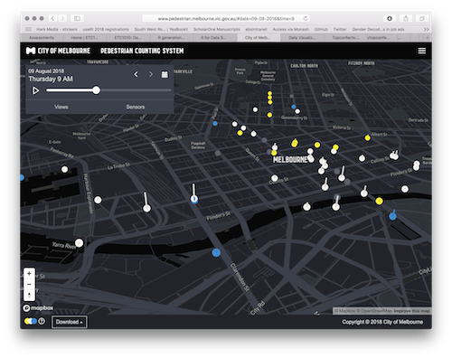

```{r setup}

library(tidyverse)
```

# Our Turn:

.huge[
- Open rstudio.cloud and check out Lecture 3B and follow along.
]

# Example: pedestrian sensor

```{r show-pedestrian-sensor, echo = FALSE, out.width = "100%"}

```

# [Melbourne pedestrian sensor portal](http://www.pedestrian.melbourne.vic.gov.au/):

- Contains hourly counts of people walking around the city. 
- Extract records for 2018 for the sensor at Melbourne Central
- Use lubridate to extract different temporal components, so we can study the pedestrian patterns at this location. 


```{r rwalkr-load}
library(rwalkr)
walk_all <- melb_walk_fast(year = 2018)
library(dplyr)

walk <- walk_all %>% filter(Sensor == "Melbourne Central")

write_csv(walk, path = "data/walk_2018.csv")
```

```{r read-walk}
walk <- readr::read_csv("data/walk_2018.csv")
walk
```

# Let's think about the data structure.

- The basic time unit is hour of the day. 
- Date can be decomposed into 
    - month
    - week day vs weekend
    - week of the year
    - day of the month
    - holiday or work day
    

```{r image-time, out.wdith = "100%"}
include_graphics("images/Time.png")
```


# What format is walk in?

```{r print-walk}
walk
```


# Create variables with these different temporal components. 

```{r walk-tidy}
walk_tidy <- walk %>%
  mutate(month = month(Date,  label = TRUE, abbr = TRUE), 
         wday = wday(Date, label = TRUE, abbr = TRUE, week_start = 1))
walk_tidy
```

# Pedestrian count per month

```{r gg-walk-month-count, eval = FALSE}
ggplot(walk_tidy,
       aes(x = month, 
           y = Count)) + 
  geom_col()
```  

```{r gg-walk-month-count-out, ref.label = 'gg-walk-month-count', echo = FALSE, out.width = "100%"}

```

- January has a very low count relative to the other months. Something can't be right with this number, because it is much lower than expected.
- The remaining months have roughly the same counts.

# Pedestrian count per weekday

```{r gg-wday-count}
ggplot(walk_tidy,
       aes(x = wday,
           y = Count)) + 
  geom_col()
```  

How would you describe the pattern?

- Friday and Saturday tend to have a few more people walking around than other days.

# What might be wrong with these interpretations?

- There might be a different number of days of the week over the year.
- This means that simply summing the counts might lead to a misinterpretation of pedestrian patterns. 
- Similarly, months have different numbers of days.

# Your Turn: Brainstorm with your table a solution, to answer these questions:

1. Are pedestrian counts different depending on the month?
2. Are pedestrian counts different depending on the day of the week?

# What are the number of pedestrians per day?

```{r walk-day}
walk_day <- walk_tidy %>% 
  group_by(Date) %>%
  summarise(day_count = sum(Count, na.rm = TRUE))

walk_day
```


# What are the mean number of people per weekday?

```{r walk-day-summarise}
walk_week_day <- walk_day %>%
  mutate(wday = wday(Date, label = TRUE, abbr = TRUE, week_start = 1)) %>% 
  group_by(wday) %>%
  summarise(m = mean(day_count, na.rm = TRUE),
            s = sd(day_count, na.rm = TRUE))

walk_week_day
```


```{r gg-walk-day, fig.width = 8, fig.height = 3}
ggplot(walk_week_day) + 
  geom_errorbar(aes(x = wday, ymin = m - s, ymax = m + s)) +
  ylim(c(0, 45000)) +
  labs(x = "Day of week", 
       y = "Average number of predestrians")
```  

# Distribution of counts

Side-by-side boxplots show the distribution of counts over different temporal elements.

# Hour of the day

```{r gg-time-count, fig.width = 8, fig.height = 3}
ggplot(walk_tidy,
       aes(x = as.factor(Time), y = Count)) + 
  geom_boxplot()
```

# Day of the week

```{r gg-walk-weekday-count, fig.width = 8, fig.height = 3}
ggplot(walk_tidy,
       aes(x = wday,
           y = Count)) +
  geom_boxplot()
```

# Month

```{r gg-month-count-boxplot, cache = TRUE, , fig.width = 8, fig.height = 3}
ggplot(walk_tidy,
       aes(x = month, 
           y = Count)) + 
  geom_boxplot()
```

# Time series plots: Lines show consecutive hours of the day.

```{r gg-time-count-line, cache = TRUE, , fig.width = 8, fig.height = 3}
ggplot(walk_tidy, aes(x = Time, y = Count, group = Date)) + 
  geom_line()
```

# By month

```{r gg-time-count-by-date, fig.height=3, fig.width = 8}
ggplot(walk_tidy, aes(x = Time, y = Count, group = Date)) +
  geom_line() +
  facet_wrap( ~ month)
```

# By week day

```{r gg-time-count-line-facet-grid, fig.width = 8, fig.height = 3, cache = TRUE}
ggplot(walk_tidy, aes(x = Time, y = Count, group = Date)) +
  geom_line() +
  facet_grid(month ~ wday)
```

# Calendar plots

.left-code[
```{r calendar-plot}
library(sugrrants)

walk_tidy_calendar <- 
  frame_calendar(walk_tidy,
                 x = Time, 
                 y = Count, 
                 date = Date, 
                 nrow = 4)

p1 <- ggplot(walk_tidy_calendar,
       aes(x = .Time, 
           y = .Count, 
           group = Date)) +
  geom_line()

prettify(p1)
```  

# Holidays

```{r show-tsibble, out.width = "100%"}

```

```{r holiday-plot, fig.height=6, cache = TRUE}
library(tsibble)
library(sugrrants)
vic_holidays <- holiday_aus(2018, state = "VIC")

walk_holiday <- walk_tidy %>%
  mutate(holiday = if_else(condition = Date %in% vic_holidays$date, 
                          true = "yes", 
                          false = "no")) %>%
  mutate(holiday = if_else(condition = wday %in% c("Sat", "Sun"), 
                          true = "yes", 
                          false = holiday)) 

walk_holiday_calendar <- frame_calendar(data = walk_holiday,
                                        x = Time, 
                                        y = Count, 
                                        date = Date, 
                                        nrow = 4)

p2 <- ggplot(walk_holiday_calendar,
       aes(x = .Time, 
           y = .Count, 
           group = Date, 
           colour = holiday)) +
  geom_line() + 
  scale_colour_brewer(palette = "Dark2")

prettify(p2)
```

---

# Your Turn: 

.huge[

- Do the lab exercises
- Take the lab quiz
- Use the rest of the lab time to coordinate with your group on the first assignment.

]

# Lab exercise

## Pull the 2019 data for the sensor Birrarung Marr. Make plots to answer these questions. 

```{r walk-burra}
walk_birra <- walk_all %>% filter(Sensor == "Birrarung Marr")
```

## Is there the same daily pattern as observed at Melbourne Central? If not, how does it differ?

> Hint: combine the Birrarung Marr data with Melbourne central data (walk) using `bind_rows()`. Or even subset the original data that has all the obsercations into something that has melbourne central AND birrarung marr. There are many ways to get to the same answer.

```{r bind-both}
walk_both <- bind_rows(___,
                       ___)
```

## Can you detect special events, like the Australian Open tennis, based on pedestrian counts?  

> hint: try using a calendar plot from above

```{r calendar-plot}

```


## What dates does it appear that there were events on? 


## Can you match these with known events, found from web searching?
