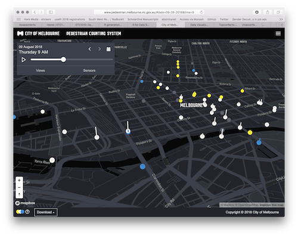
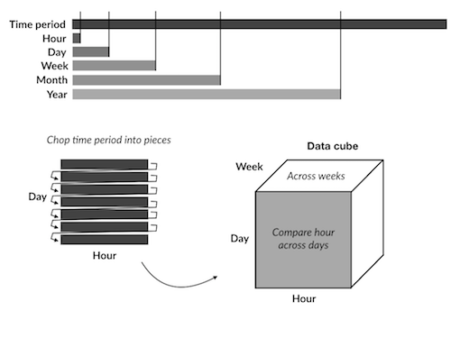

```{r setup, include=FALSE}
library(learnr)
knitr::opts_chunk$set(echo = TRUE,   
                      message = FALSE,
                      warning = FALSE,
                      collapse = TRUE,
                      fig.height = 4,
                      fig.width = 8,
                      fig.align = "center",
                      cache = FALSE)
tutorial_html_dependency()
```

# More on temporal data and visualisation

## Course web site

This is a link to the course web site, in case you need to go back and forth between tutorial and web materials: http://dmac.dicook.org

## Overview

- Working with dates
- Building up data plots

## Working with dates

There are numerous challenges of working with date variables

+ The conventional order of day, month, year is different across location
+ Years do not have the same number of days? 
+ Months have differing numbers of days.
+ Not every minute has 60 seconds
+ Times are local, for us. Where are you?
+ What day of the week is it? Day of the month? Week in the year?
+ Years start on different days, Monday, Sunday, ...
+ Months could be numbers or names. Days could be numbers of names. Each has abbreviations. 
+ Time can be relative. How many days until we go on holidays?

The `lubridate` package makes is easier to work with date/time classes. It helps parse the values, create new variables based on components like month, day, year, and do algebra on time.


### Parsing dates with time zones

```{r echo=TRUE}
library(lubridate)
library(tidyverse)
ymd("20180810")
ymd("2018-08-10")
ymd("2018/08/10")
mdy("10/15/2018")
dmy("10/08/2018")
```

If you add a time zone, what changes?

```{r echo=TRUE}
ymd("2018-08-10", tz = "Australia/Melbourne")
```

What happens if you try to specify the timezone with `AEST`?

`ymd("2018-08-10", tz = "AEST")`

```{r echo=TRUE}
ymd("2018-08-10", tz = "Africa/Abidjan")
ymd("2018-08-10", tz = "America/Anchorage")
ymd("2018-08-10", tz = "America/Los_Angeles")
```

A list of acceptable time zones can be found at https://en.wikipedia.org/wiki/List_of_tz_database_time_zones

Time zones may make more sense with functions like:

```{r echo=TRUE}
today()
today(tz = "America/Los_Angeles")
now()
now(tz = "America/Los_Angeles")
```

### Parsing date with times

```{r echo=TRUE}
ymd_hms("2018-08-10 10:05:30", tz = "Australia/Melbourne")
ymd_hms("2018-08-10 10:05:30", tz = "America/Los_Angeles")
```

### Extracting temporal elements

Very often we want to know what day of the week it is, because trends and patterns in data can be quite different depending on whether it is a week day or weekend, or simply day (like a market day could be Wednesday). There are various ways to specify day of the week, as a number (this can be confusing, which is 1, Sunday, Monday or even Saturday) or text, or abbreviated text. When we talk with people we would like to use the day name, but operating on days might be useful to have it represented as a number. 

```{r echo=TRUE}
wday("2018-08-10")
wday("2018-08-10", label = TRUE)
wday("2018-08-10", label = TRUE, abbr = FALSE)
wday("2018-08-10", label = TRUE, week_start = 1)
```

Similarly, we can extract what month the day is in.

```{r echo=TRUE}
month("2018-08-10")
month("2018-08-10", label = TRUE)
month("2018-08-10", label = TRUE, abbr = FALSE)
```

Fiscally, it can be useful to know what quarter the day is in.

```{r echo=TRUE}
quarter("2018-08-10")
semester("2018-08-10")
```

Similarly, we can select days within a year. 

```{r echo=TRUE}
yday("2018-08-10")
```

## Example: pedestrian sensor



The [Melbourne pedestrian sensor portal](http://www.pedestrian.melbourne.vic.gov.au/) contains hourly counts of people walking around the city. We will extract all of the records for 2017 for the sensor at Melbourne Central, use the lubridate functions to extract different temporal components, to study the pedestrian patterns at this location. 

```{r eval=FALSE}
library(rwalkr)
ped <- run_melb(year=2017, sensor="Melbourne Central")
save(ped, file="data/ped.rda")
```


```{r echo=FALSE}
load("data/ped.rda")
ped
```


It could be useful to think about the data structure.



- The basic time unit is hour of the day. 
- Date can be decomposed into 
    - month
    - week day vs weekend
    - week of the year
    - day of the month
    - holiday or work day

Create variables with these different temporal components. 

```{r}
ped <- ped %>%
  mutate(month = month(Date, label = TRUE, abbr = TRUE), 
         wday = wday(Date, label=TRUE, abbr=TRUE,
                     week_start=1))
```

### Make some plots

```{r}
ped %>% ggplot(aes(x=month, y=Count)) + geom_col()
```

How would you describe the pattern?

- January has a very low count relative to the other months. Something can't be right with this number, because it is much lower than expected.
- The remaining months have roughly the same counts.

```{r}
ped %>% ggplot(aes(x=wday, y=Count)) + geom_col()
```

How would you describe the pattern?

- Friday and Saturday tend to have a few more people walking around than other days.

### What might be wrong with these interpretations?

There might be a different number of days of the week over the year, simply summing the counts might lead to a misinterpretation of pedestrian patterns. Similarly months have different numbers of days.

### To think about

Brainstorm with your table a solution, to answer these questions:

1. Are pedestrian counts different depending on the month?
2. Are pedestrian counts different depending on the day of the week?

```{r echo=FALSE, eval=FALSE}
ped_day <- ped %>% group_by(Date) %>%
  summarise(dayCount=sum(Count, na.rm=TRUE))
ped_wday <- ped_day %>% 
  mutate(wday = wday(Date, label=TRUE, abbr=TRUE, week_start=1)) %>%
  group_by(wday) %>%
    summarise(m=mean(dayCount, na.rm=TRUE), s=sd(dayCount, na.rm=TRUE))
ggplot(ped_wday) + geom_errorbar(aes(x=wday, ymin=m-s, ymax=m+s)) + 
  ylim(c(0, 45000)) + 
  ylab("Average number of predestrians") + 
  xlab("Day of week")
```

### Beyond aggregation

Side-by-side boxplots show the distribution of counts over different temporal elements.

#### Hour of the day

```{r}
ped %>% ggplot(aes(x=as.factor(Time), y=Count)) + geom_boxplot()
```

#### Day of the week

```{r}
ped %>% ggplot(aes(x=wday, y=Count)) + geom_boxplot()
```

#### Month

```{r}
ped %>% ggplot(aes(x=month, y=Count)) + geom_boxplot()
```

### Incorporating time

Use a line plot to indicate consecutive hours of the day.

```{r}
ped %>% ggplot(aes(x=Time, y=Count, group=Date)) + geom_line()
```

By month

```{r fig.height=6}
ped %>% ggplot(aes(x=Time, y=Count, group=Date)) + 
  geom_line() +
  facet_wrap(~month)
```

Also by day

```{r fig.height=8}
ped %>% ggplot(aes(x=Time, y=Count, group=Date)) + 
  geom_line() +
  facet_grid(month~wday)
```

### On a calendar

```{r fig.height=6}
library(sugrrants)
p1 <- ped %>% 
  frame_calendar(x = Time, y = Count, date = Date, nrow = 4) %>%
  ggplot(aes(x = .Time, y = .Count, group = Date)) +
  geom_line()
prettify(p1)
```

### Holidays

```{r fig.height=6}
library(tsibble)
vic_holidays <- holiday_aus(2017, state = "VIC")
ped <- ped %>%
  mutate(holiday = ifelse(Date %in% vic_holidays$date, "yes", "no")) %>%
  mutate(holiday = ifelse(wday %in% c("Sat", "Sun"), "yes", holiday)) 
p1 <- ped %>% 
  frame_calendar(x = Time, y = Count, date = Date, nrow = 4) %>%
  ggplot(aes(x = .Time, y = .Count, group = Date, colour=holiday)) +
  geom_line() + scale_colour_brewer(palette = "Dark2")
prettify(p1)
```

## Lab exercise

Pull the 2017 data for the sensor Birrarung Marr. Make plots to answer these questions. 

1. Is there the same daily pattern as observed at Melbourne Central? If not, how does it differ?
2. Can you detect special events, like the Australian Open tennis, based on pedestrian counts?  What dates does it appear that there were events on? Can you match these with known events, found from web searching?
