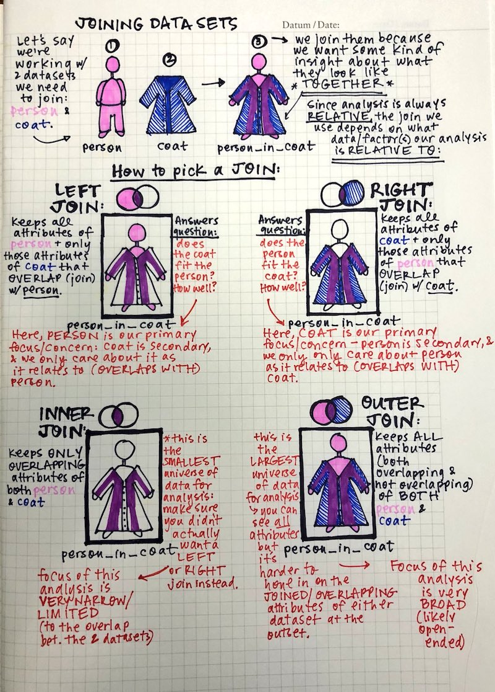

```{r setup, include=FALSE}
library(emo)
library(tidyverse)
library(knitr)
library(lubridate)
knitr::opts_chunk$set(
  fig.width = 4.25,
  fig.height = 3.5,
  fig.retina = 3,
  fig.align = "center",
  out.width = "100%",
  message = FALSE,
  warning = FALSE,
  cache = TRUE,
  autodep = TRUE,
  hiline = TRUE
)

knitr::opts_hooks$set(fig.callout = function(options) {
  if (options$fig.callout) {
    options$echo <- FALSE
    options$out.height <- "99%"
    options$fig.width <- 16
    options$fig.height <- 8
  }
  options
})

options(
  htmltools.dir.version = FALSE,
  width = 90,
  max.print = 9999,
  knitr.table.format = "html"
)

as_table <- function(...) knitr::kable(..., format = "html", digits = 3)
```

class: bg-blue center middle

.vvhuge.white[
While the song is playing...
]

.vhuge.white[
Draw a mental model / concept map of last lectures content on joins.
]

---

# recap

.vhuge[
- Joins
- venn diagrams
- feedback
]

---

# Joins with a person and a coat, by [Leight Tami](https://twitter.com/leigh_tami18/status/1021471889309487105/photo/1)

```{r joins-coat, echo = FALSE}

```


---

# Upcoming Due Dates

.vhuge[
- Assignment 2: Thursday 5th September, 5pm 
- Stay tuned on ED for the upcoming dates
]

---
class: bg-main1

# Making effective data plots

.huge[
1. Principles / science of data visualisation
2. Features of graphics
]

---
class: bg-main1

# Principles / science of data visualisation

.huge[
  - Palettes and colour blindness
  - change blindness
  - using proximity
  - hierarchy of mappings
    ]

---
class: bg-main1

# Features of graphics 

.huge[
  - Layering statistical summaries
  - Themes
  - adding interactivity
]

---
class: bg-main5

# Palettes and colour blindness

.huge[
There are three main types of colour palette:

- Qualitative: categorical variables
- Sequential: low to high numeric values
- Diverging: negative to positive values
]

---

# Qualitative: categorical variables

```{r print-qual-pal, echo=FALSE, fig.height=7, fig.width=12}
library(RColorBrewer)
display.brewer.all(type = "qual")
```

---

# Sequential: low to high numeric values

```{r print-seq-pal, echo=FALSE, fig.height=7, fig.width=12}
display.brewer.all(type = "seq")
```

---

# Diverging: negative to positive values

```{r print-div-pal, echo=FALSE, fig.height=7, fig.width=12}
library(RColorBrewer)
display.brewer.all(type = "div")
```

---
class: bg-main1
# Example: TB data

```{r read-tb, echo = FALSE}
# Read the tb data
tb <- read_csv("data/TB_notifications_2018-03-18.csv") %>%
  select(country, year, new_sp_m04:new_sp_fu) %>%
  gather(stuff, count, new_sp_m04:new_sp_fu) %>%
  separate(stuff, c("stuff1", "stuff2", "genderage")) %>%
  select(-stuff1, -stuff2) %>%
  mutate(
    gender = substr(genderage, 1, 1),
    age = substr(genderage, 2, length(genderage))
  ) %>%
  select(-genderage)

tb

```

---
class: bg-main1
# Example: TB data - adding relative change from 2002 - 2012

```{r tb-increase, echo = FALSE}
tb_inc <- tb %>%
  filter(year %in% c(2002, 2012)) %>%
  group_by(country, year) %>%
  summarise(count = sum(count, na.rm = TRUE)) %>%
  spread(year, count) %>%
  mutate(reldif = if_else(condition = `2002` == 0, 
                          true = 0, 
                          false = (`2012` - `2002`) / (`2002`))) %>%
  ungroup()

tb_inc
```


```{r map-prep, echo = FALSE}
# Join with a world map
library(maps)
library(ggthemes)
# this function gets map data of
world_map <- map_data("world")
# Names of countries need to be the same in both data tables
tb_rel <- tb_inc %>%
  mutate(country = recode(
    country,
    "United States of America" = "USA",
    "United Kingdom of Great Britain and Northern Ireland" = "UK",
    "Russian Federation" = "Russia"
  ))
tb_map <- left_join(world_map, tb_rel, by = c("region" = "country"))
```

---
class: bg-main1
# Example: Sequential colour with default palette

```{r map-default, out.width = "80%", fig.height = 4, fig.width = 8}
ggplot(tb_map) + geom_polygon(aes(x = long, y = lat, group = group, fill = reldif)) +
  theme_map()
```  

---
class: bg-main1

# Example: (improved) sequential colour with default palette

```{r viridis-plot, out.width = "80%", fig.height = 4, fig.width = 8}
library(viridis)
ggplot(tb_map) +
  geom_polygon(aes(x = long, y = lat, group = group, fill = reldif)) +
  theme_map() + scale_fill_viridis(na.value = "white")
```

---
class: bg-main1

# Example:  Diverging colour with better palette

```{r map-distiller, out.width = "80%", fig.height = 4, fig.width = 8}
ggplot(tb_map) +
  geom_polygon(aes(x = long, y = lat, group = group, fill = reldif)) +
  theme_map() +
  scale_fill_distiller(palette = "PRGn", na.value = "white", limits = c(-7, 7))
```

---

# summary on colour palettes

.huge[
- Different ways to map colour to values:
  - Qualitative: categorical variables
  - Sequential: low to high numeric values
  - Diverging: negative to positive values
]

---
class: bg-main1
# Colour blindness

.huge[
- About 8% of men (about 1 in 12), and 0.5% women (about 1 in 200) population have difficulty distinguishing between red and green. 
- Several colour blind tested palettes: RColorbrewer has an associated web site [colorbrewer.org](http://colorbrewer2.org) where the palettes are labelled. See also `viridis`, and `scico`.
]

---
class: bg-main1

# Plot of two coloured points: Normal Mode

```{r colour-blind, fig.show='hold', fig.width=8, fig.height=4, echo = FALSE}
library(scales)
df <- data.frame(x = runif(100), y = runif(100), cl = sample(c(rep("A", 50), rep("B", 50))))
p <- ggplot(data = df, aes(x, y, colour = cl)) + theme_bw() +
  geom_point() + theme(legend.position = "none", aspect.ratio = 1)
library(dichromat)
clrs <- hue_pal()(3)
p
```

---
class: bg-main1

# Plot of two coloured points: dicromat mode

```{r colour-blind-2, fig.show='hold', fig.width=8, fig.height=4, echo = FALSE}
clrs <- dichromat(hue_pal()(3))
p + scale_colour_manual("", values = clrs)
```

---
class: bg-main1

```{r colourblindr-show, echo = FALSE, out.width = "80%"}
library(colorblindr)
cvd_grid(p)
```

---
class: bg-main1

```{r colourblindr-brewer, echo = TRUE, out.width = "60%"}
p2 <- p + scale_colour_brewer(palette = "Dark2")
p2
```

---
class: bg-main1

```{r cb-grid, out.width = "80%", echo = FALSE}
cvd_grid(p2)
```


---
class: bg-main1

```{r colourblindr-viridis, echo = TRUE, out.width = "60%"}
p3 <- p + scale_colour_viridis_d()
p3
```

---
class: bg-main1

```{r cb-grid-viridis, out.width = "80%", echo = FALSE}
cvd_grid(p3)
```


---
class: bg-main1

# Summary colour blindness

.huge[
- Apply colourblind-friendly colourscales
  - `+ scale_colour_viridis()`
  - `+ scale_colour_brewer(pallete = "Dark2")`
  - `scico` R package
]

---
class: bg-main1

# Pre-attentiveness: Find the odd one out?

```{r pre-attentiveness, echo = FALSE, out.width = "60%"}
df <- data.frame(x = runif(100), 
                 y = runif(100), 
                 cl = sample(c(rep("A", 1), 
                               rep("B", 99))))
ggplot(data = df, 
       aes(x, 
           y, 
           shape = cl)) + 
  theme_bw() +
  geom_point() +
  theme(legend.position = "None", aspect.ratio = 1)
```

---
class: bg-main1

# Pre-attentiveness: Find the odd one out?

```{r pre-attentive-easier, echo = FALSE, , out.width = "60%"}
ggplot(data = df, aes(x, y, colour = cl)) +
  geom_point() +
  theme_bw() +
  theme(legend.position = "None", aspect.ratio = 1) +
  scale_colour_brewer(palette = "Set1")
```

---
class: bg-main1

# Using proximity in your plots

.vhuge[
Basic rule: place the groups that you want to compare close to each other
]

```{r read-tb-again, echo=FALSE}
tb <- read_csv("data/TB_notifications_2018-03-18.csv") %>%
  select(country, iso3, year, new_sp_m04:new_sp_fu) %>%
  gather(stuff, count, new_sp_m04:new_sp_fu) %>%
  separate(stuff, c("stuff1", "stuff2", "genderage")) %>%
  select(-stuff1, -stuff2) %>%
  mutate(
    gender = substr(genderage, 1, 1),
    age = substr(genderage, 2, length(genderage))
  ) %>%
  select(-genderage)

tb_au_2012 <- tb %>%
  filter(country == "Australia") %>%
  filter(!(age %in% c("04", "014", "514", "u"))) %>%
  filter(year == 2012)
```

---
class: bg-main1


.vhuge[
Which plot answers which question?

- "Is the incidence similar for males and females in 2012 across age groups?"
- "Is the incidence similar for age groups in 2012, across gender?" 

]

---
class: bg-main1

## ...incidence similar for: (males and females) or (age groups, across gender) ?" 


```{r  print-many-tb, echo=FALSE, fig.width=8, fig.height=2}
gg_fill_gender <- 
ggplot(tb_au_2012,
       aes(x = gender, 
           y = count, 
           fill = gender)) +
  geom_col(position = "dodge") +
  facet_grid(~age) +
  scale_fill_brewer(palette = "Dark2")

gg_fill_age <- 
ggplot(tb_au_2012,
       aes(x = age, 
           y = count, 
           fill = age)) +
  geom_col(position = "dodge") +
  facet_grid(~gender) +
  scale_fill_brewer(palette = "Dark2")

gg_fill_gender
gg_fill_age
```

???

Here are two different arrangements of the tb data. To answer the question "Is the incidence similar for males and females in 2012 across age groups?" the first arrangement is better. It puts males and females right beside each other, so the relative heights of the bars can be seen quickly. The answer to the question would be "No, the numbers were similar in youth, but males are more affected with increasing age."

The second arrangement puts the focus on age groups, and is better to answer the question "Is the incidence similar for age groups in 2012, across gender?" To which the answer would be "No, among females, the incidence is higher at early ages. For males, the incidence is much more uniform across age groups."


---
class: bg-main1

# "Is the incidence similar for males and females in 2012 across age groups?"

```{r gg-fill-gender-print, fig.width=8, fig.height=2, echo = FALSE}
gg_fill_gender
```

.vlarge[
- Males & females next to each other: relative heights of bars is seen quickly. 
- Auestion answer: "No, the numbers were similar in youth, but males are more affected with increasing age."
]

---
class: bg-main1

# "Is the incidence similar for age groups in 2012, across gender?"

```{r gg-fill-age-print, fig.width=8, fig.height=2, echo = FALSE}
gg_fill_age
```

.vlarge[
- Puts the focus on age groups 
- Answer to the question: "No, among females, the incidence is higher at early ages. For males, the incidence is much more uniform across age groups."
]

---

# Proximity wrap up

.huge[
- Facetting of plots, and proximity are related to change blindness, an area of study in cognitive psychology. 
- There are a series of fabulous videos illustrating the effects of making a visual break, on how the mind processes it by Daniel Simons lab. 
- Here's one example:  
[The door study](https://www.youtube.com/watch?v=FWSxSQsspiQ)
]

---

# Layering

.huge[
- *Statistical summaries:* It is common to layer plots, particularly by adding statistical summaries, like a model fit, or means and standard deviations. The purpose is to show the **trend** in relation to the **variation**. 
- *Maps:* Commonly maps provide the framework for data collected spatially. One layer for the map, and another for the data.
]

```{r smooth-later, echo = FALSE}
df <- tibble(
  x = runif(100),
  y1 = 4 * x + rnorm(100),
  y2 = -x + 10 * (x - 0.5)^2 + rnorm(100)
)
```

---
class: bg-main1

```{r point-1, out.width = "60%"}
ggplot(df, aes(x = x, y = y1)) + geom_point()
```

---
class: bg-main1

```{r point-2, out.width = "60%"}
ggplot(df, aes(x = x, y = y1)) + geom_point() +
  geom_smooth(method = "lm", se = FALSE)
```

---
class: bg-main1

```{r point-3, out.width = "60%"}
ggplot(df, aes(x = x, y = y1)) + geom_point() +
  geom_smooth(method = "lm")
```

---
class: bg-main1

```{r point-4, out.width = "60%"}
ggplot(df, aes(x = x, y = y2)) + geom_point()
```

---
class: bg-main1

```{r point-5, out.width = "60%"}
ggplot(df, aes(x = x, y = y2)) + geom_point() +
  geom_smooth(method = "lm", se = FALSE)
```

---
class: bg-main1

```{r point-6, out.width = "60%"}
ggplot(df, aes(x = x, y = y2)) + geom_point() +
  geom_smooth(se = FALSE)
```


---
class: bg-main1

```{r point-7, out.width = "60%"}
ggplot(df, aes(x = x, y = y2)) + geom_point() +
  geom_smooth(se = FALSE, span = 0.05)
```

---
class: bg-main1

```{r point-8, out.width = "60%"}
p1 <- ggplot(df, aes(x = x, y = y2)) + geom_point() +
  geom_smooth(se = FALSE, span = 0.2)
p1
```

---
class: bg-main1

# Interactivity with magic plotly

```{r point-interactive}
library(plotly)
ggplotly(p1)
```


---

# Themes: Add some style to your plot

.left-code[
```{r mtcars, eval = FALSE}
p <- ggplot(mtcars) +
  geom_point(aes(x = wt, 
                 y = mpg, 
                 colour = factor(gear))) +
  facet_wrap(~am)
p

```  
]

.right-plot[
```{r mtcars-out, ref.label = 'mtcars', echo = FALSE, out.width = "100%"}

```
]

---

# Theme: theme_minimal

.left-code[
```{r mtcars-minimal, eval = FALSE}
p + 
  theme_minimal()
```  
]

.right-plot[
```{r mtcars-minimal-out, ref.label = 'mtcars-minimal', echo = FALSE, out.width = "100%"}

```
]
---

# Theme: ggthemes `theme_few()`

.left-code[
```{r mtcars-theme-few, eval = FALSE}
p + 
  theme_few() + 
  scale_colour_few()
```  
]

.right-plot[
```{r mtcars-theme-few-out, ref.label = 'mtcars-theme-few', echo = FALSE, out.width = "100%"}

```

]
---

# Theme: ggthemes `theme_excel()` `r ji("sick")`

.left-code[
```{r mtcars-theme-excel, eval = FALSE}
p + 
  theme_excel() + 
  scale_colour_excel()
```  
]

.right-plot[
```{r mtcars-theme-excel-out, ref.label = 'mtcars-theme-excel', echo = FALSE, out.width = "100%"}

```
]
---

# Theme: for fun

.left-code[
```{r theme-wes, eval = FALSE}
library(wesanderson)
p + 
  scale_colour_manual(
    values = wes_palette("Royal1")
    )

```  
]

.right-plot[
```{r theme-wes-out, ref.label = 'theme-wes', echo = FALSE, out.width = "100%"}

```
]

---
class: bg-main1

# Summary: themes

.huge[
- The `ggthemes` package has many different styles for the plots. 
- Other packages such as `xkcd`, `skittles`, `wesanderson`, `beyonce`, `ochre`, ....
]

---

# Hierarchy of mappings

.vlarge[
1. Position - common scale (BEST): axis system
2. Position - nonaligned scale: boxes in a side-by-side boxplot
3. Length, direction, angle: pie charts, regression lines, wind maps
4. Area: bubble charts
5. Volume, curvature: 3D plots
6. Shading, color (WORST): maps, points coloured by numeric variable

- [Di's crowd-sourcing expt](http://visiphilia.org/2016/08/03/CM-hierarchy)
- Nice explanation by [Peter Aldous](http://paldhous.github.io/ucb/2016/dataviz/week2.html)
- [General plotting advice and a book from Naomi Robbins](https://www.forbes.com/sites/naomirobbins/#2b1e20082a6a)
]

---

# Your Turn:

.huge[
- lab quiz open (requires answering questions from Lab exercise)
- go to rstudio.cloud and check out exercise 4-B
- If you want to use R / Rstudio on your laptop:
  - Install R + Rstudio (see )
  - open R
  - type the following:
  ```r
  # install.packages("usethis")
  library(usethis)
  use_course("dmac.netlify.com/lectures/lecture4b/exercise/exercise-4b.zip")
  ```
]


---

# Resources

.huge[
- Kieran Healy [Data Visualization](http://socviz.co/index.html)
- Winston Chang (2012) [Cookbook for R](graphics cookbook)
- Antony Unwin (2014) [Graphical Data Analysis](http://www.gradaanwr.net)
- Naomi Robbins (2013) [Creating More Effective Charts](http://www.nbr-graphs.com)
]

---

# Share and share alike

<a rel="license" href="http://creativecommons.org/licenses/by/4.0/"></a><br />This work is licensed under a <a rel="license" href="http://creativecommons.org/licenses/by/4.0/">Creative Commons Attribution 4.0 International License</a>.

???

## Variable types and mapping

```{r vartype, echo=FALSE, message=FALSE, warnings=FALSE, results='asis'}
vartype <-
  "| Type of variable | How to map                  | Common errors |
 |:-----------------|:----------------------------|:--------------|
| Categorical, qualitative  | Category + count/proportion displayed, often as an area plot  or with a small number of categories mapped to colour or symbol | Not including 0 on the count/proportion axis. Not ordering categories. |
| Quantitative | Position along an axis | Displaying as a bar, especially when showing mean values. Mapping to colour. |
| Date/Time | Time-ordered axis, different temporal resolutions to study long term trend, or seasonal patterns. Lines typically connect measurements to indicate temporal dependence | Time order corrupted |
| Space | Conventional projections of the sphere, map aspect ratio| Wrong aspect ratio |
"
cat(vartype, fill = TRUE)
```

```{r vartype-hux, echo=FALSE, width=120, eval=FALSE}
library(huxtable)
vartype <- hux(
  Type = c("Categorical, qualitative", "Quantitative, numeric"),
  Mapping = c("Usually summarised by count or proportion,  and category + statistic displayed, often as an area plot;  or with a small number of categories mapped to colour or symbol", "Position along an axis"),
  add_colnames = TRUE
) %>%
  set_align(everywhere, everywhere, c("left", "left")) %>%
  set_col_width(1, 0.3) %>%
  set_bold(value = c(TRUE, TRUE, FALSE, FALSE, FALSE, FALSE), byrow = TRUE) %>%
  set_wrap(everywhere, 2, TRUE) %>%
  set_width(10)
vartype
```


# Coordinate systems

- *Cartesian, polar:* most plots are made in Cartesian coordinates. Just a few are in polar coordinates, primarily the pie chart. Polar coordinates use radius and angle to describe position in 2D space. Occasionally measurements like wind (direction and speed) make sense to be plotted in polar coordinates.
- *fixed, equal:* When variables are made on scales that should be comparable, it may be important to reflect this in the axes limits and page space that the plot takes. (This is different from `theme(aspect.ratio=1)` which sets the physical size of the plot to be the same, or in some ratio.)
- *map:* Maps come in conventional formats, most often with a specific aspect ratio of vertical to horizontal axes, that depends on latitude. 
- *flip:* Useful for generating a plot with a categorical variable on the x axis and then flipping it sideways to look at.

```{r coord-system}
df <- tibble(x = runif(100), y = runif(100) * 10)
ggplot(df, aes(x = x, y = y)) + geom_point() + coord_fixed()
ggplot(df, aes(x = x, y = y)) + geom_point() + coord_equal()
ggplot(df, aes(x = x, y = y)) + geom_point() + coord_fixed(ratio = 0.2)
ggplot(df, aes(x = x, y = y)) + geom_point() + theme(aspect.ratio = 1)
```


## Adding interactivity to plots

Interaction on a plot can help de-clutter it, by making labels only show on mouse over. Occasionally it can be useful to zoom into parts of the plot. Often it is useful to change the aspect ratio.

The `plotly` package makes it easy to add interaction to ggplots.

```{r intx-passengers, echo=FALSE}
library(readxl)
passengers <- read_xls("data/WebAirport_FY_1986-2017.xls", sheet = 3, skip = 6)
passengers <- passengers %>%
  filter(!is.na(AIRPORT)) %>%
  select(
    airport = AIRPORT,
    Year,
    IN_DOM = INBOUND...5,
    OUT_DOM = OUTBOUND...6,
    IN_INTL = INBOUND...8,
    OUT_INTL = OUTBOUND...9
  ) %>%
  filter(!airport %in% "TOTAL AUSTRALIA") %>%
  gather(key = "where", value = "amount", IN_DOM:OUT_INTL) %>%
  separate(where, into = c("bound", "type_of_flight"))
```

```{r passengers-plotly}
library(plotly)
p <- passengers %>%
  filter(type_of_flight == "INTL") %>%
  spread(key = bound, value = amount) %>%
  ggplot() + geom_point(aes(x = IN, y = OUT, label = airport)) +
  facet_wrap(~Year, ncol = 8) +
  coord_equal() +
  scale_x_continuous("Incoming passengers (mil)", breaks = seq(0, 8000000, 2000000), labels = seq(0, 8, 2)) +
  scale_y_continuous("Outgoing passengers (mil)", breaks = seq(0, 8000000, 2000000), labels = seq(0, 8, 2))
ggplotly(p)
```

```{r eechidna, eval=FALSE, echo=FALSE}
# devtools::install_github("ropenscilabs/eechidna")
library(eechidna)
launchApp(
  age = c("Age25_34", "Age35_44", "Age55_64"),
  religion = c("Christianity", "Catholic", "NoReligion"),
  other = c("NotOwned", "Indigenous", "Population")
)
```
