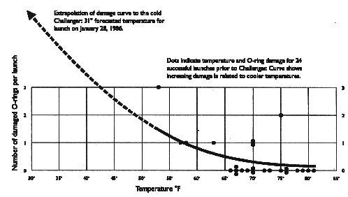

```{r, echo = FALSE, warning = FALSE, message=FALSE}
knitr::opts_chunk$set(
  message = FALSE,
  warning = FALSE,
  collapse = TRUE,
  echo=FALSE,
  comment = "",
  fig.height = 5.5,
  fig.width = 9,
  fig.align = "center",
  cache = FALSE
)
library(tidyverse)
library(gridExtra)
library(plotly)
library(lubridate)
```

# Overview

- naniar
- data set overviews
- which summary to use

---
# Exploring missings

West Pacific Tropical Atmosphere Ocean Data, 1993 & 1997, for improved detection, understanding and prediction of El Nino and La Nina, collected from [http://www.pmel.noaa.gov/tao/index.shtml](http://www.pmel.noaa.gov/tao/index.shtml)

```{r}
library(naniar)
glimpse(oceanbuoys)
```

---
# Missingness map

Heatmap display showing where missing values are in the data table.

```{r}
vis_miss(oceanbuoys, sort_miss=TRUE) + theme(aspect.ratio=1)
```

---
# Numerical summaries

Proportion of observations missing:

```{r}
s_miss <- miss_summary(oceanbuoys)
s_miss$miss_df_prop
```

Proportion of variables missing:

```{r}
s_miss$miss_var_prop
```

How many observations have $k$ missings?

```{r}
s_miss$miss_case_table
```

---
# By group

```{r}
s_miss_group <- oceanbuoys %>% 
  group_by(year) %>% miss_summary()
s_miss_group$miss_case_table
```

---
# Missings shouldn't be ignored

but most software will simply drop them!

```{r warning=TRUE}
ggplot(oceanbuoys,
       aes(x = sea_temp_c,
           y = humidity)) +
  geom_point() + theme(aspect.ratio=1)
```

---
# Keep them in the plot

```{r}
ggplot(oceanbuoys,
       aes(x = sea_temp_c,
           y = humidity)) +
  scale_colour_brewer(palette="Dark2") +
  geom_miss_point() + theme(aspect.ratio=1)
```

---
# by year

```{r}
ggplot(oceanbuoys,
       aes(x = sea_temp_c,
           y = humidity)) +
  geom_miss_point() + 
  scale_colour_brewer(palette="Dark2") +
  facet_wrap(~year) + 
  theme(aspect.ratio=1) 
```

---
# Understanding missing dependencies

```{r}
ggplot(oceanbuoys,
       aes(x = sea_temp_c,
           y = air_temp_c)) +
  geom_miss_point() + 
  scale_colour_brewer(palette="Dark2") +
  facet_wrap(~year) + 
  theme(aspect.ratio=1)
```

Year needs to be accounted for in finding good substu=itute values.

---
# Relationship with other variables

```{r}
tao_shadow <- bind_shadow(oceanbuoys)
ggplot(data = tao_shadow,
       aes(x = wind_ew, y=wind_ns, colour=air_temp_c_NA)) +
       scale_colour_brewer(palette="Dark2") +
       geom_point() + theme(aspect.ratio=1) 
```

---
# Handling missings

- An small fraction of cases have several missings, drop the cases
- A variable or two, out of many, have a lot of missings, drop the variables
- If missings are small in number, but located in many cases and variables, you need to impute these values, to do most analyses
- Designing the imputation should take into account dependencies that you have seen between missingness and existing variables.
- For the ocean buoys data this means imputation needs to be done separately by year

---
# Common ways to impute values

- Simple parametric: use the mean or median of the complete cases for each variable
- Simple non-parametric: find the $k$ nearest neighbours with a complete value and average these
- Multiple imputation: Use a statistical distribution, e.g. normal model and simulate a value (or set of values, hot deck imputation) for the missings

---
# Examples - using the mean

and ignoring year.

```{r}
tao_shadow <- tao_shadow %>%
  mutate(sea_temp_c = ifelse(is.na(sea_temp_c), 
                             mean(sea_temp_c, na.rm=TRUE),
                             sea_temp_c),
         air_temp_c = ifelse(is.na(air_temp_c), 
                             mean(air_temp_c, na.rm=TRUE),
                             air_temp_c))
ggplot(tao_shadow,
       aes(x = sea_temp_c,
           y = air_temp_c, 
           colour=air_temp_c_NA)) +
  geom_point(alpha=0.7) + 
  facet_wrap(~year) + 
  scale_colour_brewer(palette="Dark2") +
  theme(aspect.ratio=1)
```

POOR MATCH!

---
# by year

```{r}
t93 <- bind_shadow(oceanbuoys) %>% 
  filter(year=="1993") %>%
  mutate(sea_temp_c = ifelse(is.na(sea_temp_c), 
                             mean(sea_temp_c, na.rm=TRUE),
                             sea_temp_c),
         air_temp_c = ifelse(is.na(air_temp_c), 
                             mean(air_temp_c, na.rm=TRUE),
                             air_temp_c)) 
t97 <- bind_shadow(oceanbuoys) %>% 
  filter(year=="1997") %>%
  mutate(sea_temp_c = ifelse(is.na(sea_temp_c), 
                             mean(sea_temp_c, na.rm=TRUE),
                             sea_temp_c),
         air_temp_c = ifelse(is.na(air_temp_c), 
                             mean(air_temp_c, na.rm=TRUE),
                             air_temp_c))
 
tao_shadow <- bind_rows(t93, t97)  

ggplot(tao_shadow,
       aes(x = sea_temp_c,
           y = air_temp_c, 
           colour=air_temp_c_NA)) +
  geom_point(alpha=0.7) + 
  facet_wrap(~year) + 
  scale_colour_brewer(palette="Dark2") +
  theme(aspect.ratio=1)
```

Better, but still a bit weird!

---
# Nearest neighbors imputation

```{r}
#source("https://bioconductor.org/biocLite.R")
#biocLite("impute")
library(impute)
tao_impute <- bind_shadow(oceanbuoys) %>%
  arrange(year, sea_temp_c, air_temp_c) %>%
  select(sea_temp_c, air_temp_c) 
tao_impute <- impute.knn(as.matrix(tao_impute), 5)
tao_shadow <- bind_shadow(oceanbuoys) %>%
  arrange(year, sea_temp_c, air_temp_c) %>%
  mutate(sea_temp_c = tao_impute$data[,1],
         air_temp_c = tao_impute$data[,2])
ggplot(tao_shadow,
       aes(x = sea_temp_c,
           y = air_temp_c, 
           colour=air_temp_c_NA)) +
  geom_point(alpha=0.7) + 
  facet_wrap(~year) + 
  scale_colour_brewer(palette="Dark2") +
  theme(aspect.ratio=1)
```

A LITTLE BETTER!

---
# by year

```{r}
tao_impute_93 <- bind_shadow(oceanbuoys) %>%
  arrange(year, sea_temp_c, air_temp_c) %>%
  filter(year=="1993") %>%
  select(sea_temp_c, air_temp_c) 
tao_impute_93 <- impute.knn(as.matrix(tao_impute_93), 5)
tao_impute_97 <- bind_shadow(oceanbuoys) %>%
  arrange(year, sea_temp_c, air_temp_c) %>%
  filter(year=="1997") %>%
  select(sea_temp_c, air_temp_c)
tao_impute_97 <- impute.knn(as.matrix(tao_impute_97), 5)
tao_impute <- rbind(tao_impute_93$data, tao_impute_97$data)
tao_shadow <- bind_shadow(oceanbuoys) %>%
  arrange(year, sea_temp_c, air_temp_c) %>%
  mutate(sea_temp_c = tao_impute[,1],
         air_temp_c = tao_impute[,2])
ggplot(tao_shadow,
       aes(x = sea_temp_c,
           y = air_temp_c, 
           colour=air_temp_c_NA)) +
  geom_point(alpha=0.5) + 
  facet_wrap(~year) + 
  scale_colour_brewer(palette="Dark2") +
  theme(aspect.ratio=1)
```

MUCH BETTER!

---
# Famous example of ignoring missings

- Subsequent investigation determined that the cause was failure of the O-ring seals used to isolate the fuel supply from burning gases.
- NASA staff ignored observations where no O-rings failed.




[http://www.asktog.com/books/challengerExerpt.html](http://www.asktog.com/books/challengerExerpt.html)

---
# Data summary

In general, there is a nice way to get a quick overview of your data

```{r}
library(visdat)
vis_dat(airquality) + theme(aspect.ratio=1)
```

---

```{r}
data(pedestrian)
glimpse(pedestrian)
```

---

```{r}
pedestrian %>% 
  filter(year==2016) %>%
  vis_dat() + theme(aspect.ratio=1)
```

---
# Data descriptions

We have seen a lot of descriptive statistics thus far. Here is a summary of good practice:

- Depending on the variable type some summaries are appropriate and others are not
- For quantitative variables, you need to examine the distribution to determine to use *mean/sd* or *median/IQR* statistical summaries
- For categorical variables, summarise using counts and proportions
- For two quantitative variables, if the distributions are both symmetric and unimodal, correlation is a good numerical statistic
- Two categorical variables are typically summarised using a contingency table, which has counts, and several different proportion calculations
- Mix of a categorical and a quantitative variable, numerical summary by category!

---
# Which statistics?

In the PISA data, looking at some of the demographics index variables, would you use *mean/sd* or *median/IQR* to summarise these quantitative variables?

```{r}
load("../labs/pisa_au.rda")
pisa_au <- pisa_au %>% mutate(state=as.character(substr(STRATUM, 4, 5)),
                schtype_yr=as.character(substr(STRATUM, 6, 7))) %>%
  mutate(state=recode(state, "01"="ACT", "02"="NSW", "03"="VIC",
       "04"="QLD", "05"="SA", "06"="WA", "07"="TAS", "08"="NT")) %>%
  mutate(schtype_yr=recode(schtype_yr,
            "01"="Catholic_Y10", "02"="Catholic_noY10",
            "03"="Gov_Y10", "04"="Gov_noY10",
            "05"="Ind_Y10", "06"="Ind_noY10",
            "07"="Catholic_Y10", "08"="Catholic_noY10",
            "09"="Gov_Y10", "10"="Gov_noY10",
            "11"="Ind_Y10", "12"="Ind_noY10",
            "13"="Catholic_Y10", "14"="Catholic_noY10",
            "15"="Gov_Y10", "16"="Gov_noY10",
            "17"="Ind_Y10", "18"="Ind_noY10",
            "19"="Catholic_Y10", "20"="Catholic_noY10",
            "21"="Gov_Y10", "22"="Gov_noY10",
            "23"="Ind_Y10", "24"="Ind_noY10",
            "25"="Catholic_Y10", "26"="Catholic_noY10",
            "27"="Gov_Y10", "28"="Gov_noY10",
            "29"="Ind_Y10", "30"="Ind_noY10",
            "31"="Catholic_Y10", "32"="Catholic_noY10",
            "33"="Gov_Y10", "34"="Gov_noY10",
            "35"="Ind_Y10", "36"="Ind_noY10",
            "37"="Catholic_Y10", "38"="Catholic_noY10",
            "39"="Gov_Y10", "40"="Gov_noY10",
            "41"="Ind_Y10", "42"="Ind_noY10",
            "43"="Catholic_Y10", "44"="Catholic_noY10",
            "45"="Gov_Y10", "46"="Gov_noY10",
            "47"="Ind_Y10", "48"="Ind_noY10")) %>%
  separate(schtype_yr, c("schtype","yr")) %>%
  rename(birthmonth=ST003D02T, birthyr=ST003D03T,
         gender=ST004D01T, desk=ST011Q01TA,
         room=ST011Q02TA, computer=ST011Q04TA, internet=ST011Q06TA,
         solarpanels=ST011D17TA, tvs=ST012Q01TA, cars=ST012Q02TA,
         music_instr=ST012Q09NA, books=ST013Q01TA, birthcnt=ST019AQ01T,
         mother_birthcnt=ST019BQ01T, father_birthcnt=ST019CQ01T,
         test_anxiety=ST118Q01NA, ambitious=ST119Q04NA,
         prefer_team=ST082Q01NA, make_friends_easy=ST034Q02TA,
         tardy=ST062Q03TA, science_fun=ST094Q01NA, breakfast=ST076Q01NA,
         work_pay=ST078Q10NA, sport=ST078Q11NA, internet_use=IC006Q01TA,
         install_software=IC015Q02NA,
         outhours_study=OUTHOURS, math_time=MMINS, read_time=LMINS,
         science_time=SMINS, belong=BELONG,
         anxtest=ANXTEST, motivat=MOTIVAT, language=LANGN,
         home_edres=HEDRES, home_poss=HOMEPOS, wealth=WEALTH,
         stuweight=W_FSTUWT) %>%
    mutate(math=(PV1MATH+PV2MATH+PV3MATH+PV4MATH+PV5MATH+
                     PV6MATH+PV7MATH+PV8MATH+PV9MATH+PV10MATH)/10,
           science=(PV1SCIE+PV2SCIE+PV3SCIE+PV4SCIE+PV5SCIE+
                        PV6SCIE+PV7SCIE+PV8SCIE+PV9SCIE+PV10SCIE)/10,
           read=(PV1READ+PV2READ+PV3READ+PV4READ+PV5READ+
                     PV6READ+PV7READ+PV8READ+PV9READ+PV10READ)/10) %>%
   select(state, schtype, yr, birthmonth, birthyr, gender, desk, room,
          computer, internet, solarpanels, tvs, cars, music_instr, books,
          birthcnt, mother_birthcnt, father_birthcnt, test_anxiety,
          ambitious, prefer_team, make_friends_easy, tardy, science_fun,
          breakfast, work_pay, sport, internet_use, install_software,
          outhours_study, math_time, read_time, science_time, belong,
          anxtest, motivat, language, home_edres, home_poss, wealth,
          ESCS, stuweight, math, science, read) %>%
  mutate(gender=factor(gender, levels=1:2, labels=c("female", "male"))) %>% 
  mutate(birthmonth=factor(birthmonth, levels=1:12,
    labels=c("jan", "feb", "mar", "apr", "may", "jun", "jul", "aug",
                            "sep", "oct", "nov", "dec")))
p1 <- ggplot(pisa_au, aes(x=math)) + geom_density(fill="black", alpha=0.5)
p2 <- ggplot(pisa_au, aes(x=ESCS)) + geom_density(fill="black", alpha=0.5)
p3 <- ggplot(pisa_au, aes(x=wealth)) + geom_density(fill="black", alpha=0.5)
p4 <- ggplot(pisa_au, aes(x=stuweight)) + geom_density(fill="black", alpha=0.5)
grid.arrange(p1, p2, p3, p4, ncol=2)
```

--
- *mean/sd*, *median/IQR*, *mean/sd* and point out the long tail of low values, *aaagh*

---
# Categorical variable

```{r}
pisa_au %>% 
  count(gender) %>%
  mutate(p=n/sum(n))
```

---
# How many digits should you use?

- Recommendation (Chatfield, 1991 The Practice of Statistics): Two-three variable digits
- Gender proportions: 0.49298 round to 0.49, 0.50702 round to 0.51
- or 0.49298 round to 0.493, 0.50702 round to 0.507

---
# Contingency tables

- Two categorical variables, count the unique combinations
- Add the marginal counts
- Add proportions by dividing by (1) overall count, (2) row marginal count, (3) column marginal count

e.g. Gender by TVs in the household

```{r}
#pisa_au %>% count(ST004D01T, ST003D03T)
addmargins(table(pisa_au$gender, pisa_au$cars))
```

---
# Proportions

```{r}
addmargins(table(pisa_au$gender, pisa_au$cars))
```

Overall:
```{r}
options(digits=3)
addmargins(table(pisa_au$gender, pisa_au$cars))/nrow(pisa_au)
```

---

By row:

```{r}
addmargins(table(pisa_au$gender, pisa_au$cars))
```

```{r}
prop.table(addmargins(table(pisa_au$gender, pisa_au$cars)), margin=1)
```

---

By column:

```{r}
addmargins(table(pisa_au$gender, pisa_au$cars))
```

```{r}
prop.table(addmargins(table(pisa_au$gender, pisa_au$cars)), margin=2)
```

---
# Contingency tables and mosaic plots

```{r}

library(ggmosaic)
PISA_gender_cars <- pisa_au %>% count(gender, cars) %>% 
  replace_na(list(gender=0, cars=0)) %>%
  mutate(gender=factor(gender), cars=factor(cars))
p1 <- ggplot(PISA_gender_cars) +
  geom_mosaic(aes(weight=n, x=product(gender), fill=cars))
p2 <- ggplot(PISA_gender_cars) +
  geom_mosaic(aes(weight=n, x=product(cars), fill=gender))
grid.arrange(p1, p2, ncol=2)
```


---
class: inverse middle 
# Share and share alike

<a rel="license" href="http://creativecommons.org/licenses/by/4.0/"></a><br />This work is licensed under a <a rel="license" href="http://creativecommons.org/licenses/by/4.0/">Creative Commons Attribution 4.0 International License</a>.

