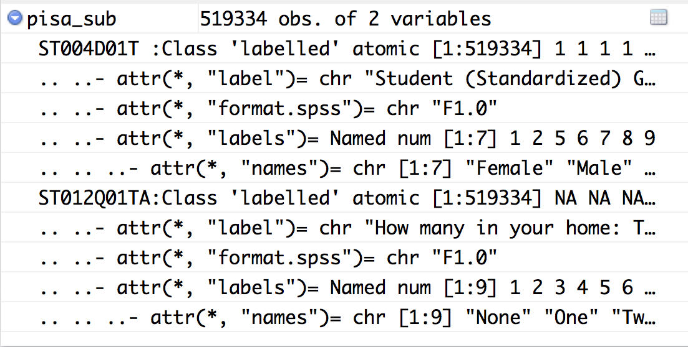

```{r, echo = FALSE, warning = FALSE, message=FALSE}
knitr::opts_chunk$set(
  message = FALSE,
  warning = FALSE,
  collapse = TRUE,
  echo=FALSE,
  comment = "",
  fig.height = 5.5,
  fig.width = 9,
  fig.align = "center",
  cache = FALSE
)
library(tidyverse)
library(gridExtra)
library(plotly)
library(ggthemes)
library(ggmap)
library(lubridate)
library(haven)
library(readxl)
```

# Overview

- SPSS format (PISA data)
- `read_csv` vs `read.csv`
- Handling large data sets by constructing a small database: `sqlite`
- Web format (json) data, `jsonlite` (crossrates)
- netcdf, hdf5, feather for large binary files
- Web scraping?

---
# Reading foreign binary formats

Many organisations provide their data in conventional software package formats, e.g. SPSS, SAS, Stata. The OECD PISA data that we have used earlier provided the 2015 results as SPSS (and SAS) format files. The 2012 results were provided only as SAS files. 

These data sets are fairly large, and it can be frustrating to wait for the download and then struggle to read the contents of a file. The SPSS format file is actually a `zip` archive `http://vs-web-fs-1.oecd.org/pisa/PUF_SPSS_COMBINED_CMB_STU_QQQ.zip`. It unpacks into two files, and the one with the information about students is about 1.5Gb. 

The `haven` package in R lets you read this format:

```{r echo=TRUE, eval=FALSE}
library(haven)
pisa_2015 <- read_sav("CY6_MS_CMB_STU_QQQ.sav")
```

An additional file describing the data, it is a data dictionary, 
[Codebook_CMB.xlsx](http://www.oecd.org/pisa/data/2015database/Codebook_CMB.xlsx) can be used alongside the data file to understand variable names, and categories. 

---
# A new type of data structure

Large survey instruments like this typically use coded names for variables, and have a long description of the variable as supplementary information, and maybe several more additional labels, not the `dbl+lbl`. Its still a tibble, though. 

```{r}
load("pisa_sub.rda")
glimpse(pisa_sub)
```



---

Access the additional information by

```{r echo=TRUE}
attr(pisa_sub$ST004D01T, "labels")
```

```{r echo=TRUE}
attr(pisa_sub$ST012Q01TA, "labels")
```

---
# Handling of missing values

Big survey instruments, typically have complex missing codes. From the subset of PISA data above, there are five possible ways that missings might occur in this data (`Valid Skip`,`Not Reached`,`Not Applicable`,`Invalid`,`No Response`), and they are coded in this complexity. 

By default, `read.sav` turns all of these into NA. 

---
# `read_csv` vs `read.csv`

Before the tidyverse, there was base R. Many people are accustomed to reading `csv` files with `read.csv`. There are benefits for making the switch to the `readr`:

- Automatic parsing of different types of information
- Manual override for parsing to very specifically read some formats
- Much faster routines, but for even faster with big data look into `data.table::fread()`
- Base R functions inherit some behaviour from your operating system and environment variables, so import code that works on your computer might not work on someone else's. The `readr` routines work across platforms, and thus produce more reproducible results.
- 
--
*How do you peak at a big data set?*

--
When you can see that a file is large, try to read just a few lines in. 

---
# Big binary files

- Climate data sets are often stored in netCDF (Network Common Data Form) format. These are "gridded" data which means big rectangular tables. They are typically large, and require special routines for extracting information on what is in the file, and what records to extract. There is an [R cheatsheet here](https://www.r-bloggers.com/a-netcdf-4-in-r-cheatsheet/).
- Another common format is HDF5 (Hierarchical Data Format), arose from supercomuting needs, for storing multidimensional or grouped data. An example is the song recommender system [Million Song DatasetMillion Song Dataset](https://labrosa.ee.columbia.edu/millionsong/pages/getting-dataset). The `rhdf5` from [bioconductor] (https://www.bioconductor.org/packages/devel/bioc/vignettes/rhdf5/inst/doc/rhdf5.pdf) can read this for you.
- A new format `feather` has recently been announced, by the R and python groups. It is a fast, lightweight, and easy-to-use binary file format for storing data frames, not metadata. A good description of the speed increases can be found [here](https://blog.dominodatalab.com/the-r-data-i-o-shootout/).

---
# JSON

With the advent of web communication, comes JavaScript Object Notation (JSON). It is a language-independent data format, and supplants extensible markup language (XML). It is a verbose data descriptor, from wikipedia:

```
{
  "firstName": "John",
  "lastName": "Smith",
  "isAlive": true,
  "age": 25,
  "address": {
    "streetAddress": "21 2nd Street",
    "city": "New York",
    "state": "NY",
    "postalCode": "10021-3100"
  },
  "phoneNumbers": [
    {
      "type": "home",
      "number": "212 555-1234"
    },
    {
      "type": "office",
      "number": "646 555-4567"
    },
    {
      "type": "mobile",
      "number": "123 456-7890"
    }
  ],
  "children": [],
  "spouse": null
}
```

---
# Cross rates

An example we have seen is the cross rates data available at [https://openexchangerates.org/](https://openexchangerates.org/). To access this data you need to:

- 1.Get a free plan from https://openexchangerates.org/signup/free
- 2.Tell this function your API key -- `Sys.setenv("OER_KEY", "your-key-here")`

Then you can access the data using a command like:

```
u <- sprintf(
    "https://openexchangerates.org/api/historical/%s.json?app_id=%s",
    day, Sys.getenv("OER_KEY")
  )
res <- jsonlite::fromJSON(u)
```

There's a nice help page by [Carson Sievert here](https://gist.github.com/cpsievert/e05da83fc4253e6d1986). 

---
# Web scraping

- Example: NBA salaries
- ESPN provides basketball players' salaries for the 2017-2018 season at [http://espn.go.com/nba/salaries](http://espn.go.com/nba/salaries)

```{r echo=TRUE}
library(XML)
nba <- NULL
for (i in 1:11) {
  temp <- readHTMLTable(
    sprintf("http://espn.go.com/nba/salaries/_/page/%d",i))[[1]]
  nba <- rbind(nba, temp)
}
glimpse(nba)
```

---
# Working with strings

```
head(nba$SALARY)

# get rid of $ and , in salaries and convert to numeric:
gsub("[$,]", "", head(as.character(nba$SALARY)))
nba$SALARY <- as.numeric(gsub("[$,]", "", 
  as.character(nba$SALARY)))
```

```{r, echo=FALSE, warning=TRUE}
head(nba$SALARY)

# get rid of $ and , in salaries and convert to numeric:
gsub("[$,]", "", head(as.character(nba$SALARY)))
nba$SALARY <- as.numeric(gsub("[$,]", "", 
                                as.character(nba$SALARY)))
```

- Where does the warning come from?

---
# Cleaning NBA salaries data: hunting the warning

```
nba %>% filter(is.na(SALARY)) %>% head()
```

```{r, echo=FALSE}
nba %>% filter(is.na(SALARY)) %>% head()
```

- We don't need these rows - delete all of them

```
dim(nba)
nba <- nba[-which(nba$RK=="RK"),]
dim(nba)
```

```{r, echo=FALSE}
dim(nba)
nba <- nba[-which(nba$RK=="RK"),]
dim(nba)
```

---
# Cleaning NBA data

- Separate names into first, last, and position

```
nba <- nba %>% 
  mutate(NAME = as.character(nba$NAME)) %>% 
  separate(NAME, c("full_name", "position"), ",") %>% 
  separate(full_name, c("first", "last"), " ") 
```


```{r echo=FALSE}
nba <- nba %>% 
  mutate(NAME = as.character(nba$NAME)) %>% 
  separate(NAME, c("full_name", "position"), ",") %>% 
  separate(full_name, c("first", "last"), " ") 
head(nba)
```

---
# Cleaned data ...?

- Numbers might still be wrong, but now we are in a position to check for that.

```
ggplot(data=nba, aes(x=SALARY)) + geom_histogram()
```

```{r, echo=FALSE, message=FALSE, error=FALSE, fig.width=7, fig.height=5}
ggplot(data=nba, aes(x=SALARY)) + geom_histogram()
```


---
class: inverse middle 
# Share and share alike

<a rel="license" href="http://creativecommons.org/licenses/by/4.0/"></a><br />This work is licensed under a <a rel="license" href="http://creativecommons.org/licenses/by/4.0/">Creative Commons Attribution 4.0 International License</a>.

