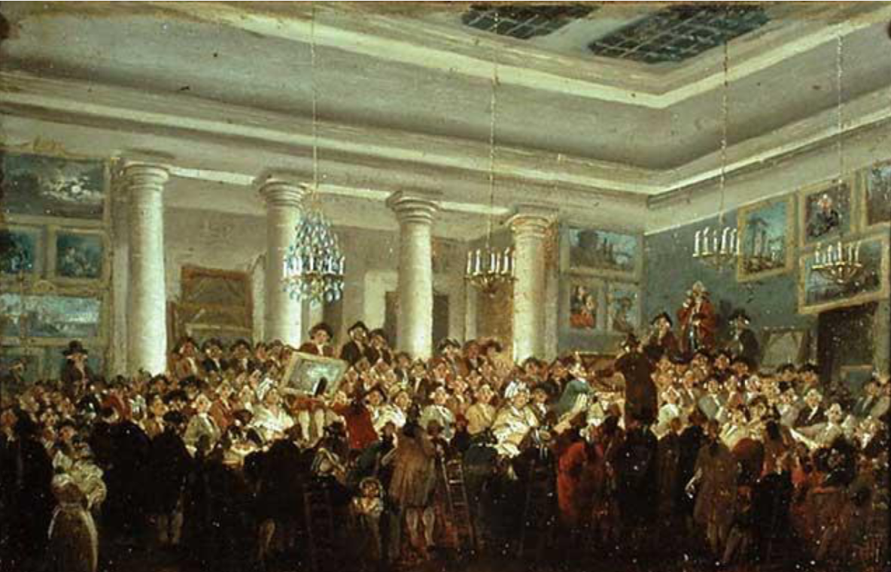

```{r setup, include=FALSE}
library(emo)
library(tidyverse)
library(polite)
library(rvest)
library(countdown)
library(knitr)
library(lubridate)
library(tuneR)
library(gridExtra)
library(plotly)
library(broom)
knitr::opts_chunk$set(
  fig.width = 8,
  fig.height = 4.5,
  fig.retina = 3,
  fig.align = "center",
  out.width = "90%",
  message = FALSE,
  warning = FALSE,
  cache = TRUE,
  autodep = TRUE,
  hiline = TRUE
)

knitr::opts_hooks$set(fig.callout = function(options) {
  if (options$fig.callout) {
    options$echo <- FALSE
    options$out.height <- "99%"
    options$fig.width <- 16
    options$fig.height <- 8
  }
  options
})

options(
  htmltools.dir.version = FALSE,
  width = 90,
  max.print = 9999,
  knitr.table.format = "html"
)

as_table <- function(...) knitr::kable(..., format = "html", digits = 3)

# ggplot2 color palette with gray
color_palette <- list(gray = "#999999", 
                      salmon = "#E69F00", 
                      lightblue = "#56B4E9", 
                      green = "#009E73", 
                      yellow = "#F0E442", 
                      darkblue = "#0072B2", 
                      red = "#D55E00", 
                      purple = "#CC79A7")
```


class: bg-main1

# Recap

.huge[
- style
- functions
- map
]

---
class: bg-main1


# Today: The language of models

---
class: bg-main1

# Modelling

.huge[
- Use models to explain the relationship between variables and to make predictions

- For now we focus on **linear** models (but remember there are other types of models too!)
]

---

class: center, middle

# Packages

.left-code[


]
.right-plot.vlarge[
- You're familiar with the tidyverse:

- The broom package takes the messy output of built-in functions in R, such as `lm`, and turns them into tidy data frames.

]

---
class: bg-black

.white.vvhuge.center.middle[
Data: Paris Paintings
]

---
class: bg-main1

# Paris Paintings

```{r read-paris, message=FALSE}
pp <- read_csv("data/paris-paintings.csv", na = c("n/a", "", "NA"))
pp
```

---

# Meet the data curators

.left-code[
 


]

.right-plot.vlarge[

Sandra van Ginhoven

Hilary Coe Cronheim

PhD students in the Duke Art, Law, and Markets Initiative in 2013

- Source: Printed catalogues of 28 auction sales in Paris, 1764- 1780
- 3,393 paintings, their prices, and descriptive details from sales catalogues over 60 variables
]

---

# Auctions today


<iframe width="1013" height="570" src="https://www.youtube.com/embed/apaE1Q7r4so" frameborder="0" allow="accelerometer; autoplay; encrypted-media; gyroscope; picture-in-picture" allowfullscreen></iframe>
---

# Auctions back in the day

```{r auctions-include, echo = FALSE, out.width = "80%"}

```

Pierre-Antoine de Machy, Public Sale at the Hôtel Bullion, Musée Carnavalet, Paris (18th century)

---

# Paris auction market

```{r paris-auction-market, echo = FALSE, out.width = "80%"}
include_graphics("img/auction-trend-paris.png")
```

---
class: bg-main1

# Modelling the relationship between variables

---
class: bg-main1

# Prices: Describe the distribution of prices of paintings.

```{r gg-price, fig.height = 3.5}
ggplot(data = pp, aes(x = price)) +
  geom_histogram(binwidth = 1000)
```

---

# Models as functions

.huge[
- We can represent relationships between variables using **functions**

- A function is a mathematical concept: the relationship between an output
and one or more inputs. 

- Plug in the inputs and receive back the output

]

---
class: bg-main1

# Models as functions: Example

.huge[
- The formula $y = 3x + 7$ is a function with input $x$ and output $y$, when $x$ is $5$, the output $y$ is $22$

`y = 3 * 5 + 7 = 22`
]
--

```{r anon}
anon <- function(x) 3*x + 7
anon(5)
```


---
class: bg-main1

# Height as a function of width

.huge[
Describe the relationship between height and width of paintings.
]

```{r gg-price-point, warning = FALSE, echo = FALSE, fig.height = 3.5}
ggplot(data = pp, aes(x = Width_in, y = Height_in)) +
  geom_point() 
```

---
class: bg-main1

# Visualizing the linear model

```{r gg-point-smooth-lm, warning = FALSE, fig.height = 3.5}
ggplot(data = pp, aes(x = Width_in, y = Height_in)) +
  geom_point() +
  geom_smooth(method = "lm") # lm for linear model
```

---
class: bg-main1

# Visualizing the linear model (without the measure of uncertainty around the line)

```{r gg-point-lm-no-se, warning = FALSE, fig.height = 2.25, fig.width=5}
ggplot(data = pp, aes(x = Width_in, y = Height_in)) +
  geom_point() +
  geom_smooth(method = "lm", se = FALSE) # lm for linear model
```

---

# Visualizing the linear model (style the line)


```{r gg-smooth-change-line, warning = FALSE, fig.height = 2, fig.width = 5}
ggplot(data = pp, aes(x = Width_in, y = Height_in)) +
  geom_point() +
  geom_smooth(method = "lm", se = FALSE, 
              col = "pink", # color
              lty = 2,      # line type
              lwd = 3)      # line weight
```

---
class: bg-main1

# Vocabulary

.huge[
- **Response variable:** Variable whose behavior or variation you are trying to understand, on the y-axis (dependent variable)
]

--

.huge[
- **Explanatory variables:** Other variables that you want to use to explain the variation in the response, on the x-axis (independent variables)
]

---
class: bg-main1

# Vocabulary

.huge[
- **Predicted value:** Output of the function **model function**
    - The model function gives the typical value of the response variable
    *conditioning* on the explanatory variables
]

--

.huge[
- **Residuals:** Show how far each case is from its model value
    - Residual = Observed value - Predicted value
    - Tells how far above/below the model function each case is
]

---

# Residuals

.huge[
- What does a negative residual mean? 
- Which paintings on the plot have have negative 
residuals, those below or above the line?
]

```{r gg-price-height, warning = FALSE, echo=FALSE, fig.height = 2.5}
ggplot(data = pp, aes(x = Width_in, y = Height_in)) +
  geom_point() +
  geom_smooth(method = "lm", se = FALSE)
```

---


```{r gg-alpha, warning = FALSE, echo=FALSE, fig.height = 3.5}
ggplot(data = pp, aes(x = Width_in, y = Height_in)) +
  geom_point(alpha = 0.2)
```

--

.vlarge[
- What feature is apparent in this plot that was not (as) apparent in the previous plots? 

- What might be the reason for this feature?
]


???

The plot below displays the relationship between height and width of paintings. It  uses a lower alpha level for the points than the previous plots we looked at. 
---

# Landscape vs portait paintings

.pull-left.vlarge[
- Landscape painting is the depiction in art of landscapes – natural scenery such as mountains, valleys, trees, rivers, and forests, especially where the main subject is a wide view – with its elements arranged into a coherent composition.<sup>1</sup>

- Landscape paintings tend to be wider than longer.
]

.pull-right.vlarge[

- Portrait painting is a genre in painting, where the intent is to depict a human subject.<sup>2</sup>

- Portrait paintings tend to be longer than wider.

.footnote[
[1] Source: Wikipedia, [Landscape painting](https://en.wikipedia.org/wiki/Landscape_painting)

[2] Source: Wikipedia, [Portait painting](https://en.wikipedia.org/wiki/Portrait_painting)
]

]


---

# Multiple explanatory variables

.vlarge[
How, if at all, the relatonship between width and height of paintings vary by whether
or not they have any landscape elements?
]


```{r gg-landscape, warning = FALSE, fig.height=2}
ggplot(data = pp, aes(x = Width_in, y = Height_in, 
                      color = factor(landsALL))) +
  geom_point(alpha = 0.4) +
  geom_smooth(method = "lm", se = FALSE) +
  labs(color = "landscape")
```

---

# Models - upsides and downsides

.huge[
- Models can sometimes reveal patterns that are not evident in a graph of the
data. This is a great advantage of modelling over simple visual inspection of
data. 

- There is a real risk, however, that a model is imposing structure that is
not really there on the scatter of data, just as people imagine animal shapes in
the stars. A skeptical approach is always warranted.
]
---

# Variation around the model...

.vlarge[
is just as important as the model, if not more!

*Statistics is the explanation of variation in the context of what remains
unexplained.*

- Scatterplot suggests there might be other factors that account for large parts 
of painting-to-painting variability, or perhaps just that randomness plays a big role.

- Adding more explanatory variables to a model can sometimes usefully reduce
the size of the scatter around the model. (We'll talk more about this later.)
]

---

# How do we use models?

.huge[
1. Explanation: Characterize the relationship between $y$ and $x$ via *slopes* for numerical explanatory variables or *differences* for categorical explanatory variables. (also called __inference__, as you __make inference__ on these relationships)

2. Prediction: Plug in $x$, get the predicted $y$
]

---
class: bg-main1

# Your Turn: go to rstudio.cloud and start exercise 7a

---
class: bg-main1

# Characterizing relationships with models

---
class: bg-main1


## Height & width

```{r model-height-width}
m_ht_wt <- lm(Height_in ~ Width_in, data = pp)
m_ht_wt
```

--

<br>

---
class: bg-main1

# Model of height and width

.huge[
$$\widehat{Height_{in}} = 3.62 + 0.78~Width_{in}$$
]
 
--

.huge[
- **Slope:** For each additional inch the painting is wider, the height is expected
to be higher, on average, by 0.78 inches.
]

--

.huge[
- **Intercept:** Paintings that are 0 inches wide are expected to be 3.62 inches high,
on average.
]

---
class: bg-main1

# The linear model with a single predictor

.vlarge[
- Interested in $\beta_0$ (population parameter for the intercept)
and the $\beta_1$ (population parameter for the slope) in the 
following model:

$$ \hat{y} = \beta_0 + \beta_1~x $$
]

---
class: bg-main1

# Least squares regression

.huge[
The regression line minimizes the sum of squared residuals.
]

--

.huge[
If $e_i = y - \hat{y}$,

then, the regression line minimizes $\sum_{i = 1}^n e_i^2$.
]

---

# Visualizing residuals

```{r vis-resid, echo=FALSE}
d <- tibble(
    Width_in     = m_ht_wt$model$Width_in,
    Height_in    = m_ht_wt$model$Height_in,
    pred         = m_ht_wt$fitted.values,
    res          = m_ht_wt$residuals
  )
p <- ggplot(data = d, mapping = aes(x = Width_in, y = Height_in)) +
  geom_point(alpha = 0.2) + 
  theme_bw() +
  labs(title = "Height vs. width of paintings", subtitle = "Just the data") +
  xlim(0, 250) +
  ylim(0, 200)
p
```

---

## Visualizing residuals (cont.)

```{r vis-resid-line, echo=FALSE}
p <- p + 
  geom_smooth(method = "lm", color = color_palette$darkblue, se = FALSE) +
  geom_point(mapping = aes(y = pred), color = color_palette$darkblue) +
  labs(subtitle = "Data + least squares resgression line")
p
```

---

## Visualizing residuals (cont.)

```{r vis-redis-segment, echo = FALSE}
p + 
  geom_segment(mapping = aes(xend = Width_in, yend = pred), color = color_palette$lightblue, alpha = 0.4) +
  labs(subtitle = "Data + least squares resgression line + residuals")
```


---

# Properties of the least squares regression line

.huge[
- The regression line goes through the center of mass point, the coordinates corresponding to average $x$ and average $y$: $(\bar{x}, \bar{y})$:

$$\hat{y} = \beta_0 + \beta_1 x ~ \rightarrow ~ \beta_0 = \hat{y} - \beta_1 x$$

- The slope has the same sign as the correlation coefficient:

$$\beta_1 = r \frac{s_y}{s_x}$$
]

---
class: bg-main1

# Properties of the least squares regression line

.huge[
- The sum of the residuals is zero: 
$$\sum_{i = 1}^n e_i = 0$$

- The residuals and $x$ values are uncorrelated.
]

---
class: bg-main1

# Height & landscape features

```{r fit-lands}
m_ht_lands <- lm(Height_in ~ factor(landsALL), data = pp)
m_ht_lands
```

--

<br>
.huge[
$$\widehat{Height_{in}} = 22.68 - 5.65~landsALL$$
]

---
class: bg-main1

# Height & landscape features (cont.)

.huge[
- **Slope:** Paintings with landscape features are expected, on average,
to be 5.65 inches shorter than paintings that without landscape features.
    - Compares baseline level (`landsALL = 0`) to other level
    (`landsALL = 1`).

- **Intercept:** Paintings that don't have landscape features are expected, on 
average, to be 22.68 inches tall.
]

---
class: bg-main1

# Categorical predictor with 2 levels

```{r slice-paint, echo=FALSE}
pp %>% 
  select(name, price, landsALL) %>% 
  slice(1:8)
```

---
class: bg-main1

# Relationship between height and school

```{r fit-school}
(m_ht_sch <- lm(Height_in ~ school_pntg, data = pp))
```
 
--

.vlarge[
- When the categorical explanatory variable has many levels, they're encoded to
**dummy variables**.

- Each coefficient describes the expected difference between heights in that 
particular school compared to the baseline level.
]

---
class: bg-main1

# Categorical predictor with >2 levels

```{r show-cats, echo=FALSE}
pp %>% 
  select(school_pntg) %>% 
  group_by(school_pntg) %>% 
  sample_n(1) %>%
  mutate(
    D_FL = as.integer(ifelse(school_pntg == "D/FL", 1L, 0)),
    F    = as.integer(ifelse(school_pntg == "F", 1L, 0)),
    G    = as.integer(ifelse(school_pntg == "G", 1L, 0)),
    I    = as.integer(ifelse(school_pntg == "I", 1L, 0)),
    S    = as.integer(ifelse(school_pntg == "S", 1L, 0)),
    X    = as.integer(ifelse(school_pntg == "X", 1L, 0))
  )
```
---
class: bg-main1

# The linear model with multiple predictors

.huge[
- Population model:

$$ \hat{y} = \beta_0 + \beta_1~x_1 + \beta_2~x_2 + \cdots + \beta_k~x_k $$
]

--

.huge[
- Sample model that we use to estimate the population model:
  
$$ \hat{y} = b_0 + b_1~x_1 + b_2~x_2 + \cdots + b_k~x_k $$
]

---
class: bg-main1

# Correlation does not imply causation!

.vhuge[
- Remember this when interpreting model coefficients
]

---
class: bg-main1

# Prediction with models

---
class: bg-main1

# Predict height from width

.vlarge[
On average, how tall are paintings that are 60 inches wide?
$$\widehat{Height_{in}} = 3.62 + 0.78~Width_{in}$$
]

--

```{r add-slope}
3.62 + 0.78 * 60
```

.vlarge[
"On average, we expect paintings that are 60 inches wide to be 50.42 inches high."

**Warning:** We "expect" this to happen, but there will be some variability. (We'll
learn about measuring the variability around the prediction later.)
]

---
class: bg-main1

# Prediction vs. extrapolation

.huge[
On average, how tall are paintings that are 400 inches wide?
$$\widehat{Height_{in}} = 3.62 + 0.78~Width_{in}$$
]

```{r extrapolate, warning = FALSE, echo=FALSE, fig.height = 2.5}
newdata <- tibble(Width_in = 400)
newdata <- newdata %>%
  mutate(Height_in = predict(m_ht_wt, newdata = newdata))

ggplot(data = pp, aes(x = Width_in, y = Height_in)) +
  geom_point(alpha = 0.4) +
  geom_smooth(method = "lm", fullrange = TRUE, color = color_palette$darkblue, se = FALSE) +
  xlim(0, 420) +
  ylim(0, 320) +
  geom_segment(data = newdata, mapping = aes(x = Width_in, y = 0, xend = Width_in, yend = Height_in), color = color_palette$salmon, lty = 2) +
  geom_segment(data = newdata, mapping = aes(x = Width_in, y = Height_in, xend = 0, yend = Height_in), color = color_palette$salmon, lty = 2)
```

---
class: bg-black

.white[
## Watch out for extrapolation!
]

.vlarge.white[
> "When those blizzards hit the East Coast this winter, it proved to my satisfaction 
that global warming was a fraud. That snow was freezing cold. But in an alarming 
trend, temperatures this spring have risen. Consider this: On February 6th it was 10 
degrees. Today it hit almost 80. At this rate, by August it will be 220 degrees. So 
clearly folks the climate debate rages on."<sup>1</sup>  <br>
Stephen Colbert, April 6th, 2010
]

.footnote.white[
[1] OpenIntro Statistics. "Extrapolation is treacherous." OpenIntro Statistics.
]

---

class: center, middle

# Measuring model fit

---
class: bg-main1

# Measuring the strength of the fit

.huge[
- $R^2$ is a common measurement of strength of linear model fit.

- $R^2$ tells us % variability in response explained by 
model.

- Remaining variation is explained by variables not in the model.

- $R^2$ is sometimes called the coefficient of determination.
]

---
class: bg-main1

# Obtaining $R^2$ in R

.vlarge[
- Height vs. width
]
```{r glance-r-squared}
glance(m_ht_wt)
glance(m_ht_wt)$r.squared # extract R-squared
```

.vlarge[
Roughly 68% of the variability in heights of paintings can be explained by their widths.
]

---
class: bg-main1

# Obtaining $R^2$ in R

.huge[
- Height vs. lanscape features
]

```{r glance-lands}
glance(m_ht_lands)$r.squared
```

---
class: bg-main1

# Your Turn: go to rstudio.cloud

---
class: bg-main1

# References

.huge[
- [data science in a box](https://datasciencebox.org/)
]
