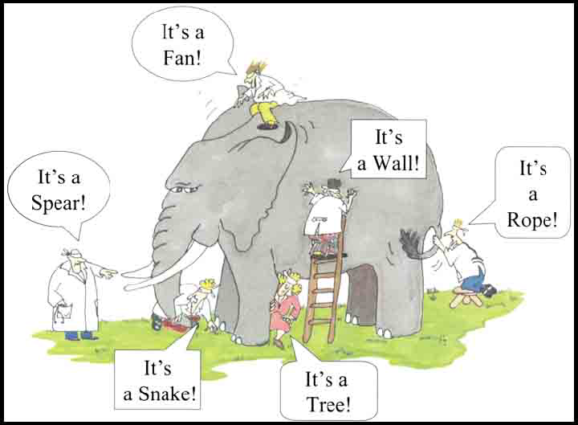

```{r setup, include=FALSE}
library(emo)
library(tidyverse)
library(polite)
library(rvest)
library(countdown)
library(knitr)
library(lubridate)
library(tuneR)
library(gridExtra)
library(plotly)
library(broom)
knitr::opts_chunk$set(
  fig.width = 8,
  fig.height = 4.5,
  fig.retina = 3,
  fig.align = "center",
  out.width = "90%",
  message = FALSE,
  warning = FALSE,
  cache = TRUE,
  autodep = TRUE,
  hiline = TRUE
)

knitr::opts_hooks$set(fig.callout = function(options) {
  if (options$fig.callout) {
    options$echo <- FALSE
    options$out.height <- "99%"
    options$fig.width <- 16
    options$fig.height <- 8
  }
  options
})

options(
  htmltools.dir.version = FALSE,
  width = 90,
  max.print = 9999,
  knitr.table.format = "html"
)

as_table <- function(...) knitr::kable(..., format = "html", digits = 3)

# ggplot2 color palette with gray
color_palette <- list(gray = "#999999", 
                      salmon = "#E69F00", 
                      lightblue = "#56B4E9", 
                      green = "#009E73", 
                      yellow = "#F0E442", 
                      darkblue = "#0072B2", 
                      red = "#D55E00", 
                      purple = "#CC79A7")
```

```{r pkg-load, echo=FALSE}
library(broom)
library(gridExtra)
```

```{r create-cor, echo = FALSE}
library(mvtnorm)
df <- tibble(r = seq(-1, 1, 0.25))
vfun <- function(df) {
  vc <- matrix(c(1, df$r, df$r, 1), ncol=2, byrow=TRUE)
  d <- as_tibble(rmvnorm(1000, mean=c(0,0), vc))
  return(d)
}
smp <- df %>%
  split(.$r) %>%
  map(vfun)

df_cor <- bind_rows(smp) %>% mutate(r = rep(df$r, rep(1000, 9)))

```

```{r fun-gg-xy-cor, echo = FALSE}
gg_xy_cor <- function(data, cor = NULL){
  
  if (length(cor) == 1) {
    new_data <- filter(data, r == cor) 
  } else if (is.null(cor)) {
    new_data <- data
  }
  
  ggplot(new_data,
         aes(x = V1, 
             y = V2)) + 
  geom_point(alpha = 0.5) +
  facet_wrap(~r, 
             ncol = 3, 
             labeller = "label_both") + 
  theme(aspect.ratio = 1) +
  labs(x = "X",
       y = "Y")
}
```


# Overview

- Feedback from the tests

- What is correlation
- What is r2
  - (pull examples from exercise)
- short exercise in class to calculate correlation and r2 and answer questions
  
- unpacking lm and model objects
- augment?
- why are making day0
- understanding residuals
- components of variation?

- understanding tidy, glance, and augment
- using tidy, glance, and augment

- Briefly show the examples of AIC, BIC, Deviance
  - These are evidence to make a decision
  - Just so they have notes on how to interpret these (higher/lower is better?)
  
---
class: bg-main1

# Feedback from assignment 1

.vlarge[
- Some students forgot to answer some of the questions: "Is there anything else in the excel spreadsheet we could look at?".
- Some groups need to follow Amelia's three-sentence interpretation to describe plots.
- For the last questions, I (Sherry) expect people to also talks about how the analysis would help with the business.

Presentation & grammar:
- Remember to do a spell check before submitting any of your files
- Don't need install.package in your Rmd library() is enough
]

---
class: bg-main1

# Mid-semester exam

- Marks will be released at the end of class

---
class: bg-main1

# What is correlation?

.huge[
- Linear association between two variables can be described by correlation
- Ranges from -1 to +1
]

---
class: bg-main1

# Strongest Positive correlation: As one variable increases, so does another variable

```{r plot-strong-pos-corr, echo = FALSE}
gg_xy_cor(df_cor, 1)
```

---
class: bg-main1

# strong Positive correlation: As one variable increases, so does another variable

```{r plot-pos-corr, echo = FALSE}

gg_xy_cor(df_cor, 0.75)

```

---
class: bg-main1

# zero correlation: neither variables are related linearly

```{r plot-meh-corr, echo = FALSE}
gg_xy_cor(df_cor, 0)
```

# strong negative correlation: as one variable increases, another variable decreases

```{r plot-neg-corr, echo = FALSE}
gg_xy_cor(df_cor, -0.5)
```


---
class: bg-main1

# STRONG negative correlation: as one variable increases, another variable decreases

```{r plot-strong-neg-corr, echo = FALSE}
gg_xy_cor(df_cor, -1)
```


---
class: bg-main1

# correlation: animated

```{r gganim-cor, eval = FALSE, echo = FALSE}
library(scico)
p_cor <- ggplot(df_cor,
                aes(x = V1, 
                    y = V2)) + 
  geom_point(aes(colour = r, group = 1L),
             alpha = 0.75) +
  theme(aspect.ratio = 1) +
  labs(x = "X",
       y = "Y") + 
  scale_colour_scico(palette = "roma") +
  theme_dark() +
  theme(legend.position = "none")

library(gganimate)
library(glue)
anim <- p_cor + 
  transition_states(r,
                    transition_length = 6,
                    state_length = 2) +
   ease_aes('cubic-in-out') +
  ggtitle('Now showing R = {closest_state}')

animate(anim, nframes = 200)
```

---
class: bg-main1

# definition of correlation

For two variables $X, Y$, correlation is:

$$r=\frac{\sum_{i=1}^{n} (x_i-\bar{x})(y_i-\bar{y})}{\sqrt{\sum_{i=1}^{n}(x_i-\bar{x})^2}\sqrt{\sum_{i=1}^{n}(y_i-\bar{y})^2}} = \frac{cov(X,Y)}{s_xs_y}$$

---
class: bg-main1

# Dance of correlation

<iframe width="1008" height="567" src="https://www.youtube.com/embed/VFjaBh12C6s" frameborder="0" allow="accelerometer; autoplay; encrypted-media; gyroscope; picture-in-picture" allowfullscreen></iframe>

---
class: bg-main1

# Remember: Correlation does not equal causation

---
class: bg-main1

# What is $R^2$?

.huge[
- (model variance)/(total variance), the amount of variance in response explained by the model. 
- Always ranges between 0 and 1, with 1 indicating a perfect fit. 
- Adding more variables to the model will always increase $R^2$, so what is important is how big an increase is gained. - Adjusted $R^2$ reduces this for every additional variable added. 
]

---
class: bg-main1

# plots of rsquared


---
class: bg-main1

# unpacking lm and model objects

- Last class we fit a model that predicted the height from the width

```{r read-paris}
pp <- read_csv("data/paris-paintings.csv", na = c("n/a", "", "NA"))
pp
```

---
class: bg-main1

# last class:

plot of paris paintings data

```{r}

```


---
class: bg-main1

# template for linear model

.huge[
`lm(<FORMULA>, <DATA>)`

`<FORMULA>`

`RESPONSE ~ EXPLANATORY VARIABLES`
]

---
class: bg-main1

# Fitting a linear model

```{r fit-paris}
m_wt_ht <- lm(Height_in ~ Width_in, data = pp)

m_wt_ht
```

---
class: bg-main1

# using tidy, augment, glance

---
class: bg-main1

# tidy: return a tidy table of model information

.huge[
`tidy(<MODEL OBJECT>)`
]

```{r tidy-paris}
tidy(m_wt_ht)
```

---
class: bg-main1

# glance: get a one-row summary out

.huge[
`glance(<MODEL OBJECT>)`
]

```{r glance-paris}
glance(m_wt_ht)
```

---
class: bg-main1

# AIC, BIC, Deviance

  - AIC, BIC, and Deviance are evidence to make a decision

- Deviance is the residual variation, how much variation in response that IS NOT explained by the model. The close to 0 the better, but it is not on a standard scale. In comparing two models if one has substantially lower deviance, then it is a better model.
- Similarly BIC (Bayes Information Criterion) indicates how well the model fits, best used to compare two models. The lower is better.
- df is the degrees of freedom left from the model fit. Starts at $n$ (sample size) and drops for each additional parameter estimated by the model. 

All of these statistics indicate the model 2 is substantially a better fit than model 1.

---
class: bg-main1

# augment: get the data

---
class: bg-main1

# augment

---
class: bg-main1

# understanding residuals

- variation explained by the model
- residual variation:  what's left over after fitting the model

---
class: bg-main1

# Your turn: go to rstudio cloud and get started on exercise 7B

---
class: bg-main1

# Going beyond a single model

```{r show-elephant}

```

.huge[
- Beyond a single model
- Fitting many models
]

Image source: https://balajiviswanathan.quora.com/Lessons-from-the-Blind-men-and-the-elephant

---
class: bg-main1

# Gapminder

- Hans Rosling was a Swedish doctor, academic and statistician, Professor of International Health at Karolinska Institute. Sadley he passed away in 2017. - He developed a keen interest in health and wealth across the globe, and the relationship with other factors like agriculture, education, energy. 
- His presentations on data are amazing! A starting place is https://www.youtube.com/watch?v=jbkSRLYSojo. 

And you can play with the gapminder data using animations at https://www.gapminder.org/tools/. 

---
class: bg-main1

# R package: `gapminder`

Contains subset of the data on five year intervals from 1952 to 2007.

```{r show-gapminder}
library(gapminder)
glimpse(gapminder)
```

---
class: bg-main1

# "How has life expectancy changed over years, for each country?"

.huge[
- Plot life expectancy by year, for each country.
- What do you learn?
]

```{r gg-gapminder-line, fig.height=4}
gapminder %>% 
  ggplot(aes(year, lifeExp, group = country)) +
    geom_line(alpha = 1/3)

```

---
class: bg-main1

# "How has life expectancy changed over years, for each country?"

.huge[
- There generally appears to be an increase in life expectancy
- A number of countries have big dips from the 70s through 90s
- a cluster of countries starts off with low life expectancy but ends up close to the highest by the end of the period.
]

---
class: bg-main1

# Gapminder: Australia

Australia was already had one of the top life expectancies in the 1950s.

```{r gapminder-oz}
oz <- gapminder %>% filter(country == "Australia")

oz
```

---
class: bg-main1

# Gapminder: Australia

```{r plot-gapminder-oz, fig.height=3, fig.width=8}
ggplot(data = oz, 
       aes(x = year, 
           y = lifeExp)) + 
  geom_line() 
```

---
class: bg-main1

# Gapminder: Australia

```{r tidy-oz-gapminder}
oz_lm <- lm(lifeExp ~ year, data = oz)

oz_lm

tidy(oz_lm)
```

---
class: bg-main1

# center year

1950 is the first year, so for model fitting we are going to shift year to begin in 1950, makes interpretability easier.

```{r center-eyar}
gap <- gapminder %>% mutate(year1950 = year - 1950)
oz <- gap %>%  filter(country == "Australia")
oz
```


---
class: bg-main1

# model for centered year

```{r oz-gapminder-centered-year}
oz_lm <- lm(lifeExp ~ year1950, data = oz)

oz_lm

tidy(oz_lm)
```

---
class: bg-main1

```{r oz-gapminder-augment, fig.height=3, fig.width=8}
oz_aug <- augment(oz_lm, oz)

oz_aug
```

---
class: bg-main1

```{r oz-gap-aug, fig.height=3, fig.width=8}
ggplot(data = oz_aug, 
       aes(x = year, 
           y = .fitted)) + 
  geom_line(colour = "blue") + 
  geom_point(aes(x = year,
                 y = lifeExp))
```

---
class: bg-main1

```{r oz-gap-year-resid, fig.height=3, fig.width=8}
ggplot(data = oz_aug, 
             aes(x = year, 
                 y = .std.resid)) + 
  geom_hline(yintercept = 0,
             colour = "white", 
             size = 2) +
  geom_line() 

```

---
class: bg-main1

# Making inferences from this

.huge[
- Life expectancy has increased 2.3 years every decade, on average. 
- There was a slow period from 1960 through to 1972, probably related to mortality during the Vietnam war.
]

---
class: bg-main1

# Can we fit for New Zealand?

```{r lm-nz}
nz <- gap %>%  filter(country == "New Zealand")
nz_lm <- lm(lifeExp ~ year1950, data = nz)
nz_lm
```

---
class: bg-main1

# Can we fit for Japan?

```{r lm-japan}
japan <- gap %>%  filter(country == "Japan")
japan_lm <- lm(lifeExp ~ year1950, data = japan)
japan_lm
```

---
class: bg-main1

# Can we fit for italy?

```{r lm-italy}
italy <- gap %>%  filter(country == "Italy")
italy_lm <- lm(lifeExp ~ year1950, data = italy)
italy_lm
```


---
class: bg-main1

# Is there a better way?


--

# Like, what if we wanted to fit a model for ALL countries?

--

# Let's tinker with the data.

---
class: bg-main1

# nest country level data (one row = one country)

```{r nest}
by_country <- gap %>% 
  select(country, year1950, lifeExp, continent) %>%
  group_by(country, continent) %>% 
  nest()

by_country
```

---
class: bg-main1

# What is in `data`?

```{r show-nest}
by_country$data[[1]]
```

---
class: bg-main1

# fit a linear model to each one?

```{r fit-many-model}
lm_afganistan <- lm(lifeExp ~ year1950, data = by_country$data[[1]])
lm_albania <- lm(lifeExp ~ year1950, data = by_country$data[[2]])
lm_algeria <- lm(lifeExp ~ year1950, data = by_country$data[[3]])
```

--

# But we are copying and pasting this code more than twice...is there a better way?

---
class: bg-main1

# A case for map???

```{r map-country}
country_model <- by_country %>% 
  mutate(model = map(data, 
                     function(x){
                       lm(lifeExp ~ year1950, data = x)
                       }
                     )
         )

country_model
```

---
class: bg-main1

# A case for map (shorthand function)

```{r map-country}
country_model <- by_country %>% 
  mutate(model = map(data, ~lm(lifeExp ~ year1950, data = .)))

country_model
```

---
class: bg-main1

# where's the model?

```{r print-model}
country_model$model[[1]]
```

---
class: bg-main1

# we need to summarise this content?

```{r tidy-printed-model}
tidy(country_model$model[[1]])
```

---
class: bg-main1

# So should we repeat it for each one?

```{r tidy-many-printed-model}
tidy(country_model$model[[1]])
tidy(country_model$model[[2]])
tidy(country_model$model[[3]])
```

---
class: bg-main1

# NO NICK, THERE's A BETTER WAY.

---
class: bg-main1


```{r map-tidy-model}
country_coefs <- country_model %>%
  mutate(tidy = map(model, tidy)) %>%
  unnest(tidy) %>%
  select(country, continent, term, estimate)

country_coefs
```

---
class: bg-main1

```{r tidy-unnested-coefs}
tidy_country_coefs <- country_coefs %>%
  spread(key = term, 
         value = estimate) %>%
  rename(intercept = `(Intercept)`)

tidy_country_coefs
```

---
class: bg-main1

```{r oz-unnested-coef, echo=TRUE}
tidy_country_coefs %>%
  filter(country == "Australia")
```

---
class: bg-main1

# Your turn: Five minute challenge

- Fit the models to all countries
- Pick your favourite country (not Australia), print the coefficients, and make a hand sketch of the the model fit.

---
class: bg-main1

# Plot all the models

```{r augmente-many-countries, fig.height=4}
country_aug <- country_model %>% 
  mutate(augmented = map(model, augment)) %>%
  unnest(augmented)

country_aug
```

---
class: bg-main1

```{r plot-gapminder-data, fig.height=4}
p1 <- gapminder %>% 
  ggplot(aes(year, lifeExp, group = country)) +
    geom_line(alpha = 1/3) + ggtitle("Data")

p2 <- ggplot(country_aug) + 
  geom_line(aes(x = year1950 + 1950, 
                y = .fitted, 
                group = country), 
            alpha = 1/3) +
  xlab("year") +
  ggtitle("Fitted models")

grid.arrange(p1, p2, ncol=2)
```

---
class: bg-main1

# Plot all the model coefficients

```{r ggplotly-aug-coef}
p <- ggplot(tidy_country_coefs, 
            aes(x = intercept, 
                y = year1950, 
                colour = continent, 
                label = country)) +
  geom_point(alpha = 0.5, 
             size = 2) +
  scale_color_brewer(palette = "Dark2")

library(plotly)
ggplotly(p)
```

---
class: bg-main1

# Let's summarise the information learned from the model coefficients.

.huge[
- Generally the relationship is negative: this means that if a country started with a high intercept tends to have lower rate of increase.
- There is a difference across the continents: Countries in Europe and Oceania tended to start with higher life expectancy and increased; countries in Asia and America tended to start lower but have high rates of improvement; Africa tends to start lower and have a huge range in rate of change.
- Three countries had negative growth in life expectancy: Rwand, Zimbabwe, Zambia
]

---
class: bg-main1

# Model diagnostics by country

```{r glance-country}
country_glance <- country_model %>% 
  mutate(glance = map(model, glance)) %>%
  unnest(glance)

country_glance
```

---
class: bg-main1

# Plot the $R^2$ values as a histogram. 

```{r country-fit}
ggplot(country_glance, 
       aes(x = r.squared)) + 
  geom_histogram()
```

---
class: bg-main1

# Countries with worst fit

Examine the countries with the worst fit, countries with $R^2<0.45$, by making scatterplots of the data, with the linear model overlaid. 

```{r show-bad-fit, fig.height=4}
badfit <- country_glance %>% filter(r.squared <= 0.45)

gap_bad <- gap %>% filter(country %in% badfit$country)

ggplot(data = gap_bad, 
       aes(x = year, 
           y = lifeExp)) + 
         geom_point() +
  facet_wrap(~country) +
  scale_x_continuous(breaks = seq(1950,2000,10), 
                     labels = c("1950", "60","70", "80","90","2000")) +
  geom_smooth(method = "lm", 
              se = FALSE)
```

Each of these countries had been moving on a nice trajectory of increasing life expectancy, and then suffered a big dip during the time period.

---
class: bg-main1

# Your Turn:

.huge[
- Use google to explain these dips using world history and current affairs information. 
- finish the lab exercise
]

---
class: bg-main1

## Share and share alike

<a rel="license" href="http://creativecommons.org/licenses/by/4.0/"></a><br />This work is licensed under a <a rel="license" href="http://creativecommons.org/licenses/by/4.0/">Creative Commons Attribution 4.0 International License</a>.


???

# many models
  - gapminder
  - fit with year
    - recenter year to be from 1950
    - fit again (ask a quiz question about this)
  - What is the average life expectancy?
  - What if we want to fit a separate model for each country? Can we fit a linear model for each country?
- why are making day0
- why are we standardization


Open the app available at [https://ebsmonash.shinyapps.io/SSregression/](https://ebsmonash.shinyapps.io/SSregression/). (The original version was obtained from [https://github.com/paternogbc/SSregression](https://github.com/paternogbc/SSregression), developed by Gustavo Brant Paterno, a PhD student from Brazil.)

The app simulates some data using different slopes and error variance. It allows you to see how characteristics of the data affect model summaries. Time to play!

1. Vary the slope from high positive to zero. What happens to the error variance? The total variance and the regression variance (due to model)? Does the proportion of variation of each component change? How? Is this the same if you vary from large negative slope to zero?
2. Holding the slope fixed at 1, increase the standard deviation of the error model. What happens to components of variation?
3. As the slope changes, what happens to the intercept?
4. Why isn't the estimated slope the same as what is set by the slider?

```{r variance, echo=FALSE, eval = FALSE}
quiz(
  question("Which following is the `total variation`?",
    answer("The sum of squared difference between observed response and fitted values."),
    answer("The sum of squared difference between observed response and average response.", correct = TRUE),
    answer("The sum of squared difference between fitted response and average response.")),
  
  question("Which following is the `model variation`?",
    answer("The sum of squared difference between observed response and fitted values."),
    answer("The sum of squared difference between observed response and average response."),
    answer("The sum of squared difference between fitted response and average response.", correct = TRUE)), 
  
  question("Which following is the `residual variance`?",
    answer("The sum of squared difference between observed response and fitted values.", correct = TRUE),
    answer("The sum of squared difference between observed response and average response."),
    answer("The sum of squared difference between fitted response and average response."))
)
```
