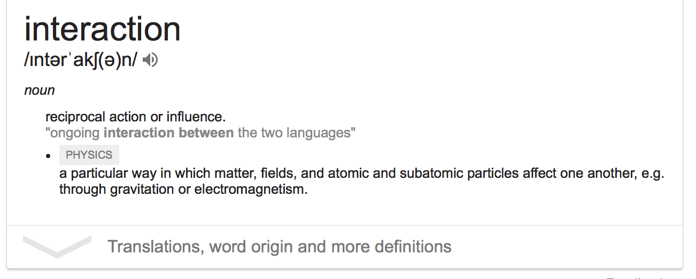

```{r setup, include=FALSE}
library(learnr)
knitr::opts_chunk$set(echo = TRUE,   
                      message = FALSE,
                      warning = FALSE,
                      collapse = TRUE,
                      fig.height = 8,
                      fig.width = 8,
                      fig.align = "center",
                      cache = FALSE)
tutorial_html_dependency()
```

```{r echo=FALSE}
library(tidyverse)
library(broom)
library(gridExtra)
```

# Intermediate models

## Course web site

This is a link to the course web site, in case you need to go back and forth between tutorial and web materials: [http://dmac.dicook.org](http://dmac.dicook.org)

## Overview

- Transformations: building on a stable platform
- Adding interactions to the model - what does this mean?
- Model building - how do you decide when you've got the bets possible model?

## Transformations

*Transform your work larvae to butterfly* (Image source: Jan Thornhill http://sci-why.blogspot.com/2013/04/help-save-monarch-butterfly.html)


- **Numerical variables**, whether they are explanatory or response, work better for modeling if they are reasonably spread out. If they are right- or left-skewed the model puts more weight on the extreme values. 
- **Categorical variables** may need to be re-levelled to balance classes, or remove low count classes.

```{r}
x <- runif(100)
df <- tibble(x, y=5-2*x+rnorm(100), x2=(2*x)^10)
p1 <- ggplot(df, aes(x=x, y=y)) + geom_point() + 
  geom_smooth(method="lm", se=FALSE) +
  ggtitle("Ideal base for model")
p2 <- ggplot(df, aes(x=x2, y=y)) + geom_point() + 
  geom_smooth(method="lm", se=FALSE) +
  ggtitle("Less stable base for model")
p3 <- ggplot(df, aes(x=x2, y=y)) + geom_point() + 
  scale_x_log10() + xlab("Log x2") +
  geom_smooth(method="lm", se=FALSE) +
  ggtitle("Log transform x over-corrects")
p4 <- ggplot(df, aes(x=x2^(1/10), y=y)) + geom_point() + 
  xlab("x2^(1/10)") +
  geom_smooth(method="lm", se=FALSE) +
  ggtitle("Power transform x fixes")
grid.arrange(p1, p2, p3, p4, ncol=2)
```

### Power transformation

This is a family of transformations you can make on quantitative data to help "symmetrise" or "normalise" (make is bell-shaped) the data. These are also called Box-Cox transformations. For $\lambda \in (-\infty, \infty)$, 

$$x_i^{(\lambda)} = \frac{x_i^\lambda -1}{\lambda}  ~~~ \mbox{if} ~\lambda \neq 0$$

but if $\lambda=0, x_i^{(\lambda)} =\ln{x_i}$

```{r}
df <- tibble(x1=rexp(500), x2=runif(500)^5, x3=abs(6-rexp(500)))
p1 <- ggplot(df, aes(x=x1)) + geom_density(fill="black", alpha=0.7)
p2 <- ggplot(df, aes(x=x2)) + geom_density(fill="black", alpha=0.7)
p3 <- ggplot(df, aes(x=x3)) + geom_density(fill="black", alpha=0.7)
p4 <- ggplot(df, aes(x=log(x1+0.1))) + geom_density(fill="black", alpha=0.7) + ggtitle("lambda=0")
p5 <- ggplot(df, aes(x=((x2)^(1/5)-1)/(1/5))) + geom_density(fill="black", alpha=0.7) + ggtitle("lambda=1/5")
p6 <- ggplot(df, aes(x=(x3^5-1)/5)) + geom_density(fill="black", alpha=0.7) + ggtitle("lambda=5")
grid.arrange(p1, p2, p3, p4, p5, p6, ncol=3)
```

It may be necessary to *shift* the values into the domain suitable for the function. For example, to take a log, all values must be bigger than 1.

### Transforming categorical variables

- Categories with small numbers of counts may need ot be combined. 
- Ordered categories might be re-coded to reflect "real" difference between classes

#### Example: flying etiquette

```{r}
fly <- read_csv("data/flying-etiquette.csv") %>% 
  select(`How often do you travel by plane?`, `Do you ever recline your seat when you fly?`, `Is itrude to recline your seat on a plane?`) %>%
  rename(travel_freq=`How often do you travel by plane?`,
         recline=`Do you ever recline your seat when you fly?`,
         rude=`Is itrude to recline your seat on a plane?`)
fly %>% count(travel_freq, sort=TRUE)
```

How often a person flies, is a pretty important context variable for understanding people's responses in the survey. There are two issues here:

- Categories `Every day`, `A few times per week` and even  `A few times per month` have small counts. You may not have enough subjects from which to infer to the larger population of flyers in these categories. 
- Category `Never`!!! If they have never flown how can they provide useful information on flying etiquette?

```{r}
library(forcats)
fly %>% count(recline, sort=TRUE)
fly %>% count(rude, sort=TRUE)
fly %>%   filter(!is.na(recline)) %>%
  filter(!is.na(rude)) %>%
  count(recline, rude, sort=TRUE)
fly %>% 
  filter(!is.na(recline)) %>%
  filter(!is.na(rude)) %>%
  mutate(recline = fct_recode(recline, Always = "Usually")) %>%
  count(recline, rude, sort=TRUE)
```

- Single variables have healthy counts
- But pairs of variables, some combinations of levels have low counts
- Collapsing two or more categories into one, might build better support 

## Adding interactions to the model




### Interaction between quantitative and categorical variables

An interaction term is needed in a model if the linear relationship is different for the response vs quantitative variable for different levels of the categorical variable. That is, a different *slope* needs to be used/estimated for each level. 

Let's take a look at how this works for the [2015 OECD PISA data](http://www.oecd.org/pisa/data/2015database/). The question to be answered is whether more time spent studying science is associated with higher science scores, and how this varies with enjoyment of science. 

```{r echo=FALSE, fig.width=6, fig.height=6}
load("data/pisa_au_sub.rda")
library(labelled)
pisa_au_science <- pisa_au %>% 
  filter(science_fun < 5) %>%
  filter(!is.na(science_time)) %>% 
  select(science, science_fun, science_time, stuweight) %>%
  mutate(science_fun = to_factor(science_fun, ordered=TRUE, drop_unused_labels = TRUE)) %>%
  mutate(science_time = as.numeric(science_time)) %>%
  filter(science_time>0)
  
ggplot(pisa_au_science, aes(x=science_time, y=science,
                            colour=science_fun)) + 
  geom_point(alpha=0.1) + 
  scale_colour_brewer("Enjoy science", palette="Dark2") +
  facet_wrap(~science_fun, ncol=2) + 
  scale_x_log10() +
  # geom_smooth(method="lm", se=FALSE) + 
  theme(legend.position="bottom") + 
  xlab("Time spent studying science per week (mins") + 
  ylab("Synthetic science score")
```


```{r pipeline, echo=FALSE}
quiz(
  question("How would you describe the relationship between science score and time spent studying?",
    answer("Weak", correct = TRUE),
    answer("Moderate"), 
    answer("Strong")),
  question("What do these lines of code do?   `filter(science_fun < 5) %>%
  filter(!is.na(science_time))`", 
    answer("Remove missing values", correct = TRUE),
    answer("Remove extreme values, and missing values"),
    answer("I have no idea")),
  question("Why was `science_time` transformed to a log scale?",
    answer("It has a right-skewed distribution.", correct = TRUE),
    answer("It has a left-skewed distribution."),
    answer("It is symmetric")),
  question("Why were 0 values of `science_time` removed?",
    answer("It could be argued that these are most likely missing values", correct = TRUE),
    answer("They are outliers affecting the modeling"),
    answer("No-one would be able to study science 0 minutes per week"))
)
```

There are two possible models:

$y_i = \beta_0+\beta_1x_{i1}+\beta_2x_{i2}+\varepsilon_i$ (Model 1)

$y_i = \beta_0+\beta_1x_{i1}+\beta_2x_{i2}+\beta_3x_{i1}*x_{i2}+\varepsilon_i$ (Model 2)

where $y=$ science score, $x_1=$ science study time, $x_2=$ science enjoyment. 

Model 2 has an interaction term. This means that the slope will be allowed to vary for the different levels of the categorical variables, science_fun.

*Note:* Ordered factors are treated as "numeric" in the default model fit, so we should convert `science_fun` to be an unordered categorical variable. Also, `science_time` is heavily skewed so should be transformed.

```{r}
pisa_au_science <- pisa_au_science %>%
  mutate(log_science_time = log10(science_time)) %>%
  mutate(science_fun_c = factor(science_fun, ordered=FALSE))
mod1 <- lm(science~log_science_time+science_fun_c, data=pisa_au_science, weights = stuweight)
mod2 <- lm(science~log_science_time*science_fun_c, data=pisa_au_science, weights = stuweight)
tidy(mod1)
tidy(mod2)
```

### Five minute challenge

- Write out the equations for both models. (Ignore the log transformation.)
- Make a **hand** sketch of both models.

### Which is the better model?

```{r}
glance(mod1)
glance(mod2)
```

`r emo::ji("shocked")` they are both pretty bad! The interaction model (mod2) is slightly better but its really not.

### Interaction between quantitative variables

- Interactions for two quantitative variables in a model, can be thought of as allowing the paper sheet (model) to curl.

```{r}
library(viridis)
x1 <- runif(500)
x2 <- runif(500)
df <- tibble(x1, x2, y1=5-2*x1+4*x2+rnorm(500)*0.5,
             y2=5-2*x1+4*x2+10*(-x1)*x2+rnorm(500)*0.5)
p1 <- ggplot(df, aes(x=x1, y=x2, colour=y1)) + 
  geom_point(size=5, alpha=0.5) + 
  scale_colour_viridis() + 
  theme_bw() + theme(aspect.ratio=1, legend.position="none") +
  ggtitle("Flat sheet: no interaction")
p2 <- ggplot(df, aes(x=x1, y=x2, colour=y2)) + 
  geom_point(size=5, alpha=0.5) + 
  scale_colour_viridis() + 
  theme_bw() + theme(aspect.ratio=1, legend.position="none") +
  ggtitle("Curled sheet: needs an interaction term")
df_loess1 <- loess(y1~x1+x2, data=df)
df_loess2 <- loess(y2~x1+x2, data=df)
df_grid <- expand.grid(x1=seq(0, 1, 0.1), x2=seq(0, 1, 0.1))
df_grid <- df_grid %>%
  mutate(y1 = as.vector(predict(df_loess1, newdata=df_grid)),
         y2 = as.vector(predict(df_loess2, newdata=df_grid)))
p3 <- ggplot(df_grid, aes(x=x1, y=x2, z=y1, colour=y1)) + 
  geom_contour(aes(colour = stat(level))) + 
  scale_colour_viridis() + 
  theme_bw() + theme(aspect.ratio=1, legend.position="none") +
  ggtitle("Flat sheet: no interaction") + 
  geom_point(data=df, aes(x=x1, y=x2, colour=y1), size=0.5, alpha=0.5)
p4 <- ggplot(df_grid, aes(x=x1, y=x2, z=y2)) + 
  geom_contour(aes(colour = stat(level))) + 
  scale_colour_viridis() + 
  theme_bw() + theme(aspect.ratio=1, legend.position="none") +
  ggtitle("Curled sheet: needs an interaction term") + 
  geom_point(data=df, aes(x=x1, y=x2, colour=y2), size=0.5, alpha=0.5)
grid.arrange(p1, p2, p3, p4, ncol=2)
```


### Five minute challenge

Using the PISA data: How does science score relate to text anxiety and gender?
- Make a plot of science by anxtest, coloured by gender. Does it look like an interaction term might be necessary?
- Fit the model with `science` score as the response and `gender` and `anxtest`. 
- Try an interaction between gender and anxtest. 
- Which is the better model?

The code below has `???` where you need to replace with something sensible.

```{r eval=FALSE}
pisa_au_science <- pisa_au %>% 
  filter(!is.na(???)) %>%
  select(science, gender, anxtest, stuweight) 
ggplot(pisa_au_science, aes(x=anxtest, y=science, colour=gender)) + geom_smooth(method="lm")
sci_lm1 <- lm(science ~ ??? + ???, data=pisa_au_science, weights=stuweight)
sci_lm2 <- lm(science ~ ??? * ???, data=pisa_au_science, weights=stuweight)
tidy(???)
glance(???)
```


## Model building

Goal: The simplest model possible that provides similar predictive accuracy to most complex model.

Approach: 

- Start simply, fit main effects models (single best variable, adding several more variables independently) and try to understand the effect that each has in the model. 
- Explore transformations with the aim to build a stable foundation of explanatory variables for the model.
- Check model diagnostics, residual plots.
- Explore two variable interactions, and understand effect on model.
- Explore three variable interactions.
- Use model goodness of fit to help decide on final. There may be more than one model that are almost equally as good.

*Aside:* Ideally, values of explanatory variables cover all possible combinations in their domain. There should *not be any association between explanatory variables*. If there is, then the there is more uncertainty in the parameter estimates. Its like building a table with only two legs, that table would be a bit wobbly, and unstable. A work around is to first regress one explanatory variable on the other, and add the residuals from this fit to the model, instead of the original variable. That is, suppose $X_1, X_2$ are strongly linearly associated, then model $X_2\sim b_0+b_1X_1+e$, and use $e$ (call it $X^*_2$) in the model instead of $X_2$. You would then only be using the part of $X_2$ that is not related to $X_1$ to expand the model. This approach can be used for multiple explanatory variables that are associated. 

### Lab exercise

Build the best model you can for science score, by exploring  these variables: math score, reading score, tvs, books, breakfast, feel free to choose others. (Code provided in Rmd is just a sample, and needs to be modified.)

```{r echo=FALSE, eval=FALSE}
pisa_au_science <- pisa_au %>% 
  filter(science_fun < 5) %>%
  filter(!is.na(science_time)) %>%
  filter(!is.na(anxtest)) %>%
  select(science, math, read, science_fun, science_time, breakfast, gender, anxtest, books, tvs, stuweight) %>%
  mutate(science_time = as.numeric(science_time)) %>%
  filter(science_time>0) %>%
  mutate(log_science_time = log10(science_time)) %>%
  mutate(science_fun_c = factor(science_fun, ordered=FALSE))
sci_lm <- lm(science ~ math + read + science_fun_c + science_time + gender*anxtest, data=pisa_au_science, weights=stuweight)
tidy(sci_lm)
glance(sci_lm)
```

## Share and share alike

<a rel="license" href="http://creativecommons.org/licenses/by/4.0/"></a><br />This work is licensed under a <a rel="license" href="http://creativecommons.org/licenses/by/4.0/">Creative Commons Attribution 4.0 International License</a>.
