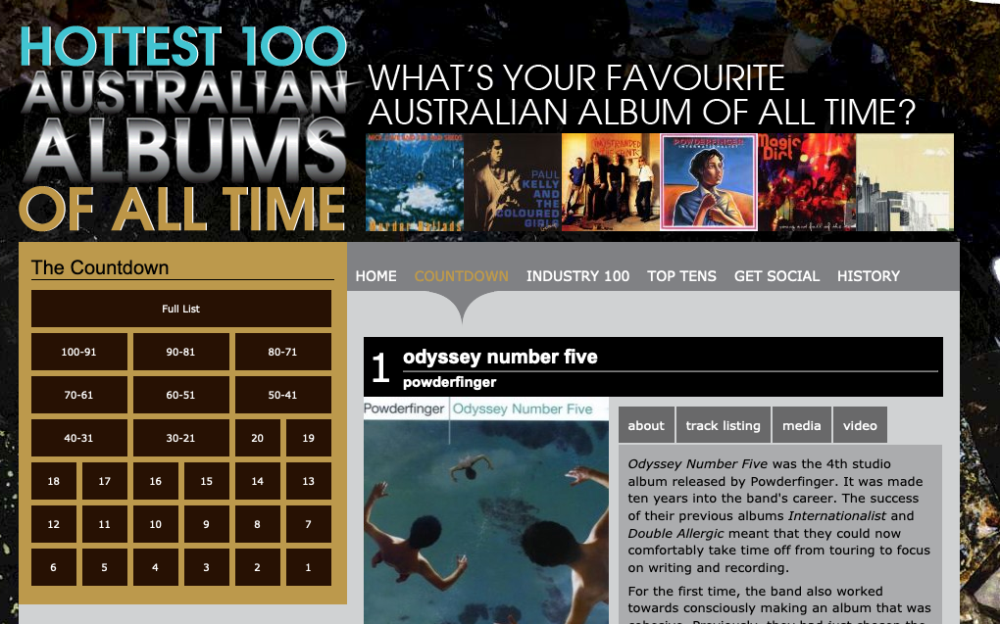

```{r setup, include=FALSE}
library(tidyverse)
library(knitr)
library(plotly)
library(broom)
library(textdata)
library(tm)

knitr::opts_chunk$set(
  fig.width = 8,
  fig.height = 4.5,
  fig.retina = 3,
  fig.align = "center",
  out.width = "90%",
  message = FALSE,
  warning = FALSE,
  cache = TRUE,
  autodep = TRUE,
  hiline = TRUE
)

knitr::opts_hooks$set(fig.callout = function(options) {
  if (options$fig.callout) {
    options$echo <- FALSE
    options$out.height <- "99%"
    options$fig.width <- 16
    options$fig.height <- 8
  }
  options
})

options(
  htmltools.dir.version = FALSE,
  width = 90,
  max.print = 9999,
  knitr.table.format = "html"
)

as_table <- function(...) knitr::kable(..., format = "html", digits = 3)

# ggplot2 color palette with gray
color_palette <- list(
  gray = "#999999",
  salmon = "#E69F00",
  lightblue = "#56B4E9",
  green = "#009E73",
  yellow = "#F0E442",
  darkblue = "#0072B2",
  red = "#D55E00",
  purple = "#CC79A7"
)
```

class: bg-main1
# recap

.huge[
- linear models (are awesome)
- many models
]

---
class: bg-main1

# Announcements

.huge[
- Assignment 3
- Project
- Peer review marking open (soon!)
- No class on September 27 (AFL day)
]

---
class: bg-main1

# Tidytext analysis

```{r overview-img, echo = FALSE}
include_graphics("images/text_analysis.png")
```

---
class: bg-main1

# Why text analysis?

.huge[
- To use the realtors text description to improve the Melbourne housing price model
- Determine the extent of public discontent with train stoppages in Melbourne
- The differences between Darwin's first edition of the Origin of the Species and the 6th edition
- Does the sentiment of posts on Newcastle Jets public facebook page reflect their win/los record?
]

---
class: bg-main1

# Typical Process

.huge[
1. Read in text
2. Pre-processing: remove punctuation signs, remove numbers, stop words, stem words
3. Tokenise: words, sentences, ngrams, chapters
4. Summarise
5. model
]

---
class: bg-main1

# Packages

.huge[
In addition to `tidyverse` we will be using three other packages today
]

```{r list-pkgs}
library(tidytext)
library(genius)
library(gutenbergr)
```

---
class: bg-main1

# Tidytext

.huge[
- Using tidy data principles can make many text mining tasks easier, more effective, and consistent with tools already in wide use.

- Learn more at https://www.tidytextmining.com/, by Julia Silge and David Robinson.
]

---
class: bg-main1

# What is tidy text?

```{r show-text}
text <- c("This will be an uncertain time for us my love",
          "I can hear the echo of your voice in my head",
          "Singing my love",
          "I can see your face there in my hands my love",
          "I have been blessed by your grace and care my love",
          "Singing my love")

text
```

---
class: bg-main1

# What is tidy text?

```{r tidy-text-tile}
text_df <- tibble(line = seq_along(text), text = text)

text_df
```

---
class: bg-main1

# What is tidy text?

```{r unnest-tokens}
text_df %>%
  unnest_tokens(
    output = word,
    input = text,
    token = "words" # default option
  ) 
```

---
class: bg-main1

# What is unnesting?

```{r unnest-tokens-chars}
text_df %>%
  unnest_tokens(
    output = word,
    input = text,
    token = "characters"
  )
```

---
class: bg-main1

# What is unnesting - ngrams length 2

```{r unnest-tokens-ngram-2}
text_df %>%
  unnest_tokens(
    output = word,
    input = text,
    token = "ngrams",
    n = 2
  )
```

---
class: bg-main1

# What is unnesting - ngrams length 3

```{r unnest-tokens-ngram-3}
text_df %>%
  unnest_tokens(
    output = word,
    input = text,
    token = "ngrams",
    n = 3
  )
```

---

class: center, middle

# Analyzing lyrics of one artist

---
class: bg-main1

# Let's get more data

.huge[
We'll use the `genius` package to get song lyric data from [Genius](https://genius.com/).

- `genius_album()` allows you to download the lyrics for an entire album in a 
tidy format. 

]

---
class: bg-main1

# getting more data

.huge[
- Input: Two arguments: `artists` and `album`. If it gives you issues check that you have the album name and
artists as specified on [Genius](https://genius.com/).

- Output: A tidy data frame with three columns:
    - `title`: track name
    - `track_n`: track number
    - `text`: lyrics
]

---
class: bg-main1

# [Greatest Australian Album of all time (as voted by triple J)](https://www.abc.net.au/triplej/hottest100/alltime/11/countdown/cd_1.htm)

```{r show-powderfinger-website, echo = FALSE, out.width = "90%"}

```


---
class: bg-main1

# Greatest Australian Album of all time (as voted by triple J)

```{r powderfinger-album, cache=TRUE}
od_num_five <- genius_album(
  artist = "Powderfinger",
  album = "Odyssey Number Five"
)

od_num_five
```

---
class: bg-main1

# Save for later

```{r save-powderfinger}
powderfinger <- od_num_five %>%
  mutate(
    artist = "Powderfinger",
    album = "Odyssey Number Five"
  )

powderfinger
```

---
class: bg-main1

# What songs are in the album?

```{r distinct-songs}
powderfinger %>% distinct(track_title)
```

---
class: bg-main1

# How long are the lyrics in Powderfinger's songs?

```{r powderfinger-n-lines}
powderfinger %>%
  count(track_title) %>%
  arrange(-n)
```

---
class: bg-main1

# Tidy up the lyrics!

```{r unnest-tokens-powderfinger}
powderfinger_lyrics <- powderfinger %>%
  unnest_tokens(output = word,
                input = lyric)

powderfinger_lyrics
```

---
class: bg-main1

# What are the most common words?

```{r common-words}
powderfinger_lyrics %>%
  count(word) %>%
  arrange(-n)
```

---

# Stop words

.huge[
- In computing, stop words are words which are filtered out before or after processing of natural language data (text).

- They usually refer to the most common words in a language, but there is not a single list of stop words used by all natural language processing tools.
]

---
class: bg-main1

# English stop words

```{r eng-stopwords}
get_stopwords()
```

---
class: bg-main1

# Spanish stop words

```{r spanish-stopwords}
get_stopwords(language = "es")
```

---
class: bg-main1

# Various lexicons

.huge[
See `?get_stopwords` for more info.
]

```{r other-lexicons}
get_stopwords(source = "smart")
```

---
class: bg-main1

# What are the most common words?

```{r repeat}
powderfinger_lyrics
```

---
class: bg-main1

# What are the most common words?

```{r stopwords-anti-join}
stopwords_smart <- get_stopwords(source = "smart")

powderfinger_lyrics %>%
  anti_join(stopwords_smart)
```

---
class: bg-main1

# What are the most common words?

```{r stopwords-anti-join-complete}
powderfinger_lyrics %>%
  anti_join(stopwords_smart) %>%
  count(word) %>%
  arrange(-n)
```

---

# What are the most common words?

```{r gg-common-words, eval=FALSE}
powderfinger_lyrics %>%
  anti_join(stopwords_smart) %>%
  count(word) %>%
  arrange(-n) %>%
  top_n(20) %>%
  ggplot(aes(fct_reorder(word, n), n)) +
  geom_col() +
  coord_flip() +
  theme_minimal() +
  labs(title = "Frequency of Powderfinger's lyrics",
       subtitle = "`Back` tops the chart",
       y = "",
       x = "")
```

---

```{r gg-common-words-out, ref.label = 'gg-common-words', echo = FALSE, out.width = "100%"}

```

---
class: bg-main1

# Sentiment analysis

.huge[
- One way to analyze the sentiment of a text is to consider the text as a combination of its individual words 

- and the sentiment content of the whole text as the sum of the sentiment content of the individual words
]

---
class: bg-main1

# Sentiment lexicons

.pull-left[
```{r show-sentiment-afinn}
get_sentiments("afinn")
```
]

.pull-right[
```{r show-sentiment-bing}
get_sentiments("bing")
```
]

---
class: bg-main1

# Sentiment lexicons

.pull-left[
```{r show-sentiment-bing2}
get_sentiments(lexicon = "bing")
```
]

.pull-right[
```{r show-sentiment-loughran}
get_sentiments(lexicon = "loughran")
```
]

---
class: bg-main1

# Sentiments in Powderfinger's lyrics

```{r sentiment-powderfinger}
sentiments_bing <- get_sentiments("bing")

powderfinger_lyrics %>%
  inner_join(sentiments_bing) %>%
  count(sentiment, word) %>%
  arrange(-n)
```

---

# Visualising sentiments

```{r gg-sentiment, echo=FALSE, message=FALSE}
powderfinger_lyrics %>%
  inner_join(sentiments_bing) %>%
  count(sentiment, word) %>%
  arrange(desc(n)) %>%
  group_by(sentiment) %>%
  top_n(10) %>%
  ungroup() %>%
  ggplot(aes(fct_reorder(word, n), n, fill = sentiment)) +
  geom_col() +
  coord_flip() +
  facet_wrap(~sentiment, scales = "free") +
  theme_minimal() +
  labs(
    title = "Sentiments in Powderfinger's lyrics",
    x = ""
  )
```

---
class: bg-main1

## Visualising sentiments

```{r gg-sentiment2, eval = FALSE}
powderfinger_lyrics %>%
  inner_join(sentiments_bing) %>%
  count(sentiment, word) %>%
  arrange(desc(n)) %>%
  group_by(sentiment) %>%
  top_n(10) %>%
  ungroup() %>%
  ggplot(aes(fct_reorder(word, n), n, fill = sentiment)) +
  geom_col() +
  coord_flip() +
  facet_wrap(~sentiment, scales = "free") +
  theme_minimal() +
  labs(
    title = "Sentiments in Powderfinger's lyrics",
    x = ""
  )
```

---
class: bg-main1

# Comparing lyrics across artists

---

## Get more data: The White Stripes & The Midnight


```{r get-artists, cache=TRUE}
stripes <- genius_album(artist = "The White Stripes",
                        album = "Elephant") %>%
  mutate(artist = "The White Stripes",
         album = "Elephant")

midnight <- genius_album(artist = "The Midnight",
                         album = "Kids") %>%
  mutate(artist = "The Midnight",
         album = "Kids")
```

---
class: bg-main1

# Combine data:

```{r combine-data}
ldoc <- bind_rows(powderfinger,
                  stripes,
                  midnight)

ldoc
```

---
class: bg-main1

# LDOC lyrics

```{r ldoc-lyrics}
ldoc_lyrics <- ldoc %>%
  unnest_tokens(word, lyric)

ldoc_lyrics
```

---
class: bg-main1

# Common LDOC lyrics - Without stop words:

```{r common-LDOC-lyrics}
ldoc_lyrics %>%
  anti_join(stopwords_smart) %>%
  count(artist, word, sort = TRUE) # alternative way to sort
```

---
class: bg-main1

# Common LDOC lyrics - With stop words:

```{r common-ldoc}
ldoc_lyrics_counts <- ldoc_lyrics %>%
  count(artist, word, sort = TRUE)

ldoc_lyrics_counts
```

---
class: bg-main1

# What is a document about?

.huge[
- Term frequency
- Inverse document frequency

$$idf(\text{term}) = \ln{\left(\frac{n_{\text{documents}}}{n_{\text{documents containing term}}}\right)}$$

tf-idf is about comparing **documents** within a **collection**.
]

---
class: bg-main1

# Calculating tf-idf: Perhaps not that exciting... What's the issue?

```{r calc-tf-idf}
ldoc_words <- ldoc_lyrics_counts %>%
  bind_tf_idf(term = word, document = artist, n = n)

ldoc_words
```

---
class: bg-main1

# Re-calculating tf-idf

```{r re-calc-tf-odf}
ldoc_words %>%
  bind_tf_idf(term = word, document = artist, n = n) %>%
  arrange(-tf_idf)
```

---

```{r gg-tf-idf, echo=FALSE,message=FALSE, fig.height = 5}
ldoc_words %>%
  group_by(artist) %>%
  top_n(10) %>%
  ungroup() %>%
  ggplot(aes(fct_reorder(word, tf_idf), tf_idf, fill = artist)) +
  geom_col(show.legend = FALSE) + 
  coord_flip() +
  facet_wrap(~artist, ncol = 1, scales = "free") +
  scale_y_continuous() +
  theme_minimal() +
  labs(x = NULL, y = "tf-idf") +
  ylim(c(0, 0.015))
```

---
class: bg-main1

# Your Turn:

.huge[
- go to rstudio.cloud and repeat the analyses done in the lecture for your own artists.
- some suggestions:
  - Daft Punk's "Discovery" or "Random Access Memories"
  - Musicals: "Les Miserables" or "Wicked"
]

---
class: bg-main1, middle, center

# Part Two: Tidy Text analysis on Books

---
class: bg-main1

# Getting some books to study

.huge[
The [Gutenberg project](http://www.gutenberg.org/wiki/Main_Page) provides the text of over 57000 books free online. 

Let's explore The Origin of the Species by Charles Darwin using the `gutenbergr` R package.
]

---
class: bg-main1

.huge[
We need to know the `id` of the book, which means looking this up online anyway. 

- The first edition is `1228`
- The sixth edition is `2009`
]

---
class: bg-main1

# Packages used

.huge[
- We need the `tm` package to remove numbers from the page, and `gutenbergr` to access the books.
]
```{r load-extra-pkgs}
# The tm package is needed because the book has numbers
# in the text, that need to be removed, and the
# install.packages("tm")
library(tm)
library(gutenbergr)
```

---
class: bg-main1

# Download darwin

```{r download-darwin}
darwin1 <- gutenberg_download(1228)
darwin1
# remove the numbers from the text
darwin1$text <- removeNumbers(darwin1$text)
```

---
class: bg-main1

# Tokenize

.huge.pull-left[
- break into one word per line
- remove the stop words
- count the words
- find the length of the words
]

.pull-right[
```{r tokenize-text}
darwin1_words <- darwin1 %>%
  unnest_tokens(word, text) %>%
  anti_join(stop_words) %>%
  count(word, sort = TRUE) %>%
  mutate(len = str_length(word))

darwin1_words
```
]

---
class: bg-main1

# Analyse tokens

```{r analyse-text}
quantile(
  darwin1_words$n,
  probs = seq(0.9, 1, 0.01)
)
```

---
class: bg-main1

# Analyse tokens

.left-code[
```{r gg-analyse-text, eval = FALSE}
darwin1_words %>%
  top_n(n = 20,
        wt = n) %>%
  ggplot(aes(x = n,
             y = fct_reorder(word, n))) +
  geom_point() +
  ylab("")
```  
]

.right-plot[
```{r gg-analyse-text-out, ref.label = 'gg-analyse-text', echo = FALSE, out.width = "100%"}

```
]

---
class: bg-main1

# Download and tokenize the 6th edition.

```{r dl-second-edition}
darwin6 <- gutenberg_download(2009)

darwin6$text <- removeNumbers(darwin6$text)
```

---
class: bg-main1

# show tokenized words

```{r table-second-edition}
darwin6_words <- darwin6 %>%
  unnest_tokens(word, text) %>%
  anti_join(stop_words) %>%
  count(word, sort = TRUE) %>%
  mutate(len = str_length(word))

darwin6_words
```

---
class: bg-main1

```{r quantile-second-edition}
quantile(darwin6_words$n, probs = seq(0.9, 1, 0.01))
```

---
class: bg-main1


```{r gg-second-edition}
darwin6_words %>%
  top_n(n = 20,
        wt = n) %>%
  ggplot(aes(x = n, y = fct_reorder(word, n))) + geom_point() +
  ylab("")
```

---
class: bg-main1

# Compare the word frequency

.left-code[
```{r full-join-darwin}
darwin <- full_join(
  darwin1_words, 
  darwin6_words, 
  by = "word"
  ) %>%
  rename(
    n_ed1 = n.x, 
    len_ed1 = len.x, 
    n_ed6 = n.y, 
    len_ed6 = len.y
    )
```
]

.right-plot[
```{r full-join-darwin-out}
darwin
```

]


---
class: bg-main1

## plot the word frequency

.left-code[
```{r plot-word-freq, eval = FALSE}
library(plotly)
p <- ggplot(darwin, 
            aes(x = n_ed1, 
                y = n_ed6, 
                label = word)) +
  geom_abline(intercept = 0, 
              slope = 1) +
  geom_point(alpha = 0.5) +
  xlab("First edition") + 
  ylab("6th edition") +
  scale_x_log10() + 
  scale_y_log10() + 
  theme(aspect.ratio = 1)
ggplotly(p)
```
]

.right-plot[
```{r plot-word-freq-out, ref.label = 'plot-word-freq', echo = FALSE, out.width = "100%"}

```
]

---
class: bg-main1

# Your turn:

.vlarge[
- Does it look like the 6th edition was an expanded version of the first?
- What word is most frequent in both editions?
- Find some words that are not in the first edition but appear in the 6th.
- Find some words that are used the first edition but not in the 6th.
- Using a linear regression model find the top few words that appear more often than expected, based on the frequency in the first edition. Find the top few words that appear less often than expected. 
]

---
class: bg-main1

## Book comparison

.huge[
Idea: Find the important words for the content of each document by decreasing the weight of commonly used words and increasing the weight for words that are not used very much in a collection or corpus of documents.
]

---
class: bg-main1

# Term frequency, inverse document frequency (`tf_idf`).

.vlarge[
Helps measure word importance of a document in a collection of documents.

E.g, A novel in a collection of novels, a website in a collection of websites.
]

.large[
$$tf_{word} = \frac{Number~of~times~word~t~appears~in~a~document}{Total~number~of~words~in~the~document}$$

$$idf_{word} = log \frac{number~of~documents}{number~of~documents~word~appears~in}$$

$$tf_idf = tf\times idf$$

]

---
class: bg-main1

```{r bind-rows-darwin}
darwin <- bind_rows("first" = darwin1_words, 
                    "sixth" = darwin6_words,
                    .id = "edition")

darwin
```

---
class: bg-main1

# TF IDF

```{r darwin-tf-idf}
darwin_tf_idf <- darwin %>% bind_tf_idf(word, edition, n)

darwin_tf_idf %>% arrange(desc(tf_idf))
```

---
class: bg-main1

```{r gg-rawin-tf-idf}
gg_darwin_1_vs_6 <-
darwin_tf_idf %>%
  arrange(desc(tf_idf)) %>%
  mutate(word = factor(word,
                       levels = rev(unique(word)))) %>%
  group_by(edition) %>%
  top_n(15) %>%
  ungroup() %>%
  ggplot(aes(x = word, 
             y = tf_idf, 
             fill = edition)) +
  geom_col(show.legend = FALSE) +
  labs(x = NULL, 
       y = "tf-idf") +
  facet_wrap(~edition, 
             ncol = 2, 
             scales = "free") +
  coord_flip() + 
  scale_fill_brewer(palette = "Dark2")
```  

---
class: bg-main1

```{r gg-rawin-tf-idf-out, echo = FALSE}
gg_darwin_1_vs_6
```

---
class: bg-main1

# What do we learn?

.huge[
- Mr Mivart appears in the 6th edition, multiple times
]

```{r show-mivart}
str_which(darwin6$text, "Mivart")
darwin6[5435, ]
```

---
class: bg-main1

# What do we learn?

.huge[
- Prof title is used more often in the 6th edition
- There is a tendency for latin names 
- Mistletoe was mispelled in the 1st edition
]

---
class: bg-main1

# Lab exercise 

.huge[
Text Mining with R has an example comparing historical physics textbooks:  *Discourse on Floating Bodies* by Galileo Galilei, *Treatise on Light* by Christiaan Huygens, *Experiments with Alternate Currents of High Potential and High Frequency* by Nikola Tesla, and *Relativity: The Special and General Theory* by Albert Einstein. All are available on the Gutenberg project. 

Work your way through the [comparison of physics books](https://www.tidytextmining.com/tfidf.html#a-corpus-of-physics-texts). It is section 3.4.
]

---
class: bg-main1

# Thanks

.huge[
- Dr. Mine Çetinkaya-Rundel
- Dr. Julia Silge: https://github.com/juliasilge/tidytext-tutorial
- Dr. Julia Silge and Dr. David Robinson: https://www.tidytextmining.com/
- Josiah Parry: https://github.com/JosiahParry/genius
]
