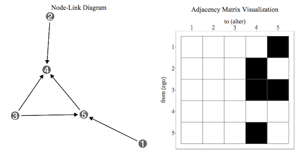
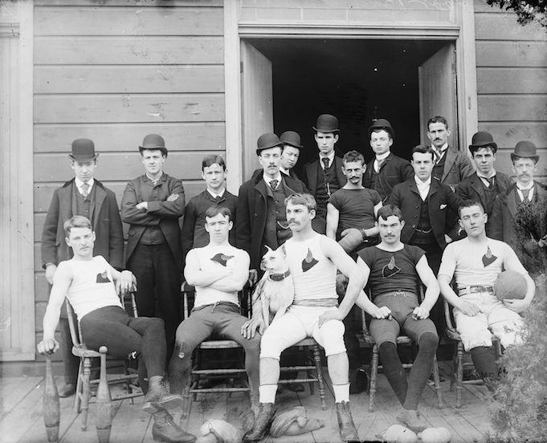
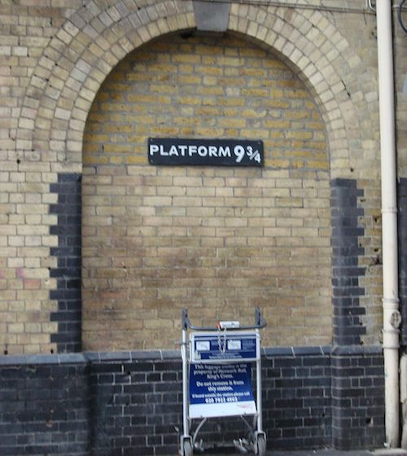
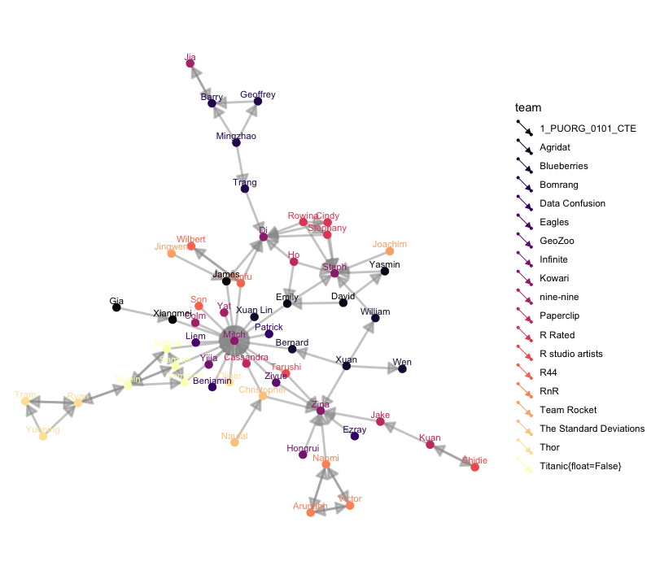

```{r setup, include=FALSE}
library(learnr)
knitr::opts_chunk$set(echo = TRUE,   
                      message = FALSE,
                      warning = FALSE,
                      collapse = TRUE,
                      fig.height = 6,
                      fig.width = 6,
                      fig.align = "center",
                      cache = FALSE)
tutorial_html_dependency()
library(tidyverse)
library(plotly)
```

# Network analysis

## Course web site

This is a link to the course web site, in case you need to go back and forth between tutorial and web materials: [http://dmac.dicook.org](http://dmac.dicook.org)

## Overview

Network data arises in many settings, e.g. study of communities, biological pathways, ... Typically the data is provided in two related tables, nodes and edges. Both may have additional attributes.

This is a nodes data set, the characters from the TV series Mad Men.

```{r echo=FALSE}
library(geomnet)
data(madmen)
madmen$vertices
```

and the network component measures how the "nodes" are associated. Here it is whether they have had an affair.

```{r echo=FALSE}
madmen$edges
```

Why?

- Telephone exchanges: Nodes are the phone numbers. Edges would indicate a call was made betwen two numbers.
- Book or movie plots: Nodes are the characters. Edges would indicate whether they appear together in a scene, or chapter. If they speak to each other, various ways we might measure the association.
- Social media: nodes would be the people who post on facebook, including comments. Edges would measure who  comments on who's posts.

A basic component is to have an association matrix between many objects. (Image above created by Sam Tyner.) 



The R package [geomnet](https://github.com/sctyner/geomnet) provides tools for working with network data. 

## Example: Madmen


*Source: [wikicommons](https://en.wikipedia.org/wiki/Mad_Men#/media/File:Mad-men-title-card.jpg)*

Here's an example from the [TV series Madmen](https://en.wikipedia.org/wiki/Mad_Men). The nodes data contains the actors in the series, and the edges contains pairs of actors that had romantic relationships.

```{r}
glimpse(madmen)
```


### Generate a network view

- Create a layout (in 2D) which places nodes which are most related close,
- Plot the nodes as points, connect the appropriate lines
- Overlaying other aspects, e.g. gender

```{r fig.width=8, fig.height=6}
# data step: join the edge and node data with a fortify call
MMnet <- fortify(as.edgedf(madmen$edges), madmen$vertices)
# create plot
set.seed(5556677)
ggplot(data = MMnet, aes(from_id = from_id, to_id = to_id)) +
  geom_net(aes(colour = Gender), layout.alg = "kamadakawai",
    size = 2, labelon = TRUE, vjust = -0.6, ecolour = "grey60",
    directed =FALSE, fontsize = 3, ealpha = 0.5) +
    scale_colour_manual(values = c("#FF69B4", "#0099ff")) +
    xlim(c(-0.05, 1.05)) +
    theme_net() +
    theme(legend.position = "bottom")
```

```{r eval=FALSE}
ggplotly()
```

Which actor was most connected?

```{r}
madmen$edges %>% 
  gather(X, Name, Name1, Name2) %>% 
  count(Name, sort=TRUE)
```

What do we learn?

- Don Draper had a lot of affairs, all with loyal partners except for his wife Betty, who had two affairs herself
- Peggy Olson was the female character with the most affairs, but her husband Pete Campbell had almost as many affairs 

## Example: American college football

Early American football outfits were like Australian AFL today!


*Source: [wikicommons](https://commons.wikimedia.org/wiki/File:Unknown_Early_American_Football_Team.jpg)*

Fall 2000 Season of [Division I college football](https://en.wikipedia.org/wiki/NCAA_Division_I). Nodes are the teams, edges are the matches. Teams are broken into "conferences" which are the primary competition, but they can play outside this group.

```{r echo=TRUE}
glimpse(football)
```


```{r fig.width=11, fig.height=8, fig.align='center'}
# data step: merge vertices and edges
ftnet <- merge(
  football$edges, football$vertices,
  by.x = "from", by.y = "label", all = TRUE
)

# label independent schools
ftnet$schools <- ifelse(ftnet$value == "Independents", ftnet$from, "")
ggplot(data = ftnet,
       aes(from_id = from, to_id = to)) +
  geom_net(
    aes(
      colour = value, group = value,
      linetype = factor(1-same.conf),
      label = schools
    ),
    linewidth = 0.5,
    size = 5, vjust = -0.75, alpha = 0.3,
    layout.alg = 'fruchtermanreingold'
  ) +
  theme_net() +
  theme(legend.position = "bottom") +
  scale_colour_brewer("Conference", palette = "Paired")
```

What do we learn?

- Remember layout is done to place nodes that are more similar close together in the display. The colours indicate conference the team belongs too. For the most part, conferences are clustered, more similar to each other than other conferences. 
- There are some clusters of conference groups, eg Mid-American, Big East, and Atlantic Coast
- The Independents are independent
- Some teams play far afield from their conference.

## Example: Harry Potter characters



*Source: [wikicommons](https://commons.wikimedia.org/wiki/File:Harry_Potter_Platform_Kings_Cross.jpg)*

There is a connection between two students if one provides emotional support to the other at some point in the book. Code to pull the data together is provided by Sam Tyner [here](https://github.com/sctyner/geomnet/blob/master/README.Rmd#harry-potter-peer-support-network).

```{r echo=TRUE}
load("data/hpchars.rda")
load("data/hpedges.rda")
head(hp.chars)
head(hp.edges)
```


```{r fig.width=10, fig.height=7, eval=FALSE}
hp.all <- fortify(as.edgedf(hp.edges), hp.chars, group = "book")
ggplot(data=hp.all, aes(from_id = from, to_id = to_id)) + 
  geom_net(fiteach=T, directed = T, size = 3, linewidth = .5, 
           ealpha = .5, labelon = T, fontsize = 3, repel = T, 
           labelcolour = "black", arrowsize = .5, singletons = FALSE,
           aes(colour = house, group = house, shape = gender)) + 
  scale_colour_manual(values = c("#941B08","#F1F31C", 
                                 "#071A80", "#154C07")) + 
  facet_wrap(~book, labeller = "label_both", ncol=3) + 
  theme_net() + theme(panel.background = element_rect(colour = 'black'), legend.position="bottom")
```

## Your turn

- Read in the class data. `s1.name` and `s2.name` are the first names of class members, and tutors, with the latter being the "go-to" person for the former. 
- Write the code to produce a class network that looks something like this:




- Try changing the layout method to "circle" or "mds"
- Try setting a random seed, a random number that affects the initial condition for the layout optimisation. You coulde use code like this, substituting in a different:
- For the class members/tutors, shevin, james, nicole, wai, jamesjing, write out the 5x5 association matrix.

`r emo::clock(lubridate::ymd_hms("2019-05-07 17:30:00"))` **Lab quiz time!**

<!--
## Simpsons

Your turn to make a network diagram for the Simpsons. The measure of association will be "that the two characters had lines in the same episode together".

- How many characters appeared only in one episode? (You will want to drop these)
- Write code to search if a character has a line in an episode
- Compile a dataset of episode (rows) and character (columns) which is a binary matrix where 1 indicates the character had a line in the episode, and 0 is otherwise
- Gather the matrix into long form, with these columns: `episode`, `character`, `had a line` (0,1)
- Filter the rows with `had a line` equal to 1. 
- Count the number of times the pair of characters appeared. This now forms your edge set, with an additional column of the strength of the relationship
- Make your network display
-->

## Share and share alike

<a rel="license" href="http://creativecommons.org/licenses/by/4.0/"></a><br />This work is licensed under a <a rel="license" href="http://creativecommons.org/licenses/by/4.0/">Creative Commons Attribution 4.0 International License</a>.
