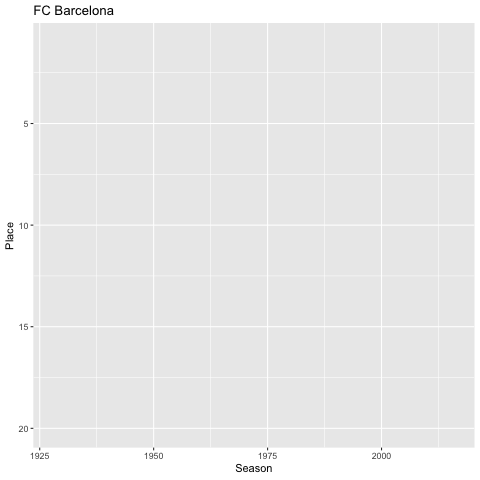
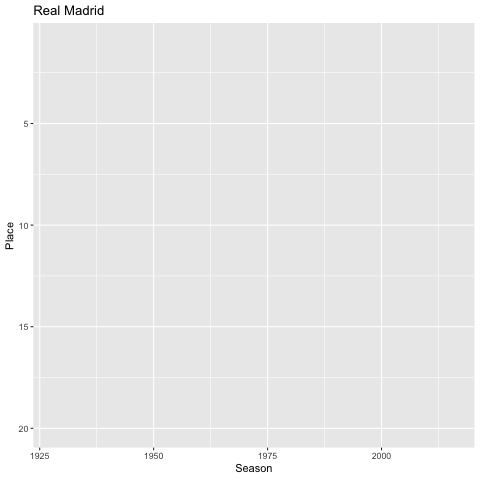
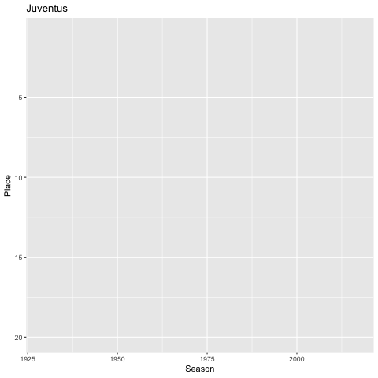
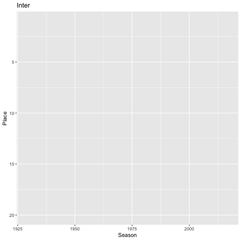
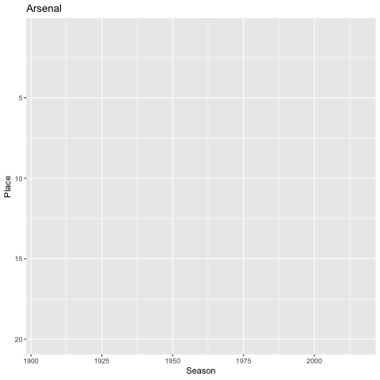
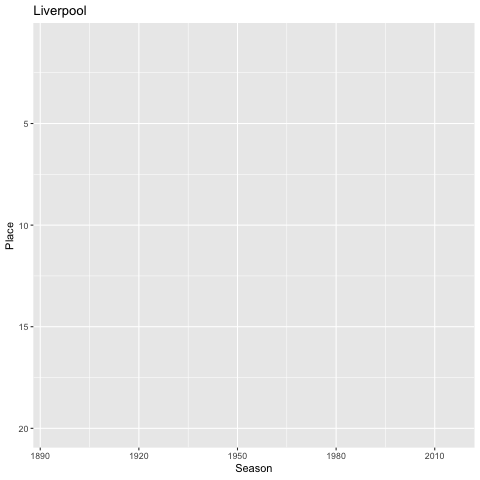
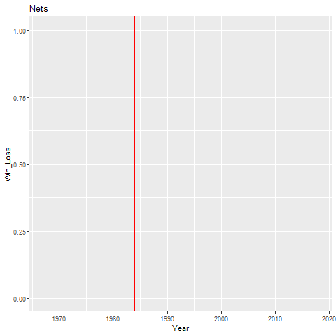
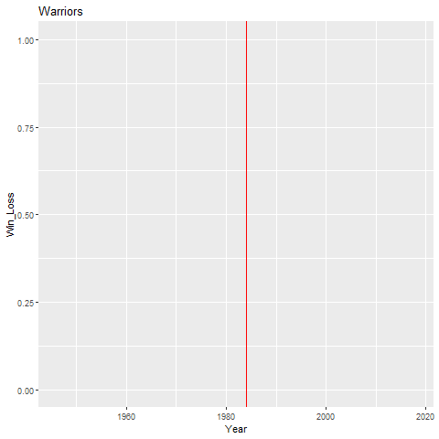
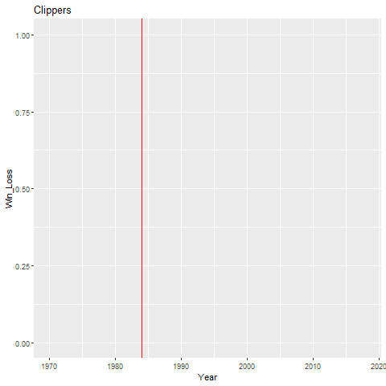
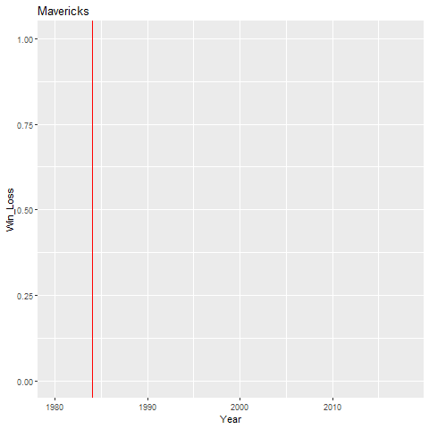

<!--
```{r setup, include=FALSE}
knitr::opts_chunk$set(echo = TRUE)
```

Note that the `echo = FALSE` parameter was added to the code chunk to prevent printing of the R code that generated the plot.

ggplot 2 colours: 
http://www.sthda.com/english/wiki/ggplot2-colors-how-to-change-colors-automatically-and-manually

Set3,Set2,Set1,Pastel2,Pastel1,Paired,Dark2,Accent
-->

```{r echo=FALSE}
library(tidyverse)
library(dplyr)
library(lubridate)
library(naniar)
library(visdat)
library(gganimate)
library(dygraphs)
library(readxl)
```


```{r echo=FALSE}
spanish <- read_csv("data/spanish_placing.csv")
english <- read_csv("data/english_placing.csv")
italian <- read_csv("data/italian_placing.csv")
```

```{r echo=FALSE}
value_2007 <- read_xlsx("data/Soccer-Club-Valuations-07-now.xlsx", sheet="Sheet2")
value_2008 <- read_xlsx("data/Soccer-Club-Valuations-07-now.xlsx", sheet="Sheet3")
value_2009 <- read_xlsx("data/Soccer-Club-Valuations-07-now.xlsx", sheet="Sheet4")
value_2010 <- read_xlsx("data/Soccer-Club-Valuations-07-now.xlsx", sheet="Sheet5")
value_2011 <- read_xlsx("data/Soccer-Club-Valuations-07-now.xlsx", sheet="Sheet6")
value_2012 <- read_xlsx("data/Soccer-Club-Valuations-07-now.xlsx", sheet="Sheet7")
value_2013 <- read_xlsx("data/Soccer-Club-Valuations-07-now.xlsx", sheet="Sheet8")
value_2014 <- read_xlsx("data/Soccer-Club-Valuations-07-now.xlsx", sheet="Sheet9")
value_2015 <- read_xlsx("data/Soccer-Club-Valuations-07-now.xlsx", sheet="Sheet10")
value_2016 <- read_xlsx("data/Soccer-Club-Valuations-07-now.xlsx", sheet="Sheet11")
value_2017 <- read_xlsx("data/Soccer-Club-Valuations-07-now.xlsx", sheet="Sheet12")
value_2018 <- read_xlsx("data/Soccer-Club-Valuations-07-now.xlsx", sheet="Sheet13")

year_2007 <- rep(2007, nrow(value_2007))
year_2008 <- rep(2008, nrow(value_2008))
year_2009 <- rep(2009, nrow(value_2009))
year_2010 <- rep(2010, nrow(value_2010))
year_2011 <- rep(2011, nrow(value_2011))
year_2012 <- rep(2012, nrow(value_2012))
year_2013 <- rep(2013, nrow(value_2013))
year_2014 <- rep(2014, nrow(value_2014))
year_2015 <- rep(2015, nrow(value_2015))
year_2016 <- rep(2016, nrow(value_2016))
year_2017 <- rep(2017, nrow(value_2017))
year_2018 <- rep(2018, nrow(value_2018))

value_2007 <- value_2007 %>% add_column(Year=year_2007)
value_2008 <- value_2008 %>% add_column(Year=year_2008)
value_2009 <- value_2009 %>% add_column(Year=year_2009)
value_2010 <- value_2010 %>% add_column(Year=year_2010)
value_2011 <- value_2011 %>% add_column(Year=year_2011)
value_2012 <- value_2012 %>% add_column(Year=year_2012)
value_2013 <- value_2013 %>% add_column(Year=year_2013)
value_2014 <- value_2014 %>% add_column(Year=year_2014)
value_2015 <- value_2015 %>% add_column(Year=year_2015)
value_2016 <- value_2016 %>% add_column(Year=year_2016)
value_2017 <- value_2017 %>% add_column(Year=year_2017)
value_2018 <- value_2018 %>% add_column(Year=year_2018)

value_all_years <- value_2007 %>% bind_rows(value_2008) %>%
                                  bind_rows(value_2009) %>%
                                  bind_rows(value_2010) %>%
                                  bind_rows(value_2011) %>%
                                  bind_rows(value_2012) %>%
                                  bind_rows(value_2013) %>%
                                  bind_rows(value_2014) %>%
                                  bind_rows(value_2015) %>%
                                  bind_rows(value_2016) %>%
                                  bind_rows(value_2017) %>%
                                  bind_rows(value_2018)
```

```{r echo=FALSE}
value_all_years <- value_all_years %>% rename("Value" = "Value ($M)[6]")
value_all_years <- value_all_years %>% mutate(Value = str_remove(Value, ",")) %>% filter(Team != "Team")
value_all_years <- value_all_years %>% mutate(Value = as.numeric(Value))
value_all_years <- value_all_years %>% mutate(Year = as.Date(as.character(Year), format="%Y"))
```


Introduction {data-icon="fa-align-justify"}
===================================

Row
---------------------------------------
### Background
<font size="6">Investigating the affects of Team Wealth on Performance</font>

<p>
<ul style="list-style-type: circle;">
<li>Salary caps are used to limit how much teams can pay their players.</li>
<li>They were first introduced in the NBA in the 1984-85 season.</li>
<li>Many sports have followed.</li>
<li>Soccer is the world's most popular sport.</li>
<li>It is well known that professional soccer players receive outrageous salaries especially in the European leagues.</li>
<li>NBA has increased the salary cap limit since it's introduction</li>
<li> We believe that successful teams tend to dominate leagues largely due to their finances.</li>
</ul>
</p>

Row
-------------------------------------
### Data Analysis
<font size="5">Approah</font>
<p></p>
<font size="4">Hence, through statistical analysis, we are investigating the affects of money on team performances in the NBA and European Soccer. </font>

Row
------------------------------------
### Data collection and wrangling 
<font size="5">Data Collection and Wrangling</font>
<p>
<ul style="list-style-type: circle;">
<li>Data was collected from a variety of sources.</li>
<li>Data about wealth of football teams was collected from Forbes which has assessed the wealth of European football teams since 2007.</li>
<li>Data about wealth had to be combined over different years and certain metrics needed to be cleaned (numbers containing punctuation signs).</li>
<li>Football data was in the form of matches.</li>
<li>We wrote a script that would calculate the standings of each season so that we could see where the teams placed each year.</li>
<li>We have data on all European leagues but decided to focus on the three major ones.</li>
</ul>
</p>


Overview {data-navmenu="Soccer Analysis"}
=================================================
Row
------------------------------
### Overview
<font size="5">Investigating any connections between club value and performance</font>
<br>
<p>
<ul style="list-style-type: circle;">
<li>Limiting our data to Europe.</li>
<li>Exploring the three best leagues in England, Italy and Spain.</li>
<li>Comparing their financial data vs performance.</li>
</ul>
</p>

Row
-----------------------------
### Valuation of some Top European Teams 
```{r echo=FALSE}
value_all_years %>% filter(Team %in% c("Real Madrid", "Barcelona", "Juventus", "Manchester United", "Arsenal", "Roma")) %>% ggplot(data=., aes(x=Year, y=Value, colour=Team)) + geom_line() + facet_wrap(~Country) + labs(y="Value in millions")
```

La Liga (Spain) {data-navmenu="Soccer Analysis"}
=====================================================
Row
--------------------
### Intro
<font size="5"> La Liga is the highest soccer league in Spain, consisting of the top 20 teams each season.</font>


Row
---------------------------
### Wealthiest La Liga teams 
```{r echo=FALSE}
value_all_years %>% filter(Country == "Spain") %>% group_by(Team) %>% count() %>% ggplot(data=., aes(x=reorder(Team, -n), y=n,fill=Team)) + geom_col()  + labs(x="Team", y="Number of times in Forbes top 20", title='Spain')
```


Row
---------------------------
### Wins per team
```{r echo=FALSE}
spanish %>% filter(Place == 1) %>% group_by(Team) %>% count() %>% arrange(desc(n)) %>% 
  ggplot(aes(x=reorder(Team, n), y=n, fill=Team)) + geom_col() + coord_flip() + labs(x="Team", y="Number of wins", title="Wins per team (Spanish)")
```

Row
-----------------------
### Performance of the wealthiest teams  
```{r echo=FALSE}
spanish %>% filter(Team %in% c("Real Madrid", "FC Barcelona", "Atletico Madrid")) %>% group_by(Team) %>% 
ggplot(data=., aes(x=Team, y=Place,fill=Team)) + geom_boxplot() + scale_y_reverse(lim=c(20, 1)) + labs(title="Distribution of placing for top wealthiest (Spanish)")
```


Row {.tabset}
--------------------------

### FC Barcelona 
```{r, echo=FALSE}

```


### Static Graph
```{r echo=FALSE}
s <- spanish %>% filter(Team %in% c("FC Barcelona")) %>% group_by("Season") 
s %>% ggplot(aes(x=Season, y=Place, colour=Team))+ geom_line(colour="purple") + scale_y_reverse(lim=c(20, 1)) + labs(title="Barcelona")
```


Row {.tabset}
------------------------

### Real Madrid 
```{r echo=FALSE}

```


### Static Graph
```{r echo=FALSE}
s <- spanish %>% filter(Team %in% c("Real Madrid")) %>% group_by("Season") 
s %>% ggplot(aes(x=Season, y=Place, colour=Team))+ geom_line(colour="goldenrod4") + scale_y_reverse(lim=c(20, 1)) + labs(title="Real Madrid")
```


Row {.tabset}
------------------------
### Atletico Madrid
```{r echo=FALSE}

```

### Static Graph
```{r echo=FALSE}
s <- spanish %>% filter(Team %in% c("Atletico Madrid")) %>% group_by("Season") 
s %>% ggplot(aes(x=Season, y=Place, colour=Team))+ geom_line(colour="red2") + 
     scale_y_reverse(lim=c(20, 1)) + labs(title="Atletico Madrid")
```

Row
---------------------
### Discussion
<ul style="list-style-type: circle;">
<li>2 outlying wealthiest clubs; Barcelona and Real Madrid</li>
<li>Correspondingly these two clubs have the greatest number of total wins by  a significant margin </li>
<li>This was confirmed with a box plot showing that the variance of placings is very low and the range of placings for Barcelona and Real Madrid over a long period of time is small. This highlights the stronghold that these two teams have on placings, while the rest of the less wealthy teams are left to fight for lower standings.</li>
<li>Atletico Madrid, the third wealthiest club in the Spanish league shows a significant increase in versatility in placings with respect to Barcelona and Real Madrid</li>
<li>This signifies that other teams most likely have to go through 'rebuilding' phases as their team ages, leading to them placing far lower on occasion whereas Barcelona and Real Madrid can buy players in their prime and therefore have far less 'peaks' and 'troughs' in season placement. There could be many other reasonable explanations for this trend.</li>
<li>This is further demonstrated in the line graphs</li>
</ul>

Seria A (Italy) {data-navmenu="Soccer Analysis"}
=====================================================
Row
--------------------
### Intro
<font size="5"> Seria A is considered one of top soccer leagues in Europe and represents the best teams in Italy.</font>

Row 
--------------------
### Wealthiest Seria A teams 
```{r echo=FALSE}
value_all_years %>% filter(Country == "Italy") %>% group_by(Team) %>% count() %>% 
  ggplot(data=., aes(x=reorder(Team, -n), y=n,fill=Team)) + geom_col()  + labs(x="Team", y="Number of times in Forbes top 20", title='Italy')
```

Row 
-----------------------------
### Wins per team Seria A
```{r echo=FALSE}
italian %>% filter(Place == 1) %>% group_by(Team) %>% count() %>% arrange(desc(n)) %>% 
  ggplot(aes(x=reorder(Team, n), y=n, fill=Team)) + geom_col() + coord_flip() + labs(x="Team", y="Number of wins", title="Wins per team (Italian)")
```

Row
-----------------------
### Performance of  wealthiest teams  
```{r echo=FALSE}
italian %>% filter(Team %in% c("Juventus", "Inter", "AC Milan")) %>% group_by(Team) %>% 
ggplot(data=., aes(x=Team, y=Place, fill=Team)) + geom_boxplot() + scale_y_reverse(lim=c(20, 1)) + labs(title="Distribution of placing for top wealthiest (Italian)")
```

Row {.tabset}
--------------------------

### Juventus 
```{r echo=FALSE}

```


### Static Graph
```{r echo=FALSE}
s <- italian %>% filter(Team %in% c("Juventus")) %>% group_by("Season") 
s %>% ggplot(aes(x=Season, y=Place, colour=Team))+ geom_line(colour="black") + 
     scale_y_reverse(lim=c(20, 1)) + labs(title="Juventus")
```

Row {.tabset}
------------------------

### AC Milan 
```{r echo=FALSE}

```


### Static Graph
```{r echo=FALSE}
s <- italian %>% filter(Team %in% c("AC Milan")) %>% group_by("Season") 
s %>% ggplot(aes(x=Season, y=Place, colour=Team))+ geom_line(colour="red2") + 
     scale_y_reverse(lim=c(20, 1)) + labs(title="AC Milan")
```


Row {.tabset}
------------------------

### Inter Milan 
```{r echo=FALSE}

```


### Static Graph
```{r echo=FALSE}
s <- italian %>% filter(Team %in% c("Inter")) %>% group_by("Season") 
s %>% ggplot(aes(x=Season, y=Place, colour=Team))+ geom_line(colour="blue3") + 
     scale_y_reverse(lim=c(20, 1)) + labs(title="Inter")
```


Row
-------------------------------
### Discussion
<ul style="list-style-type: circle;">
<li>Similar to the Spanish League, the Italian league has 3 major clubs of significantly higher wealth; A. C. Milan, Inter Milan and Juventus. </li>
<li>The box plots of these three major clubs show similar results to the Spanish league with high average placements, low versatility and low range. </li>
<li>The line graphs show that the placements are not as dominated in the Italian league as much as they are in the Spanish league</li>
</ul>


EPL (England) {data-navmenu="Soccer Analysis"}
=====================================================

Row
--------------------------------------
### Intro
<font size="5"> The English Premier League is the top level soccer league in England and works similarly to La Liga (top 20 teams stay, remaining are relegated). </font>


Row 
------------------------------------
### Wealthiest EPL teams
```{r echo=FALSE}
value_all_years %>% filter(Country == "England") %>% group_by(Team) %>% count() %>% 
  ggplot(data=., aes(x=reorder(Team, -n), y=n,fill=Team)) + geom_col()  + labs(x="Team", y="Number of times in Forbes top 20", title='England') + theme(axis.text.x=element_text(angle=90,hjust=1,vjust=0.5))
```

Row 
-------------------------------------
### Wins per team
```{r echo=FALSE}
english %>% filter(Place == 1) %>% group_by(Team) %>% count() %>% arrange(desc(n)) %>% 
  ggplot(aes(x=reorder(Team, n), y=n)) + geom_col() + coord_flip() + labs(x="Team", y="Number of wins", title="Wins per team (English)")
```

Row
-----------------------
### Performance of wealthiest
```{r echo=FALSE}
english %>% filter(Team %in% c("Manchester United", "Arsenal", "Liverpool", "Chelsea")) %>% group_by(Team) %>% 
  ggplot(data=., aes(x=Team, y=Place, fill=Team),) + geom_boxplot() + scale_y_reverse(lim=c(20, 1)) + labs(title="Distribution of placing for top wealthiest (English)")
```


Row {.tabset}
--------------------------
### Arsenal 
```{r echo=FALSE}

```


### Static Graph
```{r echo=FALSE}
s <- english %>% filter(Team %in% c("Arsenal")) %>% group_by("Season") 
s %>% ggplot(aes(x=Season, y=Place, colour=Team))+ geom_line(colour="goldenrod3") + scale_y_reverse(lim=c(20, 1)) + labs(title="Arsenal")
```


Row {.tabset}
--------------------------

### Manchester United 
```{r echo=FALSE}
knitr::include_graphics("data/gifs/ManchesterUnited.gif")
```


### Static Graph
```{r echo=FALSE}
s <- english %>% filter(Team %in% c("Manchester United")) %>% group_by("Season") 
s %>% ggplot(aes(x=Season, y=Place, colour=Team))+ geom_line(colour="Red") + 
     scale_y_reverse(lim=c(20, 1)) + labs(title="Manchester United")
```


Row {.tabset}
--------------------------
### Liverpool 
```{r echo=FALSE}

```


### Static Graph
```{r echo=FALSE}
s <- english %>% filter(Team %in% c("Liverpool")) %>% group_by("Season") 
s %>% ggplot(aes(x=Season, y=Place, colour=Team))+ geom_line(colour="aquamarine4") + scale_y_reverse(lim=c(20, 1)) + labs(title="Liverpool")
```

Row {.tabset}
--------------------------

### Chelsea 
```{r echo=FALSE}

```


### Static Graph
```{r echo=FALSE}
s <- english %>% filter(Team %in% c("Chelsea")) %>% group_by("Season") 
s %>% ggplot(aes(x=Season, y=Place, colour=Team))+ geom_line(colour="Blue") + 
     scale_y_reverse(lim=c(20, 1)) + labs(title="Chelsea")
```


Row
-------------------------------
### Discussion
<ul style="list-style-type: circle;">
<li>The English Premier has a larger group of the 'wealthiest' teams as compared to the previous leagues analysed</li>
<li>The box plots show a larger variation in placements; however, the wealthiest teams still tend to finish towards the top of the table. </li>
<li>The line plots highlight this increase in variation compared to the Spanish and Italian Soccer leagues. </li>
</ul>


NBA { data-navmenu="Basketball Analysis"} 
================================
Row
----------------------
### Overview 
<font size="5">Conducting a similar investigation for Basketball</font>
<br>
<p>
<ul style="list-style-type: circle;">
<li>Considering the NBA as it's widely considered to be the best.</li>
<li>Exploring a spread of 10 teams</li>
<li>Comparing their performance before and after the introduction of the salary cap</li>
<li>Due to the limitation of the data availbe, Win/Loss% is used instead of placing</li>
</ul>
</p>

Row {.tabset}
----------------------
### Overall wins per team 
```{r echo=FALSE}
seasonresults <- read.csv("data/AllSeasonResults.csv")
seasonresults2 <- seasonresults[-1,] %>% as.data.frame() %>%  group_by(Champion) %>% count() %>% arrange(desc(n))
ggplot(data = seasonresults2, aes(x=reorder(Champion, n), y=n)) + geom_col() + coord_flip() + labs(x="Team", y="Number of wins", title="Wins per team")
```


```{r echo=FALSE}
seasonresults <- read.csv("data/AllSeasonResults.csv")
seasonresults_postcap <- seasonresults[1:35,]
seasonresults_postcap2 <- seasonresults_postcap[-1,] %>%  as.data.frame() %>%  group_by(Champion) %>% count() %>% arrange(desc(n))
seasonresults_precap <- seasonresults[36:82,]
seasonresults_precap2 <- seasonresults_precap[-1,] %>%  as.data.frame() %>%  group_by(Champion) %>% count() %>% arrange(desc(n))
``` 


### Wins before cap
```{r echo=FALSE}
precap <- ggplot(data = seasonresults_precap2, aes(x=reorder(Champion, n), y=n)) + geom_col() + coord_flip() + labs(x="Team", y="Number of wins", title="Wins per team before cap")
precap
```


### Wins after cap
```{r echo=FALSE}
postcap <- ggplot(data = seasonresults_postcap2, aes(x=reorder(Champion, n), y=n)) + geom_col() + coord_flip() + labs(x="Team", y="Number of wins", title="Wins per team after cap")
postcap
```


Row {.tabset}
-----------------------
### LA Lakers 
```{r echo=FALSE}

```

### Static Graph
```{r echo=FALSE, eval=TRUE}
lakers <- read_csv("data/Lakers.csv")
lakers2 <- select(lakers, "Team", "Season", "W/L%") %>% separate("Season", c("Year", "End_Year"))
names(lakers2)[4] <- "Win_Loss"
lakers2$Year <- as.numeric((lakers2$Year))
lakers3 <- lakers2 %>% ggplot(aes(x=Year, y=Win_Loss, group = 1))+ geom_line(colour="Blue")+ ylim(0,1) + labs(title="Lakers") + geom_vline(xintercept = 1984, color = "red")
lakers3
```


Row {.tabset}
----------------------
### Philadelphia Sixers
```{r echo=FALSE}

```

### Static Graph
```{r echo=FALSE}
sixers <- read_csv("data/Sixers.csv")
sixers2 <- select(sixers, "Team", "Season", "W/L%") %>% separate("Season", c("Year", "End_Year"))
names(sixers2)[4] <- "Win_Loss"
sixers2$Year <- as.numeric((sixers2$Year))
sixers3 <- sixers2 %>% ggplot(aes(x=Year, y=Win_Loss, group = 1))+ geom_line(colour="Blue")+ ylim(0,1) + labs(title="Sixers") + geom_vline(xintercept = 1984, color = "red")
sixers3
```


Row {.tabset}
--------------------
### Brooklyn Nets 
```{r echo=FALSE}

```

### Static Graph
```{r echo=FALSE}
Nets <- read_csv("data/Nets.csv")
Nets2 <- select(Nets, "Team", "Season", "W/L%") %>% separate("Season", c("Year", "End_Year"))
names(Nets2)[4] <- "Win_Loss"
Nets2$Year <- as.numeric((Nets2$Year))
Nets3 <- Nets2 %>% ggplot(aes(x=Year, y=Win_Loss, group = 1))+ geom_line(colour="Blue")+ ylim(0,1) + labs(title="Nets") + geom_vline(xintercept = 1984, color = "red")
Nets3
```

Row {.tabset}
-----------------------
### New York Knicks
```{r echo=FALSE}

```

### Static Graph
```{r echo=FALSE}
knicks <- read_csv("data/Knicks.csv")
knicks2 <- select(knicks, "Team", "Season", "W/L%") %>% separate("Season", c("Year", "End_Year"))
names(knicks2)[4] <- "Win_Loss"
knicks2$Year <- as.numeric((knicks2$Year))
knicks3 <- knicks2 %>% ggplot(aes(x=Year, y=Win_Loss, group = 1))+ geom_line(colour="Blue")+ ylim(0,1) + labs(title="Knicks") + geom_vline(xintercept = 1984, color = "red")
knicks3
```

Row{.tabset}
------------------------
### Golden State Warriors
```{r echo=FALSE}

```

### Static Graph
```{r echo=FALSE}
warriors <- read_csv("data/Warriors.csv")
warriors2 <- select(warriors, "Team", "Season", "W/L%") %>% separate("Season", c("Year", "End_Year"))
names(warriors2)[4] <- "Win_Loss"
warriors2$Year <- as.numeric((warriors2$Year))
warriors3 <- warriors2 %>% ggplot(aes(x=Year, y=Win_Loss, group = 1))+ geom_line(colour="Blue")+ ylim(0,1) + labs(title="Warriors") + geom_vline(xintercept = 1984, color = "red")
warriors3
```

Row{.tabset}
------------------------
### Chicago Bulls
```{r echo=FALSE}

```

### Static Graph
```{r echo=FALSE}
bulls <- read_csv("data/Bulls.csv")
bulls2 <- select(bulls, "Team", "Season", "W/L%") %>% separate("Season", c("Year", "End_Year"))
names(bulls2)[4] <- "Win_Loss"
bulls2$Year <- as.numeric((bulls2$Year))
bulls3 <- bulls2 %>% ggplot(aes(x=Year, y=Win_Loss, group = 1))+ geom_line(colour="Blue")+ ylim(0,1) + labs(title="Bulls") + geom_vline(xintercept = 1984, color = "red")
bulls3
```

Row{.tabset}
------------------------
### Houston Rockets
```{r echo=FALSE}

```

### Static Graph
```{r echo=FALSE}
rockets <- read_csv("data/Rockets.csv")
rockets2 <- select(rockets, "Team", "Season", "W/L%") %>% separate("Season", c("Year", "End_Year"))
names(rockets2)[4] <- "Win_Loss"
rockets2$Year <- as.numeric((rockets2$Year))
rockets3 <- rockets2 %>% ggplot(aes(x=Year, y=Win_Loss, group = 1))+ geom_line(colour="Blue")+ ylim(0,1) + labs(title="Rockets") + geom_vline(xintercept = 1984, color = "red")
rockets3
```

Row{.tabset}
------------------------
### LA Clippers 
```{r echo=FALSE}

```

### Static Graph
```{r echo=FALSE}
clippers <- read_csv("data/Clippers.csv")
clippers2 <- select(clippers, "Team", "Season", "W/L%") %>% separate("Season", c("Year", "End_Year"))
names(clippers2)[4] <- "Win_Loss"
clippers2$Year <- as.numeric((clippers2$Year))
clippers3 <- clippers2 %>% ggplot(aes(x=Year, y=Win_Loss, group = 1))+ geom_line(colour="Blue")+ ylim(0,1) + labs(title="Clippers") + geom_vline(xintercept = 1984, color = "red")
clippers3
```

Row{.tabset}
------------------------
### Boston Celtics

```{r echo=FALSE}

```

### Static Graph
```{r echo=FALSE}
celtics <- read_csv("data/Celtics.csv")
celtics2 <- select(celtics, "Team", "Season", "W/L%") %>% separate("Season", c("Year", "End_Year"))
names(celtics2)[4] <- "Win_Loss"
celtics2$Year <- as.numeric((celtics2$Year))
celtics3 <- celtics2 %>% ggplot(aes(x=Year, y=Win_Loss, group = 1))+ geom_line(colour="Blue")+ ylim(0,1) + labs(title="Celtics") + geom_vline(xintercept = 1984, color = "red")
celtics3
```

Row{.tabset}
------------------------
### Dallas Mavericks
```{r echo=FALSE}

```

### Static Graph
```{r echo=FALSE}
mavs <- read_csv("data/Mavs.csv")
mavs2 <- select(mavs, "Team", "Season", "W/L%") %>% separate("Season", c("Year", "End_Year"))
names(mavs2)[4] <- "Win_Loss"
mavs2$Year <- as.numeric((mavs2$Year))
mavs3 <- mavs2 %>% ggplot(aes(x=Year, y=Win_Loss, group = 1))+ geom_line(colour="Blue")+ ylim(0,1) + labs(title="Mavericks") + geom_vline(xintercept = 1984, color = "red")
mavs3
```

Row
----------------------
### Discussion
<ul style="list-style-type: circle;">
<li>The NBA team with the most of number of wins were the Celtics, Lakers and the Bulls</li>
<li>There is some evidence to suggest that there is a larger spread in total wins per team after the salary cap was introduced however is not conclusive</li>
<li>The NBA Salary cap has increased significantly over time however this has not led to a club dominating the league.</li>

</ul>


Conclusion {data-icon="fa-align-justify"}
===================================
Row
---------------------------------------
### Conclusion
<font size="6">Conclusion</font>

<p>
<ul style="list-style-type: circle;">
<li>Correlation between club wealth and performance for Soccer</li>
<li>Influence of salary caps on NBA teams. </li>
<li>Accuracy of our hypothesis.</li>
<li>Limitations of our findings.</li>
<li>Extension of our analysis.</li>
</ul>
</p>


References {data-icon="fa-external-link-alt"}
==================================
Row 
----------------------------
### References
<font size="5">References</font><br><p></p>
<p>Anon., 2017. <em>opisthokonta. </em>[Online] <br />Available at: <u>https://opisthokonta.net/?page_id=995&amp;fbclid=IwAR06yFQ-zr3aabVX0dC5L-ADBYcOA_MGfYcU9RBpNzVtwaltI_N-x6e1g4Y</u><br />[Accessed 22 May 2019].</p>
<p>Anon., 2019. [Online] <br />Available at: <u>https://www.basketball-reference.com/?fbclid=IwAR0tiUPxwvdoXeOMbEdSd7JX9skw0BaMpsHiuPixrQQ2t0kNydu_jMP4MvM</u><br />[Accessed 15 May 2019].</p>
<p>Anon., 2019. <em>datahub. </em>[Online] <br />Available at: <u>https://datahub.io/collections/football?fbclid=IwAR3r5dyW1JNvHG-f81TWI-4zfpCvZQ0k928ukeiN8Edw33p3FoJYPkLKUlY</u><br />[Accessed 2019 May 2019].</p>
<p>Anon., 2019. <em>Forbes. </em>[Online] <br />Available at: <u>https://www.forbes.com/soccer-valuations/list/?fbclid=IwAR2I1fKTwvQvH_USx_Q55Mqf8DvfR8daAT4wqpeIvxQpWnia59RBXMsZ_aM#tab:overall</u><br />[Accessed 25 May 2019].</p>
<p>Anon., 2019. <em>NBA Salary Cap History. </em>[Online] <br />Available at: <u>https://www.basketball-reference.com/contracts/salary-cap-history.html</u><br />[Accessed 20 May 2019].</p>
<p>Celik O.B., I.-Y. M., 2017. Salary differences under the salary cap in major league soccer. <em>International Journal of Sports Science and Coaching, </em>pp. 623-624.</p>
<p>Depken, C., 2000. Wage disparity and team productivity: evidence from major league basketball. <em>Economics Letters, </em>pp. 87-92.</p>
<p>Staudohar, P., 1998. Salary Caps in proffessional team sports. <em>Compensation and working conditions, </em>pp. 3-11.</p>
<p>&nbsp;</p>